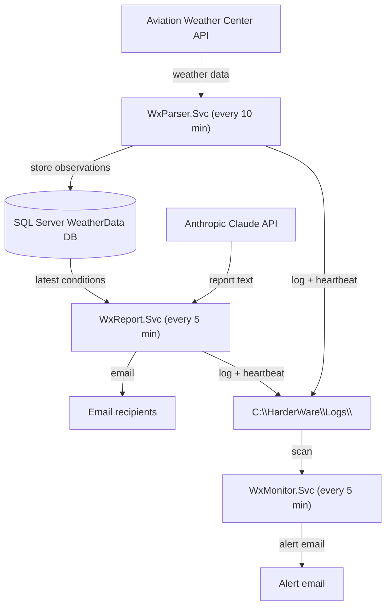
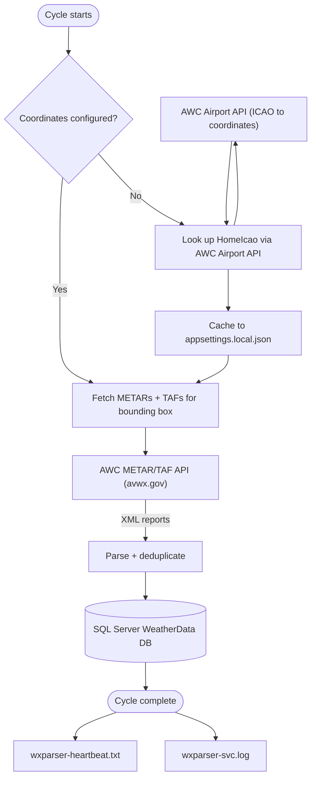
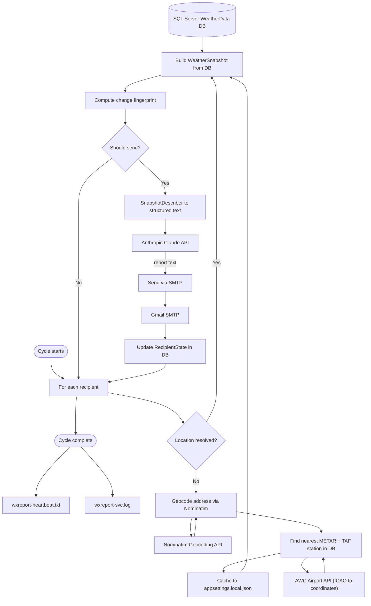
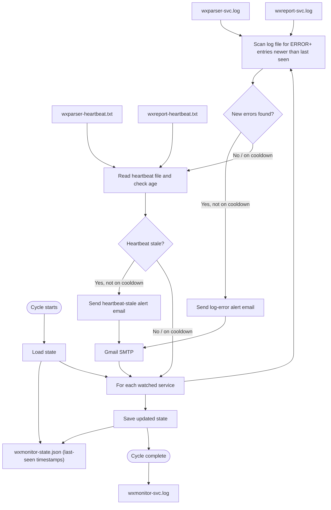
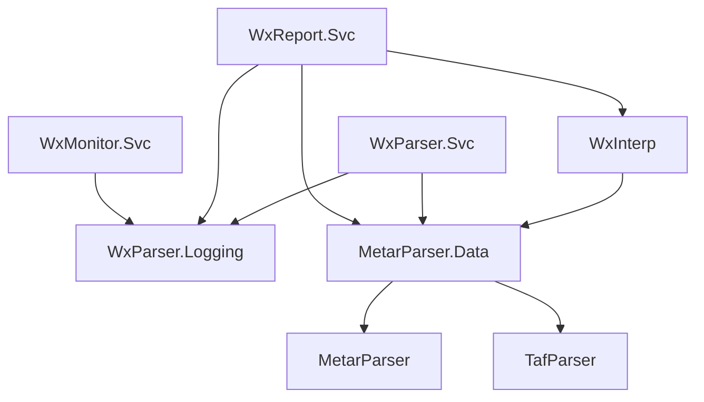
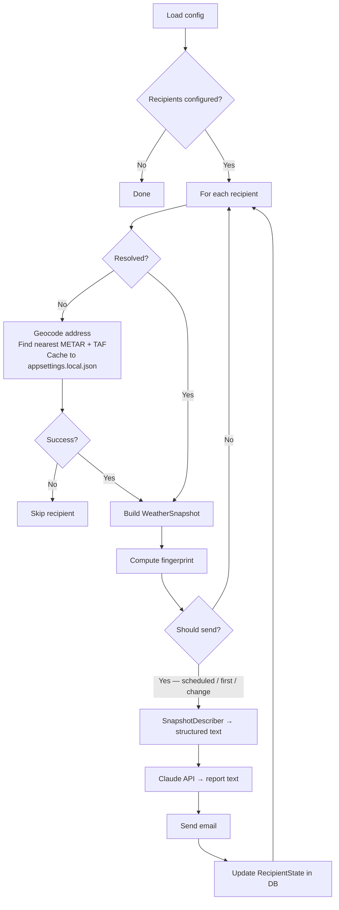
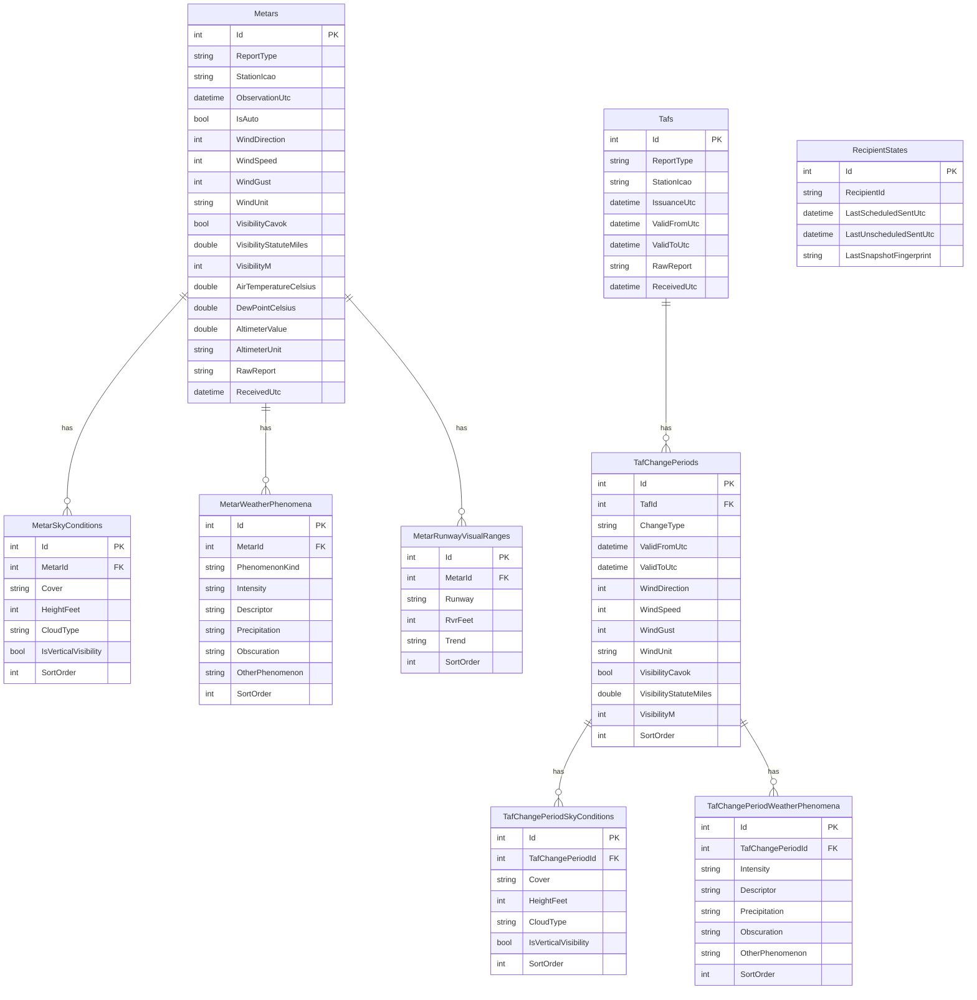

# WxParser System — Design Document

**Living document.** Update this file whenever the code changes in a meaningful way.

---

> **Viewing this document with diagrams**
>
> The architecture diagrams in this file are written in [Mermaid](https://mermaid.js.org/) and must be rendered to be readable. Raw Markdown shows them as fenced code blocks.
>
> **One-time setup in VS Code:**
> 1. Open the Extensions panel — **Ctrl+Shift+X**
> 2. Search for **Markdown Preview Mermaid Support**
> 3. Install the extension by **Matt Bierner**
>
> **Viewing the rendered document:**
> - **Ctrl+Shift+V** — opens a rendered preview in a new tab
> - **Ctrl+K V** — opens the rendered preview side-by-side with the source
>
> The preview updates automatically as you edit the source.

---

## Table of Contents

1. [Purpose](#1-purpose)
2. [System Architecture](#2-system-architecture)
3. [Solution Structure](#3-solution-structure)
4. [Service Details](#4-service-details)
   - [WxParser.Svc — Data Fetcher](#41-wxparsersvc--data-fetcher)
   - [WxReport.Svc — Report Generator](#42-wxreportsvc--report-generator)
   - [WxMonitor.Svc — Health Monitor](#43-wxmonitorsvc--health-monitor)
5. [Class Libraries](#5-class-libraries)
6. [Data Model](#6-data-model)
7. [Configuration Guide](#7-configuration-guide)
8. [External Dependencies](#8-external-dependencies)
9. [Installation and Deployment](#9-installation-and-deployment)
10. [Known Limitations and Future Work](#10-known-limitations-and-future-work)

---

## 1. Purpose

WxParser is a set of Windows services that:

- Periodically fetch METAR and TAF aviation weather reports from the Aviation Weather Center API and store them in a local SQL Server database.
- Generate friendly, plain-English (or other language) weather summaries using Anthropic's Claude AI and email them to a configured list of recipients.
- Monitor the health of the above services and send alert emails if errors occur or a service goes silent.

Recipients each have their own location. The system automatically resolves the nearest METAR and TAF reporting stations for each recipient on first run and caches the result. Daily reports are sent at each recipient's configured local time; additional reports are triggered by significant weather changes.

---

## 2. System Architecture

### 2.1 Overview

Three Windows services share a log directory and a SQL Server database. WxParser.Svc feeds the database; WxReport.Svc reads from it; WxMonitor.Svc watches both.



---

### 2.2 WxParser.Svc — data flow



---

### 2.3 WxReport.Svc — data flow



---

### 2.4 WxMonitor.Svc — data flow



---

## 3. Solution Structure

```
WxParser/
├── DESIGN.md                        ← this file
├── WxParser.sln
├── appsettings.shared.json          ← shared fetch-region config (git-tracked)
└── src/
    ├── MetarParser/                 ← METAR text parser library
    ├── TafParser/                   ← TAF text parser library
    ├── MetarParser.Data/            ← EF Core entities, fetchers, DB context, geocoders
    ├── WxParser.Logging/            ← log4net wrapper (static Logger class)
    ├── WxInterp/                    ← snapshot interpreter (METAR+TAF → WeatherSnapshot)
    ├── WxParser.Svc/                ← Windows service: periodic fetch
    ├── WxReport.Svc/                ← Windows service: report generation and email
    └── WxMonitor.Svc/               ← Windows service: log and heartbeat monitoring
tests/
    ├── MetarParser.Tests/
    ├── TafParser.Tests/
    └── WxInterp.Tests/
```

### Project dependency graph



---

## 4. Service Details

### 4.1 WxParser.Svc — Data Fetcher

**Purpose:** Keep the local database populated with current METAR and TAF data.

**Cycle (default: every 10 minutes):**
1. Resolve home coordinates from `appsettings.shared.json` (`HomeLatitude`, `HomeLongitude`). If absent, look up via `AirportLocator` using `HomeIcao` and cache to `appsettings.local.json`.
2. Fetch all METARs within a configurable bounding box (default ±5°) around home coordinates via the AWC API.
3. Fetch the home ICAO station explicitly (in case it falls outside the bounding box result).
4. Fetch all TAFs within the same bounding box.
5. Insert new records; skip duplicates (unique index on station + observation time + report type).
6. Write the current UTC timestamp to `wxparser-heartbeat.txt`.

**Key classes:**
| Class | Location | Role |
|---|---|---|
| `FetchWorker` | WxParser.Svc | `BackgroundService`; owns the fetch loop |
| `MetarFetcher` | MetarParser.Data | AWC API call → parse → insert METARs |
| `TafFetcher` | MetarParser.Data | AWC API call → parse → insert TAFs |
| `MetarParser` | MetarParser | Parses raw METAR text into structured objects |
| `TafParser` | TafParser | Parses raw TAF text into structured objects |
| `AirportLocator` | MetarParser.Data | AWC API: resolves ICAO to lat/lon |

---

### 4.2 WxReport.Svc — Report Generator

**Purpose:** Generate personalized weather reports for each recipient and deliver them by email.

**Cycle (default: every 5 minutes):**



**Send-decision logic:**
- **First run:** Immediately sends a welcome + weather report.
- **Scheduled:** Sends once per day when the recipient's configured local hour arrives (default 07:00).
- **Significant change:** Sends an unscheduled report when the weather fingerprint changes, subject to a minimum gap between sends (default 60 minutes).

**Significant-change thresholds (configurable):**
| Condition | Default threshold |
|---|---|
| Wind speed | ≥ 25 kt |
| Visibility | < 3.0 SM |
| Ceiling | < 3,000 ft AGL |

**METAR station fallback (tiered):**
1. Try each ICAO in the recipient's `MetarIcao` list (comma-separated, preference order).
2. Fall back to any station in the database with data in the last 3 hours.
3. If no data at all, skip the recipient for this cycle.

The config is never updated when a fallback station is used; a warning is logged.

**Recipient resolution (one-time, cached):**
1. Geocode `Address` via Nominatim → lat/lon + locality name.
2. Query the database for all recently-reporting METAR stations; resolve each to coordinates via AirportLocator; pick the nearest.
3. Same for TAF stations.
4. Write lat, lon, `MetarIcao`, `TafIcao`, and `LocalityName` back to `appsettings.local.json`.

**Key classes:**
| Class | Role |
|---|---|
| `ReportWorker` | `BackgroundService`; owns the report loop |
| `RecipientResolver` | Address geocoding and station resolution; cache write-back |
| `WxInterpreter` | Queries DB → `WeatherSnapshot`; station fallback logic |
| `SnapshotDescriber` | `WeatherSnapshot` → structured plain-text for Claude |
| `ClaudeClient` | Anthropic Messages API wrapper |
| `EmailSender` | MailKit SMTP wrapper |
| `SnapshotFingerprint` | Computes a change-detection hash from significant weather fields |

---

### 4.3 WxMonitor.Svc — Health Monitor

**Purpose:** Alert the operator by email when either watched service logs errors or goes silent.

**Cycle (default: every 5 minutes):**
1. For each watched service, scan its log file for entries at or above `AlertOnSeverity` (default: ERROR) with a timestamp newer than the last one processed.
2. For each watched service, read its heartbeat file and compare its age to `HeartbeatMaxAgeMinutes`.
3. Send an alert email if issues are found and the per-service, per-alert-type cooldown (`AlertCooldownMinutes`, default 60) has elapsed.
4. Persist state (last-seen log timestamp, last-alert timestamps) to `wxmonitor-state.json`.

**First-run behaviour:** On first run, `LastSeenLogTimestamp` is null. The scanner baselines to the latest entry in the log without sending alerts, so installation does not flood the inbox with historical errors.

**Key classes:**
| Class | Role |
|---|---|
| `MonitorWorker` | `BackgroundService`; owns the monitor loop |
| `LogScanner` | Parses log file; handles multi-line entries (stack traces); filters by severity and timestamp |
| `HeartbeatChecker` | Reads heartbeat file; returns age |
| `AlertEmailSender` | MailKit SMTP wrapper |
| `MonitorStateStore` | Reads/writes `wxmonitor-state.json` |

---

## 5. Class Libraries

### WxParser.Logging

A thin static wrapper around log4net. All services call `Logger.Initialise()` once at startup; thereafter `Logger.Info/Warn/Error/Fatal` are available everywhere. Caller file, method, and line number are captured automatically via `[CallerFilePath]` etc.

Log format: `yyyy-MM-dd HH:mm:ss.fff LEVEL [File::Method:Line] message`

### WxInterp

Translates raw database entities into a language-neutral `WeatherSnapshot` value object, and exposes static helpers to find the nearest METAR/TAF station in the database to a given coordinate.

Key types:
- `WeatherSnapshot` — current conditions + TAF forecast periods
- `WxInterpreter` — queries DB, applies unit conversions, builds snapshot
- `ForecastPeriod`, `SkyLayer`, `SnapshotWeather` — snapshot sub-types

---

## 6. Data Model

### Entity-relationship diagram



### Key indexes

| Table | Index | Type |
|---|---|---|
| Metars | StationIcao + ObservationUtc + ReportType | Unique |
| Metars | StationIcao | Non-unique |
| Tafs | StationIcao + IssuanceUtc + ReportType | Unique |
| Tafs | StationIcao | Non-unique |
| RecipientStates | RecipientId | Unique |

---

## 7. Configuration Guide

### File layering

Each service loads configuration from up to three files, merged in order (later files win):

| File | Tracked by git | Purpose |
|---|---|---|
| `appsettings.shared.json` | Yes | Fetch-region settings shared by all services |
| `appsettings.json` | Yes | Service-specific non-secret settings |
| `appsettings.local.json` | **No** | Secrets, per-recipient data, and cached resolved values |

### appsettings.shared.json (WxParser root)

```json
{
  "Fetch": {
    "HomeIcao": "KDWH",
    "HomeLatitude": 30.0,
    "HomeLongitude": -95.5,
    "BoundingBoxDegrees": 5.0
  }
}
```

### WxParser.Svc — appsettings.json

```json
{
  "Fetch": {
    "IntervalMinutes": 10,
    "HeartbeatFile": "C:\\HarderWare\\Logs\\wxparser-heartbeat.txt"
  }
}
```

### WxReport.Svc — appsettings.json

```json
{
  "Report": {
    "IntervalMinutes": 5,
    "HeartbeatFile": "C:\\HarderWare\\Logs\\wxreport-heartbeat.txt",
    "DefaultLanguage": "English",
    "DefaultScheduledSendHour": 7,
    "MinGapMinutes": 60,
    "SignificantChange": {
      "WindThresholdKt": 25,
      "VisibilityThresholdSm": 3.0,
      "CeilingThresholdFt": 3000
    },
    "Claude": {
      "Model": "claude-haiku-4-5-20251001"
    },
    "Smtp": {
      "Host": "smtp.gmail.com",
      "Port": 587,
      "FromName": "WxReport"
    }
  }
}
```

### WxReport.Svc — appsettings.local.json

```json
{
  "ConnectionStrings": {
    "WeatherData": "Server=.\\SQLEXPRESS;Database=WeatherData;Trusted_Connection=True;..."
  },
  "Report": {
    "Claude": { "ApiKey": "sk-ant-..." },
    "Smtp": {
      "Username": "you@gmail.com",
      "Password": "your-app-password",
      "FromAddress": "you@gmail.com"
    },
    "Recipients": [
      {
        "Id": "paul-en",
        "Email": "you@gmail.com",
        "Name": "Paul",
        "Language": "English",
        "Timezone": "America/Chicago",
        "ScheduledSendHour": 7,
        "Address": "123 Main St, The Woodlands TX 77380",
        "LocalityName": "The Woodlands",
        "Latitude": 30.1658,
        "Longitude": -95.4613,
        "MetarIcao": "KDWH, KHOU",
        "TafIcao": "KIAH"
      }
    ]
  }
}
```

**Notes on recipient config:**
- `Id` must be unique across all recipients. It is used as the stable key in `RecipientStates`.
- `Address` is used only for one-time geocoding; it is never displayed in reports.
- `LocalityName` is used in report subjects and body. If omitted, it is inferred from geocoding.
- `MetarIcao` accepts a comma-separated list in preference order (e.g. `"KDWH, KHOU"`). The first station with data is used; no config update occurs when a fallback station is used.
- `Latitude`, `Longitude`, `MetarIcao`, `TafIcao` are written back automatically by the service on first run. To trigger re-resolution (e.g. after a move), set them to `null`.

### WxMonitor.Svc — appsettings.json

```json
{
  "Monitor": {
    "IntervalMinutes": 5,
    "AlertEmail": "PaulHarder2@gmail.com",
    "AlertOnSeverity": "ERROR",
    "AlertCooldownMinutes": 60,
    "WatchedServices": [
      {
        "Name": "WxParser.Svc",
        "LogFile": "C:\\HarderWare\\Logs\\wxparser-svc.log",
        "HeartbeatFile": "C:\\HarderWare\\Logs\\wxparser-heartbeat.txt",
        "HeartbeatMaxAgeMinutes": 90
      },
      {
        "Name": "WxReport.Svc",
        "LogFile": "C:\\HarderWare\\Logs\\wxreport-svc.log",
        "HeartbeatFile": "C:\\HarderWare\\Logs\\wxreport-heartbeat.txt",
        "HeartbeatMaxAgeMinutes": 15
      }
    ],
    "Smtp": {
      "Host": "smtp.gmail.com",
      "Port": 587,
      "FromName": "WxMonitor"
    }
  }
}
```

### WxMonitor.Svc — appsettings.local.json

```json
{
  "Monitor": {
    "Smtp": {
      "Username": "you@gmail.com",
      "Password": "your-app-password",
      "FromAddress": "you@gmail.com"
    }
  }
}
```

---

## 8. External Dependencies

| Service | API | Purpose | Auth |
|---|---|---|---|
| WxParser.Svc | [AWC METAR/TAF API](https://aviationweather.gov/data/api/) | Fetch weather reports | None (public) |
| WxParser.Svc / WxReport.Svc | AWC Airport API | Resolve ICAO → coordinates | None (public) |
| WxReport.Svc | [Nominatim](https://nominatim.openstreetmap.org/) | Geocode recipient address | None (User-Agent required) |
| WxReport.Svc | Anthropic Claude API | Generate natural-language reports | API key |
| WxReport.Svc / WxMonitor.Svc | Gmail SMTP | Send emails | App password |

**NuGet packages:**
| Package | Used by |
|---|---|
| `Microsoft.EntityFrameworkCore.SqlServer` | MetarParser.Data |
| `Microsoft.Extensions.Hosting.WindowsServices` | All services |
| `MailKit` | WxReport.Svc, WxMonitor.Svc |
| `log4net` | WxParser.Logging |

---

## 9. Installation and Deployment

### Prerequisites
- Windows (all three projects use `UseWindowsService`)
- .NET 8 runtime
- SQL Server (Express is sufficient); instance name `SQLEXPRESS` by default
- Gmail account with an App Password configured for SMTP

### Build
```
dotnet publish src\WxParser.Svc\WxParser.Svc.csproj -c Release -o C:\HarderWare\WxParser.Svc
dotnet publish src\WxReport.Svc\WxReport.Svc.csproj -c Release -o C:\HarderWare\WxReport.Svc
dotnet publish src\WxMonitor.Svc\WxMonitor.Svc.csproj -c Release -o C:\HarderWare\WxMonitor.Svc
```

### Install services (run as Administrator)
```
sc.exe create WxParserSvc  binPath= "C:\HarderWare\WxParser.Svc\WxParser.Svc.exe"
sc.exe create WxReportSvc  binPath= "C:\HarderWare\WxReport.Svc\WxReport.Svc.exe"
sc.exe create WxMonitorSvc binPath= "C:\HarderWare\WxMonitor.Svc\WxMonitor.Svc.exe"

sc.exe start WxParserSvc
sc.exe start WxReportSvc
sc.exe start WxMonitorSvc
```

### Startup order
Start `WxParserSvc` first and allow at least one fetch cycle to complete before starting `WxReportSvc`, so METAR data is available for station resolution.

### Log files
All logs are written to `C:\HarderWare\Logs\`. Log paths can be changed by editing `log4net.config` in each service's output directory.

### Updating a service
1. Stop the service: `sc.exe stop WxReportSvc`
2. Publish the new build over the existing directory.
3. Start the service: `sc.exe start WxReportSvc`

### Changing a recipient's location
1. In `appsettings.local.json`, update `Address` and set `Latitude`, `Longitude`, `MetarIcao`, and `TafIcao` to `null`.
2. The service will re-geocode and re-resolve on the next cycle.

---

## 10. Known Limitations and Future Work

| Item | Notes |
|---|---|
| No temperature forecast | TAF reports do not include temperature data. Forecast temperature would require GRIB data, which is a significantly larger undertaking. |
| Single bounding box | All data is fetched for one geographic region. Supporting recipients in widely separated locations would require per-region fetch configuration. |
| No metrics | Cycle duration, API call counts, send success rates, etc. are not tracked. Consider adding structured metrics (Seq, Windows Event Log) in a future session. |
| WxMonitor does not watch itself | WxMonitor has no watchdog. A Windows Task Scheduler task could serve this purpose if needed. |
| Nominatim rate limit | Nominatim's terms require a maximum of 1 request/second and a valid User-Agent. Resolution is one-time per recipient, so this is unlikely to be a problem in practice. |
