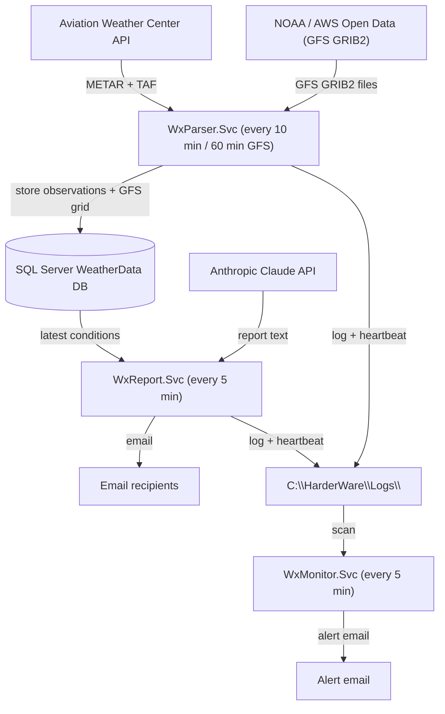
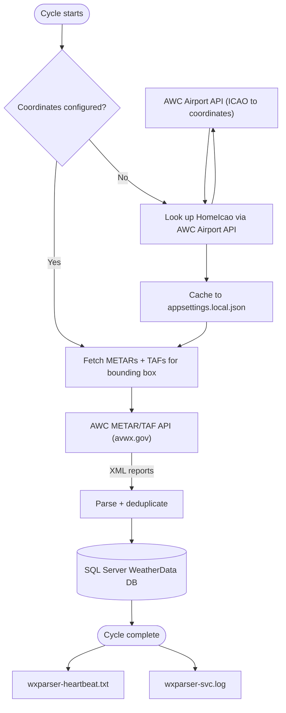
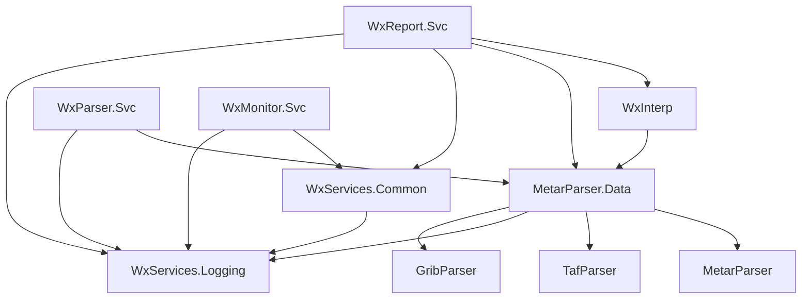
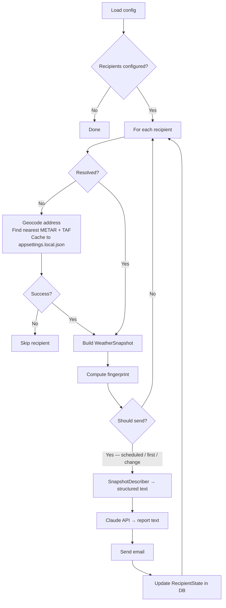
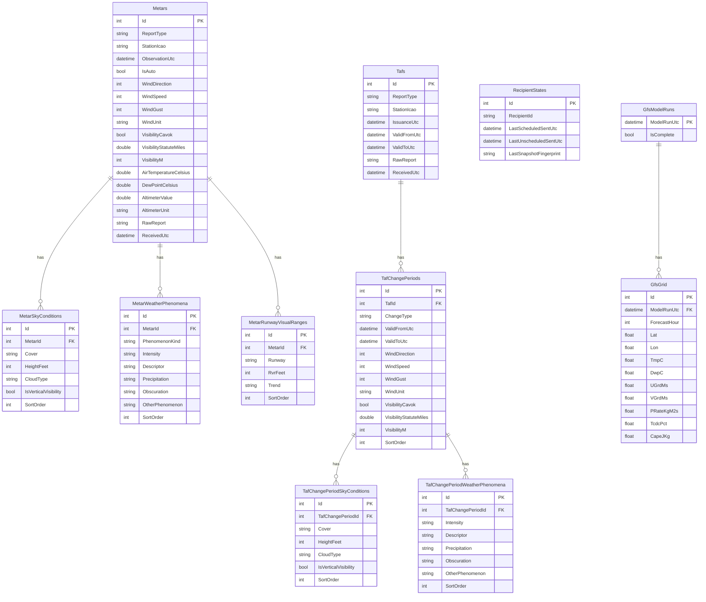

# WxServices System — Design Document

**Living document.** Update this file whenever the code changes in a meaningful way.

---

> **Viewing this document with diagrams**
>
> The architecture diagrams in this file are written in [Mermaid](https://mermaid.js.org/) and must be rendered to be readable. Raw Markdown shows them as fenced code blocks.
>
> **One-time setup in VS Code:**
> 1. Open the Extensions panel — **Ctrl+Shift+X**
> 2. Search for **Markdown Preview Mermaid Support**
> 3. Install the extension by **Matt Bierner**
>
> **Viewing the rendered document:**
> - **Ctrl+Shift+V** — opens a rendered preview in a new tab
> - **Ctrl+K V** — opens the rendered preview side-by-side with the source
>
> The preview updates automatically as you edit the source.

---

## Table of Contents

1. [Purpose](#1-purpose)
2. [System Architecture](#2-system-architecture)
3. [Solution Structure](#3-solution-structure)
4. [Service Details](#4-service-details)
   - [WxParser.Svc — Data Fetcher](#41-wxparsersvc--data-fetcher)
   - [WxReport.Svc — Report Generator](#42-wxreportsvc--report-generator)
   - [WxMonitor.Svc — Health Monitor](#43-wxmonitorsvc--health-monitor)
5. [Class Libraries](#5-class-libraries)
6. [Data Model](#6-data-model)
7. [Configuration Guide](#7-configuration-guide)
8. [External Dependencies](#8-external-dependencies)
9. [Installation and Deployment](#9-installation-and-deployment)
10. [Known Limitations and Future Work](#10-known-limitations-and-future-work)

---

## 1. Purpose

WxServices is a set of Windows services that:

- Periodically fetch METAR and TAF aviation weather reports from the Aviation Weather Center API and store them in a local SQL Server database.
- Download GFS numerical weather prediction model data from NOAA (via the AWS Open Data mirror) and extract gridded medium-range forecasts covering temperature, wind, cloud cover, precipitation rate, and convective energy (CAPE) for the configured region.
- Generate friendly, plain-English (or other language) weather summaries using Anthropic's Claude AI and email them to a configured list of recipients.
- Monitor the health of the above services and send alert emails if errors occur or a service goes silent.

Recipients each have their own location. The system automatically resolves the nearest METAR and TAF reporting stations for each recipient on first run and caches the result. Daily reports are sent at each recipient's configured local time; additional reports are triggered by significant weather changes.

---

## 2. System Architecture

### 2.1 Overview

Three Windows services share a log directory and a SQL Server database. WxParser.Svc feeds the database; WxReport.Svc reads from it; WxMonitor.Svc watches both.



---

### 2.2 WxParser.Svc — METAR/TAF data flow



---

### 2.3 WxParser.Svc — GFS data flow

Runs on a separate timer (default: every 60 minutes).


---

### 2.4 WxReport.Svc — data flow


---

### 2.5 WxMonitor.Svc — data flow


---

## 3. Solution Structure

```
WxServices/
├── DESIGN.md                        ← this file
├── WxServices.sln
├── appsettings.shared.json          ← shared config (fetch region, GFS, SMTP, Claude) — git-tracked
├── Deploy-WxService.ps1             ← PowerShell deploy script (run as Administrator)
└── src/
    ├── MetarParser/                 ← METAR text parser library
    ├── TafParser/                   ← TAF text parser library
    ├── GribParser/                  ← wgrib2 subprocess wrapper; CSV parser → GribValue records
    ├── MetarParser.Data/            ← EF Core entities, fetchers, DB context, geocoders
    ├── WxServices.Logging/          ← log4net wrapper (static Logger class)
    ├── WxServices.Common/           ← shared utilities (SmtpSender, SmtpConfig, Util)
    ├── WxInterp/                    ← snapshot interpreter (METAR+TAF+GFS → WeatherSnapshot)
    ├── WxParser.Svc/                ← Windows service: periodic METAR/TAF + GFS fetch
    ├── WxReport.Svc/                ← Windows service: report generation and email
    └── WxMonitor.Svc/               ← Windows service: log and heartbeat monitoring
tests/
    ├── MetarParser.Tests/
    ├── TafParser.Tests/
    ├── WxInterp.Tests/
    └── WxMonitor.Tests/
```

### Project dependency graph



---

## 4. Service Details

### 4.1 WxParser.Svc — Data Fetcher

**Purpose:** Keep the local database populated with current METAR, TAF, and GFS forecast data.

**METAR/TAF cycle (default: every 10 minutes):**
1. Resolve home coordinates from `appsettings.shared.json` (`HomeLatitude`, `HomeLongitude`). If absent, look up via `AirportLocator` using `HomeIcao` and cache to `appsettings.local.json`.
2. Fetch all METARs within a configurable bounding box (default ±5°) around home coordinates via the AWC API.
3. Fetch the home ICAO station explicitly (in case it falls outside the bounding box result).
4. Fetch all TAFs within the same bounding box.
5. Insert new records; skip duplicates (unique index on station + observation time + report type).
6. Write the current UTC timestamp to `wxparser-heartbeat.txt`.

**GFS cycle (default: every 60 minutes):**
1. Check for any incomplete model run registered in `GfsModelRuns`. If one exists, resume it; otherwise compute the most recent GFS cycle (00Z/06Z/12Z/18Z) that should be available on NOMADS.
2. For each forecast hour 0–120 not yet stored, fetch the `.idx` inventory file for that hour. A 404 means the run is still being computed — stop and resume next cycle.
3. Download byte-range HTTP requests for the 7 target variables (TMP, SPFH, UGRD, VGRD, PRATE, TCDC, CAPE) and concatenate them into a temporary GRIB2 file.
4. Invoke wgrib2 (via WSL) to crop to the configured bounding box and emit a CSV of grid values.
5. Assemble `GfsGridPoint` entities (applying unit conversions) and insert into `GfsGrid`.
6. When all 121 hours are stored, mark the run `IsComplete = true` and purge old runs (retaining the 2 most recent).

**Key classes:**
| Class | Location | Role |
|---|---|---|
| `FetchWorker` | WxParser.Svc | `BackgroundService`; owns the METAR/TAF and GFS fetch loops |
| `MetarFetcher` | MetarParser.Data | AWC API call → parse → insert METARs |
| `TafFetcher` | MetarParser.Data | AWC API call → parse → insert TAFs |
| `GfsFetcher` | MetarParser.Data | NOMADS byte-range download → wgrib2 → insert GfsGridPoints |
| `GribExtractor` | GribParser | wgrib2 subprocess wrapper; parses CSV output into `GribValue` records |
| `MetarParser` | MetarParser | Parses raw METAR text into structured objects |
| `TafParser` | TafParser | Parses raw TAF text into structured objects |
| `AirportLocator` | MetarParser.Data | AWC API: resolves ICAO to lat/lon; finds nearest METAR/TAF stations by bounding box |

---

### 4.2 WxReport.Svc — Report Generator

**Purpose:** Generate personalized weather reports for each recipient and deliver them by email.

**Cycle (default: every 5 minutes):**



**Send-decision logic:**
- **First run:** Immediately sends a welcome + weather report.
- **Scheduled:** Sends once per configured hour when that hour arrives in the recipient's local timezone. Multiple hours can be specified (e.g. `"6, 18"` for morning and evening); default is `"7"`. Subject line: "Weather report — …".
- **Significant change:** Sends an unscheduled report when the weather fingerprint changes and the classified severity is `Update` or `Alert`, subject to a minimum gap between sends (default 60 minutes). `Minor` severity changes (only forecast-risk flags cleared) are suppressed. Subject line and Claude prompt vary by severity:

| Severity | Trigger | Subject line | Claude opening |
|---|---|---|---|
| `Alert` | Dangerous current-condition flag appeared (wind, visibility, ceiling, or thunderstorm) | "Weather alert — …" | One urgent sentence naming the new condition |
| `Update` | Current condition cleared; precip appeared/cleared; GFS risk flag appeared; or forecast high shifted | "Weather update — …" | One or two sentences summarising what changed |
| `Minor` | Only GFS risk flags cleared (things improved) | — send suppressed — | — |

**Significant-change thresholds (configurable):**
| Condition | Default threshold |
|---|---|
| Wind speed | ≥ 25 kt |
| Visibility | < 3.0 SM |
| Ceiling | < 3,000 ft AGL |
| GFS forecast high temperature | Changes by ≥ 15 °F (next calendar day) |
| GFS CAPE | Any forecast day ≥ 1,000 J/kg |
| GFS precipitation rate | Any forecast day ≥ 2.0 mm/hr |

**METAR station fallback (tiered):**
1. Try each ICAO in the recipient's `MetarIcao` list (comma-separated, preference order).
2. Fall back to any station in the database with data in the last 3 hours.
3. If no data at all, skip the recipient for this cycle.

The config is never updated when a fallback station is used; a warning is logged.

**Recipient resolution (one-time, cached):**
1. Geocode `Address` via Nominatim → lat/lon + locality name.
2. Query the database for METAR stations active within the last 3 hours; use the AWC bbox API to find the nearest station from that active set (falling back to the full API result on first run before local data exists).
3. Query the AWC TAF bbox API for the nearest TAF station. If none is found, store the sentinel value `"NONE"` to prevent repeated lookups.
4. Write lat, lon, `MetarIcao`, `TafIcao`, and `LocalityName` back to `appsettings.local.json`.

**Key classes:**
| Class | Location | Role |
|---|---|---|
| `ReportWorker` | WxReport.Svc | `BackgroundService`; owns the report loop |
| `RecipientResolver` | WxReport.Svc | Address geocoding and station resolution; cache write-back; retries geocoding up to 3× |
| `WxInterpreter` | WxInterp | Queries DB → `WeatherSnapshot` (METAR + TAF + GFS); station fallback logic |
| `GfsInterpreter` | WxInterp | Bilinear interpolation over the four surrounding 0.25° GFS grid points → `GfsForecast` |
| `SnapshotDescriber` | WxReport.Svc | `WeatherSnapshot` → structured plain-text for Claude; unit-aware (temperature, pressure, wind speed); outputs relative humidity (computed from temperature and dew point) rather than raw dew point |
| `ClaudeClient` | WxReport.Svc | Anthropic Messages API wrapper; generates HTML email body; accepts `UnitPreferences` and `ChangeSeverity` to tailor the system prompt per recipient |
| `SmtpSender` | WxServices.Common | MailKit SMTP wrapper; sends `multipart/alternative` (plain-text + HTML) when an HTML body is provided; `fromName` set per-service at construction time |
| `SnapshotFingerprint` | WxReport.Svc | Computes an 8-field pipe-delimited fingerprint (W, V, C, TS, PR, GH, GC, GP) from significant weather fields; `ClassifyChange` compares two fingerprints and returns a `ChangeSeverity` value |

---

### 4.3 WxMonitor.Svc — Health Monitor

**Purpose:** Alert the operator by email when either watched service logs errors or goes silent.

**Cycle (default: every 5 minutes):**
1. For each watched service, scan its log file for entries at or above `AlertOnSeverity` (default: ERROR) with a timestamp newer than the last one processed.
2. For each watched service, read its heartbeat file and compare its age to `HeartbeatMaxAgeMinutes`.
3. Send an alert email if issues are found and the per-service, per-alert-type cooldown (`AlertCooldownMinutes`, default 60) has elapsed.
4. Persist state (last-seen log timestamp, last-alert timestamps) to `wxmonitor-state.json`.

**First-run behaviour:** On first run, `LastSeenLogTimestamp` is null. The scanner baselines to the latest entry in the log without sending alerts, so installation does not flood the inbox with historical errors.

**Key classes:**
| Class | Location | Role |
|---|---|---|
| `MonitorWorker` | WxMonitor.Svc | `BackgroundService`; owns the monitor loop |
| `LogScanner` | WxMonitor.Svc | Parses log file; handles multi-line entries (stack traces); filters by severity and timestamp |
| `HeartbeatChecker` | WxMonitor.Svc | Reads heartbeat file; returns age |
| `SmtpSender` | WxServices.Common | MailKit SMTP wrapper; `fromName` set per-service at construction time |
| `MonitorStateStore` | WxMonitor.Svc | Reads/writes `wxmonitor-state.json` |

---

## 5. Class Libraries

### WxServices.Logging

A thin static wrapper around log4net. All services call `Logger.Initialise()` once at startup; thereafter `Logger.Info/Warn/Error/Fatal` are available everywhere. Caller file, method, and line number are captured automatically via `[CallerFilePath]` etc.

Log format: `yyyy-MM-dd HH:mm:ss.fff LEVEL [File::Method:Line] message`

### WxServices.Common

Shared utility code referenced by WxReport.Svc and WxMonitor.Svc.

Key types:
- `SmtpConfig` — POCO holding SMTP host, port, credentials, and sender address (no `FromName`; each service supplies its own display name at construction time)
- `SmtpSender` — MailKit-based SMTP wrapper; constructed with `SmtpConfig` and a `fromName` string; `SendAsync` accepts a plain-text body and an optional `htmlBody`; when HTML is provided the message is sent as `multipart/alternative` so plain-text clients still receive a readable fallback
- `Util` — static utility class; currently exposes `Ignore(object? obj = null)` for suppressing "unused variable" warnings during debugging sessions

### WxInterp

Translates raw database entities into a language-neutral `WeatherSnapshot` value object, and exposes static helpers to find the nearest METAR/TAF station in the database to a given coordinate.

Key types:
- `WeatherSnapshot` — current conditions + TAF forecast periods + optional `GfsForecast`
- `WxInterpreter` — queries DB, applies unit conversions, builds snapshot; optionally attaches GFS forecast when lat/lon provided
- `GfsInterpreter` — queries `GfsGrid` for the most recent complete model run and bilinearly interpolates the four surrounding 0.25° grid points to an exact location; produces a `GfsForecast` covering up to 6 days
- `GfsForecast` — model run time + list of `GfsDailyForecast`
- `GfsDailyForecast` — per-day high/low temperature (°C and °F), max wind speed (kt) and dominant direction, max cloud cover (%), max CAPE (J/kg), max precipitation rate (mm/hr above threshold)
- `ForecastPeriod`, `SkyLayer`, `SnapshotWeather` — snapshot sub-types for METAR/TAF data

---

## 6. Data Model

### Entity-relationship diagram



### Key indexes

| Table | Index | Type |
|---|---|---|
| Metars | StationIcao + ObservationUtc + ReportType | Unique |
| Metars | StationIcao | Non-unique |
| Tafs | StationIcao + IssuanceUtc + ReportType | Unique |
| Tafs | StationIcao | Non-unique |
| RecipientStates | RecipientId | Unique |
| GfsGrid | ModelRunUtc + ForecastHour + Lat + Lon | Unique |
| GfsGrid | ModelRunUtc + ForecastHour | Non-unique |

---

## 7. Configuration Guide

### File layering

Each service loads configuration from up to three files, merged in order (later files win):

| File | Tracked by git | Purpose |
|---|---|---|
| `appsettings.shared.json` | Yes | Fetch-region settings shared by all services |
| `appsettings.json` | Yes | Service-specific non-secret settings |
| `appsettings.local.json` | **No** | Secrets, per-recipient data, and cached resolved values |

### appsettings.shared.json (WxServices root)

```json
{
  "Fetch": {
    "HomeIcao": "KDWH",
    "HomeLatitude": 30.0,
    "HomeLongitude": -95.5,
    "BoundingBoxDegrees": 5.0
  },
  "Gfs": {
    "Wgrib2WslPath": "/usr/local/bin/wgrib2",
    "MaxForecastHours": 120,
    "RetainModelRuns": 2,
    "TempPath": "C:\\HarderWare\\temp"
  },
  "Smtp": {
    "Host": "smtp.gmail.com",
    "Port": 587,
    "Username": null,
    "Password": null,
    "FromAddress": null
  },
  "Claude": {
    "ApiKey": null,
    "Model": "claude-sonnet-4-6"
  }
}
```

`Smtp` and `Claude` are top-level so any service can send email or call Claude without duplicating config. Secrets (`Username`, `Password`, `FromAddress`, `ApiKey`) are always `null` here and overridden in each service's `appsettings.local.json`.

### WxParser.Svc — appsettings.json

```json
{
  "Fetch": {
    "IntervalMinutes": 10,
    "HeartbeatFile": "C:\\HarderWare\\Logs\\wxparser-heartbeat.txt"
  },
  "Gfs": {
    "IntervalMinutes": 60
  }
}
```

### WxReport.Svc — appsettings.json

```json
{
  "Report": {
    "IntervalMinutes": 5,
    "HeartbeatFile": "C:\\HarderWare\\Logs\\wxreport-heartbeat.txt",
    "DefaultLanguage": "English",
    "DefaultScheduledSendHours": "7",
    "MinGapMinutes": 60,
    "PrecipRateThresholdMmHr": 0.1,
    "SignificantChange": {
      "WindThresholdKt": 25,
      "VisibilityThresholdSm": 3.0,
      "CeilingThresholdFt": 3000,
      "ForecastHighChangeDegF": 15,
      "CapeThresholdJKg": 1000,
      "GfsPrecipThresholdMmHr": 2.0
    }
  },
  "Claude": {
    "Model": "claude-haiku-4-5-20251001"
  }
}
```

`Claude.Model` can be overridden per-service to use a cheaper/faster model for report generation.

### WxReport.Svc — appsettings.local.json

```json
{
  "ConnectionStrings": {
    "WeatherData": "Server=.\\SQLEXPRESS;Database=WeatherData;Trusted_Connection=True;..."
  },
  "Smtp": {
    "Username": "you@gmail.com",
    "Password": "your-app-password",
    "FromAddress": "you@gmail.com"
  },
  "Claude": {
    "ApiKey": "sk-ant-..."
  },
  "Report": {
    "Recipients": [
      {
        "Id": "paul-en",
        "Email": "you@gmail.com",
        "Name": "Paul",
        "Language": "English",
        "Timezone": "America/Chicago",
        "ScheduledSendHours": "7",
        "Address": "123 Main St, The Woodlands TX 77380",
        "LocalityName": "The Woodlands",
        "Latitude": 30.1658,
        "Longitude": -95.4613,
        "MetarIcao": "KDWH, KHOU",
        "TafIcao": "KIAH",
        "Units": { "Temperature": "F", "Pressure": "inHg", "WindSpeed": "mph" }
      }
    ]
  }
}
```

**Notes on recipient config:**
- `Id` must be unique across all recipients. It is used as the stable key in `RecipientStates`.
- `Address` is used only for one-time geocoding; it is never displayed in reports.
- `LocalityName` is used in report subjects and body. If omitted, it is inferred from geocoding.
- `ScheduledSendHours` is a comma-separated string of hours (0–23) in the recipient's local timezone at which a daily report is sent (e.g. `"6, 18"` for morning and evening). A single hour is also valid (e.g. `"7"`). Falls back to `DefaultScheduledSendHours` in the `Report` section when omitted.
- `MetarIcao` accepts a comma-separated list in preference order (e.g. `"KDWH, KHOU"`). The first station with data is used; no config update occurs when a fallback station is used.
- `Latitude`, `Longitude`, `MetarIcao`, `TafIcao` are written back automatically by the service on first run. To trigger re-resolution (e.g. after a move), set them to `null`.
- `Units` controls how values are displayed in reports. Each field is independent — any combination is valid. Supported values: `Temperature`: `"F"` or `"C"`; `Pressure`: `"inHg"` or `"kPa"`; `WindSpeed`: `"mph"` or `"kph"`. All default to US customary when omitted.

### WxMonitor.Svc — appsettings.json

```json
{
  "Monitor": {
    "IntervalMinutes": 5,
    "AlertEmail": "PaulHarder2@gmail.com",
    "AlertOnSeverity": "ERROR",
    "AlertCooldownMinutes": 60,
    "WatchedServices": [
      {
        "Name": "WxParser.Svc",
        "LogFile": "C:\\HarderWare\\Logs\\wxparser-svc.log",
        "HeartbeatFile": "C:\\HarderWare\\Logs\\wxparser-heartbeat.txt",
        "HeartbeatMaxAgeMinutes": 90
      },
      {
        "Name": "WxReport.Svc",
        "LogFile": "C:\\HarderWare\\Logs\\wxreport-svc.log",
        "HeartbeatFile": "C:\\HarderWare\\Logs\\wxreport-heartbeat.txt",
        "HeartbeatMaxAgeMinutes": 15
      }
    ]
  }
}
```

SMTP settings come from the top-level `Smtp` block in `appsettings.shared.json` + `appsettings.local.json`. WxMonitor.Svc does not need any service-specific Smtp overrides.

### WxMonitor.Svc — appsettings.local.json

```json
{
  "Smtp": {
    "Username": "you@gmail.com",
    "Password": "your-app-password",
    "FromAddress": "you@gmail.com"
  }
}
```

---

## 8. External Dependencies

| Service | API / Tool | Purpose | Auth |
|---|---|---|---|
| WxParser.Svc | [AWC METAR/TAF API](https://aviationweather.gov/data/api/) | Fetch weather reports | None (public) |
| WxParser.Svc / WxReport.Svc | AWC Airport API | Resolve ICAO → coordinates; nearest station lookup | None (public) |
| WxParser.Svc | [NOAA GFS / AWS Open Data](https://noaa-gfs-bdp-pds.s3.amazonaws.com) | Download GFS GRIB2 forecast files | None (public) |
| WxParser.Svc | wgrib2 (WSL) | Extract sub-grid values from GRIB2 files | n/a (local binary) |
| WxReport.Svc | [Nominatim](https://nominatim.openstreetmap.org/) | Geocode recipient address | None (User-Agent required) |
| WxReport.Svc | Anthropic Claude API | Generate natural-language reports | API key |
| WxReport.Svc / WxMonitor.Svc | Gmail SMTP | Send emails | App password |

**NuGet packages:**
| Package | Used by |
|---|---|
| `Microsoft.EntityFrameworkCore.SqlServer` | MetarParser.Data |
| `Microsoft.Extensions.Hosting.WindowsServices` | All services |
| `MailKit` | WxServices.Common |
| `log4net` | WxServices.Logging |

**System prerequisites:**
| Prerequisite | Notes |
|---|---|
| WSL (Windows Subsystem for Linux) | Required for wgrib2; Ubuntu recommended |
| wgrib2 | Install inside WSL: `sudo apt install wgrib2` or build from source; default path `/usr/local/bin/wgrib2` |

---

## 9. Installation and Deployment

### Prerequisites
- Windows (all three projects use `UseWindowsService`)
- .NET 8 runtime
- SQL Server (Express is sufficient); instance name `SQLEXPRESS` by default
- Gmail account with an App Password configured for SMTP
- WSL with wgrib2 installed (for GFS data ingestion)

### Deploy script

`Deploy-WxService.ps1` (in the solution root) automates stop/publish/start for each service. Run from an **elevated** PowerShell prompt:

```powershell
# Deploy a single service
.\Deploy-WxService.ps1 -Service WxReportSvc

# Deploy all three in order (stops on first failure)
.\Deploy-WxService.ps1 -Service all
```

Valid service names: `WxParserSvc`, `WxReportSvc`, `WxMonitorSvc`, `all`.

### First-time install (run as Administrator)
```
sc.exe create WxParserSvc  binPath= "C:\HarderWare\WxParser.Svc\WxParser.Svc.exe"
sc.exe create WxReportSvc  binPath= "C:\HarderWare\WxReport.Svc\WxReport.Svc.exe"
sc.exe create WxMonitorSvc binPath= "C:\HarderWare\WxMonitor.Svc\WxMonitor.Svc.exe"

sc.exe start WxParserSvc
sc.exe start WxReportSvc
sc.exe start WxMonitorSvc
```

### Startup order
Start `WxParserSvc` first and allow at least one fetch cycle to complete before starting `WxReportSvc`, so METAR data is available for station resolution. GFS data will begin accumulating on the first 60-minute GFS cycle; full temperature forecasts appear in reports once the first complete model run is ingested (up to ~4 hours after the run's nominal time).

### Log files
All logs are written to `C:\HarderWare\Logs\`. Log paths can be changed by editing `log4net.config` in each service's output directory.

### Changing a recipient's location
1. In `appsettings.local.json`, update `Address` and set `Latitude`, `Longitude`, `MetarIcao`, and `TafIcao` to `null`.
2. The service will re-geocode and re-resolve on the next cycle.

---

## 10. Known Limitations and Future Work

| Item | Notes |
|---|---|
| Single bounding box | All METAR, TAF, and GFS data is fetched for one geographic region. Supporting recipients in widely separated locations would require per-region fetch configuration. |
| GFS requires WSL | wgrib2 is a Linux binary; the fetcher invokes it via `wsl.exe`. If WSL is unavailable or wgrib2 is not installed, the GFS cycle logs errors and skips ingestion; METAR/TAF reports continue normally without forecast data. |
| GFS forecast delay | A complete model run takes up to ~4 hours after the nominal run time to appear on NOMADS. During this window the previous run's data is used. |
| No metrics | Cycle duration, API call counts, send success rates, etc. are not tracked. Consider adding structured metrics (Seq, Windows Event Log) in a future session. |
| WxMonitor does not watch itself | WxMonitor has no watchdog. A Windows Task Scheduler task could serve this purpose if needed. |
| Nominatim rate limit | Nominatim's terms require a maximum of 1 request/second and a valid User-Agent. Resolution is one-time per recipient, so this is unlikely to be a problem in practice. |
