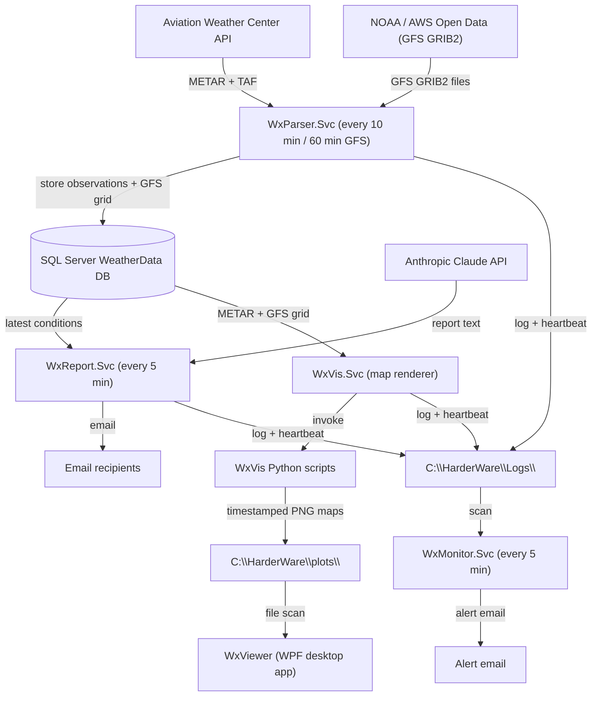
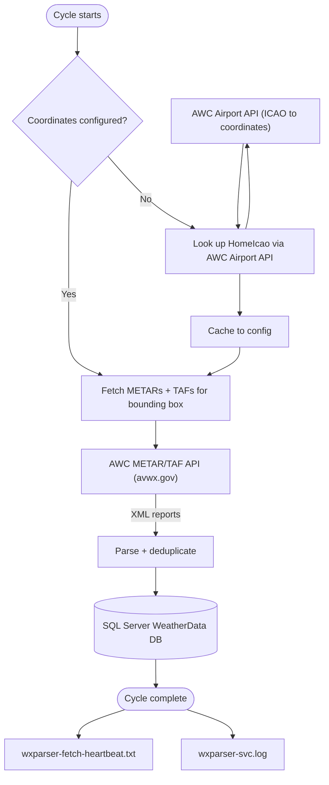
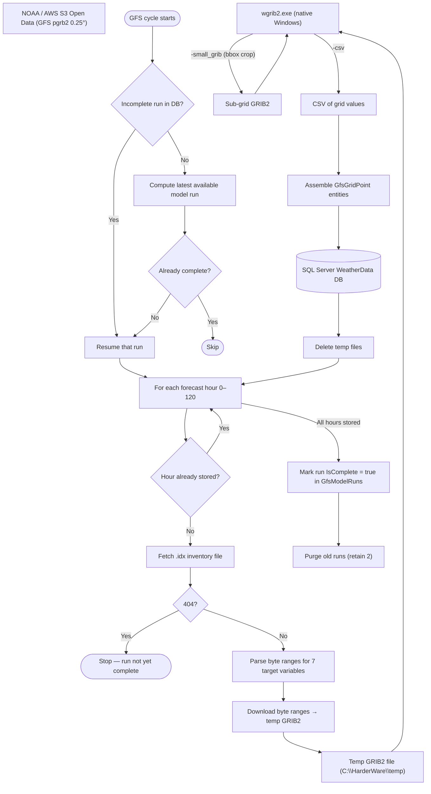
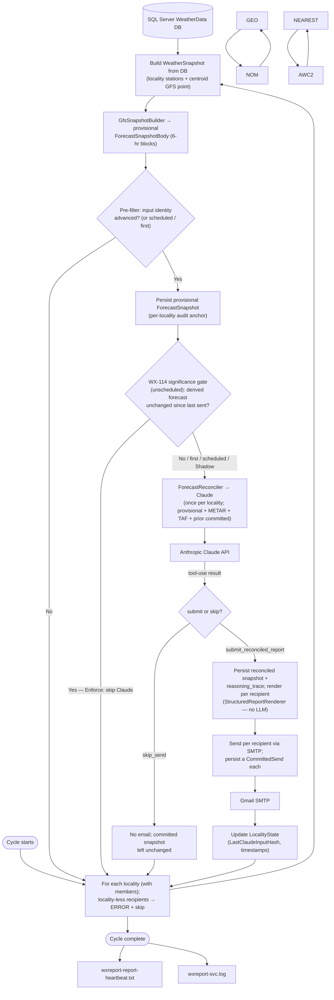
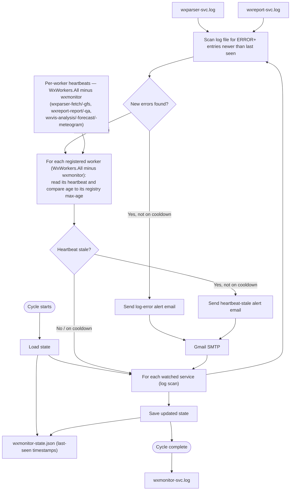
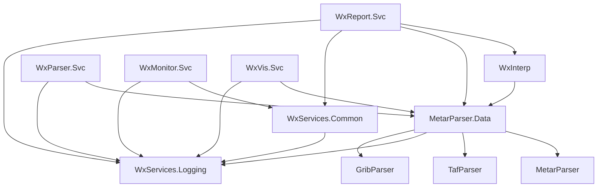

# WxServices System — Design Document

**Living document.** Update this file whenever the code changes in a meaningful way.

---

> **Viewing this document with diagrams**
>
> The architecture diagrams in this file are written in [Mermaid](https://mermaid.js.org/) and must be rendered to be readable. Raw Markdown shows them as fenced code blocks.
>
> **One-time setup in VS Code:**
> 1. Open the Extensions panel — **Ctrl+Shift+X**
> 2. Search for **Markdown Preview Mermaid Support**
> 3. Install the extension by **Matt Bierner**
>
> **Viewing the rendered document:**
> - **Ctrl+Shift+V** — opens a rendered preview in a new tab
> - **Ctrl+K V** — opens the rendered preview side-by-side with the source
>
> The preview updates automatically as you edit the source.

---

## Table of Contents

1. [Purpose](#1-purpose)
2. [System Architecture](#2-system-architecture)
3. [Solution Structure](#3-solution-structure)
4. [Service Details](#4-service-details)
   - [WxParser.Svc — Data Fetcher](#41-wxparsersvc--data-fetcher)
   - [WxReport.Svc — Report Generator](#42-wxreportsvc--report-generator)
   - [WxVis.Svc — Map Renderer](#43-wxvissvc--map-renderer)
   - [WxVis — Python Visualisation](#44-wxvis--python-visualisation)
   - [WxMonitor.Svc — Health Monitor](#45-wxmonitorsvc--health-monitor)
   - [WxViewer — Desktop Map Viewer](#46-wxviewer--desktop-map-viewer)
   - [WxManager — Management GUI](#47-wxmanager--management-gui)
5. [Class Libraries](#5-class-libraries)
6. [Data Model](#6-data-model)
7. [Configuration Guide](#7-configuration-guide)
8. [External Dependencies](#8-external-dependencies)
9. [Installation and Deployment](#9-installation-and-deployment)
10. [Known Limitations and Future Work](#10-known-limitations-and-future-work)
11. [Observability](#11-observability)

---

## 1. Purpose

WxServices is a set of headless services (four Linux containers — see *Containerized deployment (WX-7)*) that:

- Periodically fetch METAR and TAF aviation weather reports from the Aviation Weather Center API and store them in a local SQL Server database.
- Download GFS numerical weather prediction model data from NOAA (via the AWS Open Data mirror) and extract gridded medium-range forecasts covering temperature, wind, cloud cover, precipitation rate, and convective energy (CAPE) for the configured region.
- Generate friendly, plain-English (or other language) weather summaries using Anthropic's Claude AI and email them to a configured list of recipients.
- Render weather visualisation maps (synoptic analysis, GFS forecast parameter maps, and per-recipient meteograms) automatically via WxVis.Svc, which invokes the WxVis Python project after each data cycle.
- Embed a 48-hour meteogram in each recipient's weather report email and attach full-period meteograms to the WxViewer Meteograms tab.
- Provide a local WPF desktop viewer (WxViewer) for browsing and animating the generated maps and meteograms side-by-side.
- Monitor the health of the above services and send alert emails if errors occur or a service goes silent.
- Provide a local WPF management GUI (WxManager) for adding and editing recipients and sending operator service announcements to all subscribers.

Recipients each have their own location. The system automatically resolves the nearest METAR and TAF reporting stations for each recipient on first run and caches the result. Daily reports are sent at each recipient's configured local time; additional reports are triggered by significant weather changes.

---

## 2. System Architecture

### 2.1 Overview

Four headless services share a log directory and a SQL Server database: WxParser.Svc feeds the database, WxReport.Svc reads from it, WxMonitor.Svc watches both, and WxVis.Svc renders maps from it. All four run as Linux containers (see *Containerized deployment (WX-7)*).



---

### 2.2 WxParser.Svc — METAR/TAF data flow



---

### 2.3 WxParser.Svc — GFS data flow

Runs on a separate timer (default: every 60 minutes).



---

### 2.4 WxReport.Svc — data flow



---

### 2.5 WxMonitor.Svc — data flow



---

## 3. Solution Structure

```
WxServices/
├── DESIGN.md                        ← this file
├── WxServices.sln
├── Directory.Build.props            ← single product version (e.g. 1.51.0) applied to all assemblies
├── appsettings.shared.json          ← single source of truth for all config (InstallRoot, DB, SMTP, Claude, WxVis, Monitor, etc.) — git-tracked
├── Deploy-WxService.ps1             ← PowerShell deploy script (run as Administrator)
├── wgrib2/                          ← runtime-installed, not in repo; operator downloads NOAA native Windows build here
│   ├── wgrib2.exe                   ← Cygwin-compiled NOAA build; path derived from InstallRoot via WxPaths.Wgrib2DefaultPath
│   └── cygwin1.dll                  ← required alongside wgrib2.exe
└── src/
    ├── MetarParser/                 ← METAR text parser library
    ├── TafParser/                   ← TAF text parser library
    ├── GribParser/                  ← wgrib2 subprocess wrapper; CSV parser → GribValue records
    ├── MetarParser.Data/            ← EF Core entities, fetchers, DB context, geocoders, DatabaseSetup
    ├── WxServices.Logging/          ← log4net wrapper (static Logger class)
    ├── WxServices.Common/           ← shared utilities (WxPaths, SmtpSender, SmtpConfig, Util)
    ├── WxInterp/                    ← snapshot interpreter (METAR+TAF+GFS → WeatherSnapshot)
    ├── WxParser.Svc/                ← container: periodic METAR/TAF + GFS fetch
    ├── WxReport.Svc/                ← container: report generation and email
    ├── WxMonitor.Svc/               ← container: log and heartbeat monitoring
    ├── WxVis.Svc/                   ← container: automated map rendering
    ├── WxViewer/                    ← WPF desktop app: animated weather map viewer
    ├── WxManager/                   ← WPF management GUI: recipient editor + announcement sender
    └── WxVis/                       ← Python visualisation project (conda env: wxvis)
        ├── db.py                    ← SQLAlchemy engine + data loading queries
        ├── synoptic_map.py          ← Synoptic analysis maps (Barnes interpolation)
        ├── forecast_map.py          ← GFS forecast parameter maps (contour lines)
        ├── config.json              ← DB connection string + output directory (standalone fallback; service passes env vars)
        └── requirements.txt         ← conda install list
tests/
    ├── MetarParser.Tests/
    ├── TafParser.Tests/
    ├── WxInterp.Tests/
    └── WxMonitor.Tests/
```

WxVis is a standalone Python project; it has no build-time dependency on the C# projects. It reads directly from the same SQL Server database using SQLAlchemy + pyodbc (Windows Authentication).

### Project dependency graph



---

## 4. Service Details

### 4.1 WxParser.Svc — Data Fetcher

**Purpose:** Keep the local database populated with current METAR, TAF, and GFS forecast data.

**METAR/TAF cycle (default: every 10 minutes):**
1. Resolve home coordinates from config (`HomeLatitude`, `HomeLongitude`). If absent, look up via `AirportLocator` using `HomeIcao` and cache to `appsettings.local.json`.
2. Resolve the **observation fetch geometry** (WX-140): the configured wide region (`Fetch:ObsRegion*` when set, else `Fetch:Region*` — the CONUS bounds the **WxVis synoptic analysis map's METAR feed requires** — else `Home ± BoundingBoxDegrees`), plus one small box (`± LocalityBoxDegrees`, default 2°) around every locality centroid and locality-less recipient (`ObsFetchPlanner`), containment-deduplicated. The AWC data API **silently truncates** oversized bbox responses at ~550–600 reports (the Watonga/KEND incident), so each seed box is fetched with **adaptive splitting**: any box whose response reaches the cap threshold (`MetarFetcher.AwcCapSuspicionThreshold`) is split into quadrants and refetched recursively (bounded depth) — the region self-tiles to whatever density the cap demands, restoring full-station coverage that the single capped query never had. `Fetch:Region*` is also consumed by the GFS fetch.
3. Fetch METARs per the split geometry; fetch the home ICAO by ID and every `WxStations.AlwaysFetchDirect` station in **batched** `ids=` calls.
4. **Station gap fill (WX-140, `StationGapFiller` — shared with WxManager's save flow, WX-141):** AWC omits individual stations from bbox results even when boxes are small (the long-standing reason `AlwaysFetchDirect` exists). Every defined station within the fallback radius (`StationCoverage.MaxFallbackDistanceKm`, shared with `WxInterpreter`) of a locality centroid or locality-less recipient — plus every station named by a locality/recipient `MetarIcao`, regardless of distance — is checked for an observation within `StationCoverage.FreshObservationWindow`; gaps are direct-fetched in batched `ids=` calls **over that same window**. A gap station whose returned observation is old enough that the bbox pass should have carried it (and not a just-published timing race) is **automatically promoted to `AlwaysFetchDirect`**; silent stations back off for several hours between retries instead of refetching every cycle.
5. Fetch TAFs per the same split geometry, then every TAF station referenced by a locality or recipient in a **batched** `ids=` call (the by-station TAF rescue path, WX-140).
6. Insert new records (unique index on station + observation time + report type). The AWC feed can carry the same observation more than once in a single response — some stations (e.g. KJXI) are re-served byte-for-byte ~3× — and a correction (`COR`) shares its key with the observation it amends, so the insert is **reconciled by correction rank** rather than a plain skip-if-present (WX-210): duplicates within one response collapse to a single survivor (a `COR` beats a non-`COR` regardless of feed order); against the stored row, a new observation is **inserted** if absent, a later-arriving `COR` **overwrites** the stored uncorrected row in place (same primary key; child sky/weather/RVR rows replaced), a stored `COR` is **never** clobbered by a later non-`COR`, and an identical re-arrival is skipped. The batch is one transaction; on a row-level fault the inserts are retried one-per-context so a single bad row cannot discard the co-batched rows. Repeated identical METAR parse failures (e.g. a structurally malformed automated feed) WARN once and DEBUG thereafter.
7. Write the current UTC timestamp to `wxparser-fetch-heartbeat.txt` (the FetchWorker's per-worker heartbeat, WX-68).

**GFS cycle (default: every 60 minutes):**
1. Check for any incomplete model run registered in `GfsModelRuns`. If one exists, resume it; otherwise compute the most recent GFS cycle (00Z/06Z/12Z/18Z) that should be available on NOMADS.
2. For each forecast hour 0–120 not yet stored, fetch the `.idx` inventory file for that hour. A 404 means the run is still being computed — stop and resume next cycle.
3. Download byte-range HTTP requests for the 8 target variables (TMP, SPFH, UGRD, VGRD, PRATE, TCDC, CAPE, PRMSL) and concatenate them into a temporary GRIB2 file.
4. Invoke `wgrib2.exe` (NOAA native Windows build) to crop to the configured fetch region and emit a CSV of grid values.
5. Assemble `GfsGridPoint` entities (applying unit conversions) and insert into `GfsGrid`.
6. When all 121 hours are stored, mark the run `IsComplete = true` and purge old runs (retaining the 2 most recent).
7. Write the current UTC timestamp to `wxparser-gfs-heartbeat.txt` (the GfsFetchWorker's per-worker heartbeat, WX-68 — it beats on every loop iteration, not only when a run completes).

**Airport metadata refresh cycle (once per week, and on first startup):**
1. Download `airports.csv`, `countries.csv`, and `regions.csv` from OurAirports (`https://davidmegginson.github.io/ourairports-data/`), decoded as UTF-8.
2. Build in-memory lookups from `countries.csv` (alpha-2 code → short name) and `regions.csv` (full ISO 3166-2 code → region name).
3. Parse `airports.csv`; skip rows where `icao_code` and `ident` are both blank, and skip any identifier not exactly 4 characters long.
4. Upsert all valid rows into `WxStations`: update existing rows with properly-cased `Name`, `Municipality`, country fields (`Country`, `CountryCode`, `CountryAbbr`), and region fields (`Region`, `RegionCode`, `RegionAbbr`); insert new rows for airports not yet seen. Coordinates and elevation are refreshed from OurAirports data.

**Metrics emitted (OpenTelemetry):**

| Metric | Type | Description |
|---|---|---|
| `wxparser.fetch.cycles.total` | Counter | Incremented on each successful METAR/TAF fetch cycle |
| `wxparser.fetch.cycle.duration.seconds` | Histogram | Wall-clock duration of each METAR/TAF fetch cycle (buckets: 1 2 5 10 20 30 60 120 s) |
| `wxparser.gfs.cycles.total` | Counter | Incremented on each successful GFS fetch cycle |
| `wxparser.gfs.failures.total` | Counter | Incremented on each failed GFS fetch cycle |
| `wxparser.gfs.cycle.duration.seconds` | Histogram | Wall-clock duration of each GFS fetch cycle (buckets: 30 60 120 300 600 900 1800 s) |

See [Section 11 — Observability](#11-observability) for the collection stack.

**Key classes:**
| Class | Location | Role |
|---|---|---|
| `FetchWorker` | WxParser.Svc | `BackgroundService`; owns the METAR/TAF, GFS, and airport-refresh cycles |
| `MetarFetcher` | MetarParser.Data | AWC API call → parse → insert METARs |
| `TafFetcher` | MetarParser.Data | AWC API call → parse → insert TAFs |
| `GfsFetcher` | MetarParser.Data | NOMADS byte-range download → wgrib2 → insert GfsGridPoints |
| `AirportDataImporter` | MetarParser.Data | Downloads OurAirports CSVs; upserts `WxStations` with names, municipalities, coordinates, and country/region fields |
| `GribExtractor` | GribParser | wgrib2 subprocess wrapper; parses CSV output into `GribValue` records |
| `MetarParser` | MetarParser | Parses raw METAR text into structured objects |
| `TafParser` | TafParser | Parses raw TAF text into structured objects |
| `AirportLocator` | MetarParser.Data | AWC API: resolves ICAO to lat/lon; finds nearest METAR/TAF stations by bounding box |
| `HttpFetchRetry` | MetarParser.Data | Extension method `GetStringWithRetryAsync` wrapping `HttpClient.GetStringAsync` with 3-attempt exponential-backoff retry (2 s → 4 s → 8 s) for transient upstream failures |

**Upstream-fetch error handling:** METAR, TAF, and GFS fetchers all call `HttpFetchRetry.GetStringWithRetryAsync`.  Transient failures (HTTP 5xx, 429, SSL/TLS handshake errors, network-level `IOException`, request-timeout `TaskCanceledException`) are retried up to three times with exponential backoff; each retry logs at `WARN`.  Only when all three attempts have failed does the caller's catch block log at `ERROR`, which is also the point at which WxMonitor's alert pipeline (see WX-25) would escalate.  Permanent failures (4xx other than 429) throw immediately without retry so caller-specific handling still applies — notably `GfsFetcher`'s treatment of HTTP 404/301/302 as "forecast hour not yet published, stop the loop."

---

### 4.2 WxReport.Svc — Report Generator

**Purpose:** Generate personalized weather reports for each recipient and deliver them by email.

**Cycle (default: every 5 minutes):**

```mermaid
flowchart TD
    A[Load config] --> B{Recipients configured?}
    B -->|No| Z[Done]
    B -->|Yes| C["For each locality (with members);\nlocality-less recipients → ERROR + skip"]
    C --> G[Build WeatherSnapshot\nlocality stations + centroid GFS point]
    G --> G2[GfsSnapshotBuilder → provisional ForecastSnapshotBody]
    G2 --> H{Pre-filter: input identity advanced?\nor scheduled / first?}
    H -->|No| C
    H -->|Yes| W[Persist provisional ForecastSnapshot\nper-locality audit anchor]
    W --> SG{WX-114 significance gate: derived forecast unchanged\nsince last sent? (unscheduled only)}
    SG -->|Yes, Enforce - skip Claude| C
    SG -->|No / first / scheduled / Shadow| J[ForecastReconciler → Claude\nonce per locality]
    J --> I{submit or skip?}
    I -->|skip_send| C
    I -->|submit_reconciled_report| K[Persist reconciled snapshot + reasoning_trace]
    K --> KR[For each member: render HTML\nStructuredReportRenderer — no LLM]
    KR --> K2[Attach 48h meteogram PNG if available]
    K2 --> L[Send per recipient; persist a CommittedSend each]
    L --> M[Update LocalityState in DB]
    M --> C
```

**Send-decision logic (WX-47 rearchitecture):**

The decision is split into a cheap deterministic gate followed by an LLM judgment. C# no longer judges *significance* — that responsibility moved entirely into Claude's reasoning. (The retired fingerprint approach judged significance in C# and produced the 2026-04-21 KDWH double-send.)

- **First run / startup:** Immediately sends a welcome + weather report. Bypasses the pre-filter.
- **Scheduled:** Sends once per configured hour when that hour arrives in the recipient's local timezone. Multiple hours can be specified (e.g. `"6, 18"` for morning and evening); default is `"7"`. Bypasses the pre-filter. Subject line: "Weather report — …".
- **Unified input-identity pre-filter (WX-80, refined WX-110):** For non-scheduled, non-first cycles, `ReportWorker.ShouldSend` asks a single cheap C# question — *has any input identity advanced since the last Claude call?* The input identity (`InputIdentity`) is the METAR material signature, the TAF issuance time, and the GFS model run, serialized into `LocalityState.LastClaudeInputHash` (per locality since WX-130). The METAR component (WX-110) is no longer the raw observation timestamp but a coarse **material** signature — station plus public-meaningful bands: wind (under 17 / 17–33 / 34–47 / 48–63 / 64+ kt, matching `WindScale`), visibility (<1 mi vs ≥1 mi), sky (clear / partly / mostly / overcast), ~5 °F temperature bands, and present-weather tokens (with a `heavy`-intensity marker) — so a meteorologically-identical hourly re-observation produces the same identity and is skipped without paying for a Claude call (the dominant cost leak: metar-only arrivals were ~62% of gate calls). This is still identity, not significance — it never decides whether to *send*, only whether the evidence is materially what Claude already saw; TAF and GFS still key on issuance/run time, so genuinely new guidance always reaches the gate. There is no significance threshold in this gate. A minimum gap (`Report:MinGapMinutes`, default **90** since WX-110) floors the spacing between any two sends for one locality (WX-130).
- **Deterministic significance gate (WX-114, cost pre-filter):** A *second* deterministic stage between the WX-80 input-identity pre-filter and the Claude call — active only on non-scheduled, non-first cycles, and only when a prior *sent* snapshot exists. `SignificanceGate.Evaluate` compares the current deterministic forecast — the GFS provisional with the parsed TAF overlaid (the GFS+TAF merge, WX-160; detailed below) — against the last sent forecast (what the recipient last saw); when nothing has changed materially it **skips the Claude call entirely**. The input identity advanced (so the cheap WX-80 pre-filter let the cycle through), but the *derived forecast* did not, so there is nothing for Claude to judge — and that skipped call is the cost saving. It compares per local calendar day (daily high/low magnitude, a **directional** freeze/thaw at 32 °F — a freeze when the low falls strictly below 32, a thaw when it rises strictly above, with 32 itself staying in the prior state per the latent-heat dead band — and a heat-advisory crossing) and per 6-hour block (precipitation occurrence and frozen/freezing *type*, severe-flag, and sustained-wind advisory + magnitude), across four horizon tiers (0–24 / 24–48 / 48–72 / 72–120 h, thresholds loosening with range; day 6 is narrative-only and never gates). Onsets are eager and reach the far horizon; cessations are lazy and near-term-only; safety-floor rows (freeze onset, frozen-precip onset, severe onset, wind reaching advisory) always pass. Thresholds are config-driven (`Report:SignificanceGate`) and the gate has a three-state `Mode` — `Off` (never evaluated), `Shadow` (evaluated and logged but always falls through to Claude, for safe validation against real traffic), and `Enforce` (skips the Claude call on "not significant") — defaulting to **`Enforce`** so the cost saving is live and measurable; skips are counted by mode. Crucially it can only *suppress* a Claude call, never force a send, and it errs toward calling Claude on every boundary case — a wrongly-skipped real update is the only failure mode, so the gate is conservative by construction. Because the provisional snapshot is built from GFS alone, the gate was originally **blind to TAF** and took a blanket shortcut — any fresh/amended TAF since the last send was presumed significant (`taf-fresh`) and routed to Claude. TAFs reissue routinely, so that shortcut barely filtered (one day's enforce data: 81% of the cycles admitted to Claude were `taf-fresh`, and 69% of all Claude calls returned "not news"). **WX-160** retired it by giving the gate an honest input instead of a bypass: `TafBlockProjector` deterministically overlays the parsed TAF onto the GFS provisional (the TAF prevails within its validity window, matching the reconciler and therefore the stored baseline's provenance), and the gate evaluates that **GFS+TAF merged** body with the *same* threshold table — no new criteria. A fresh TAF that moves no sustained-wind band, adds no precipitation, and crosses no advisory is now suppressed deterministically; only a real TAF-driven change reaches Claude. Wind in the merge — and in every gate decision — is **sustained only**; a gust enters a gate decision solely through the severe rule (a wind ≥ 50 kt, sustained *or* gust, is severe by definition, so it rides the existing `severeFlag` criterion). To keep the comparison apples-to-apples, the reconciler now pins Claude's `windKt` to sustained wind via `ValidateWindKtSustained` — a `windKt.max` above every sustained source for the block is a folded gust, rejected and replayed with feedback — so the stored baseline the gate compares against is itself sustained (gust stays in the narrative `{q:gust}` token). Skips are counted (`wxreport.suppressed.significance_gate.total`). Wind-direction-shift (deferred to WX-111) and precip-intensity rows are out of v1 — neither has a snapshot field yet.
- **Claude two-pass reconciliation (WX-79):** When an input has advanced, `ForecastReconciler.ReconcileAsync` sends Claude the provisional snapshot (from `GfsSnapshotBuilder`), the current METAR, the current TAF, and the prior committed snapshot — **once per locality, recipient-agnostically** (WX-130) — and asks it to reconcile them and decide whether the change is *news*. Claude responds via tool-use with either:
  - `submit_reconciled_report` — a refined `final_snapshot`, a unit-neutral `structured_report` (WX-128), and a `reasoning_trace`; the structured report is then rendered per recipient and sent (no `email_body` artifact — WX-130).
  - `skip_send` — a `reasoning_trace` only; no email is sent (the WX-80 invalidation gate).
- **Unit-neutral structured report (WX-128, live since WX-130):** The reconciliation's rendered artifact is a `StructuredReportBody` (schema: `docs/structured-report-schema.md`): a language-free, salience-ranked `changes` array (tier / phenomenon / direction / UTC window / canonical-unit quantities / `chN` anchor) — **the `changes` array was LLM-authored and `chN`-anchored as described here only through WX-130; WX-189 (below) retired both, computing `changes` deterministically after the call and forbidding anchors** — plus a `narrative` map keyed by ISO 639-1 code — one entry per language among the locality's recipients — whose prose carries quantities only as `{q:...}` substitution tokens and which slimmed (WX-130) to the two **judgment** sections, `changeSummary` and `closing` (the Current Conditions table and per-day grid are rebuilt deterministically from the data, so they carry no narrative prose). There is **no `email_body`**: the WX-129 deterministic renderer (`StructuredReportRenderer`) turns the structured report into each recipient's HTML — units, locale, language, plus the station-attribution subtitle — with **no further LLM call**, which is what makes WX-123's one-call-per-locality economics work. (A recipient's first contact is a separate **welcome-only email** — `RenderWelcome` — with no weather; weather reports begin on the locality's normal cadence.) As the **live rendering source** the structured report validates **fail-closed** (WX-130, after a brief WX-144 window where it was dormant/non-fatal): intrinsic invariants in `StructuredReportBody.Validate` (token grammar via `ReportTokens`; pre-WX-189, every change narrated in every language's `changeSummary` with no dangling anchors — that anchor-correspondence invariant is retired with the `chN` scheme (WX-189 below)) plus per-call contracts in the reconciler (the exact requested-language set, no more no less) route a failure through the same retry → skip/`Failure` path as a schema-invalid `final_snapshot`; a well-formed-but-near-blank narrative trips the WX-120 fall-safe (skip-with-trace on an `allowSkip` cycle, `Failure` on a guaranteed send). The artifact is persisted per recipient to `CommittedSends.StructuredReport`. Schema versions move in lockstep: `ForecastSnapshotBody` and `StructuredReportBody` both sit at **v4**. **Narrative ↔ snapshot consistency (WX-148):** because the change narrative and the deterministic day-grid are two views of the same call with nothing else reconciling them, `ForecastReconciler.ValidateChangeSnapshotConsistency` fails closed when a change `window` is off the 6-hour block grid (00/06/12/18Z — forbidding sub-block precision finer than the blocks support) or when appearing/strengthening precip is not backed by a `final_snapshot` block carrying it in-window; these route through the retry path, and the retry now **feeds the specific failure back to Claude** as a `tool_result` (a continuation, not a blind resample; the cached prompt prefix is preserved). When retries exhaust but the snapshot parsed cleanly, the reconciler returns **`ReconcileResult.Degraded`** rather than `Failure`: `ReportWorker` then sends a **narrative-less hazard report** (deterministic banner + conditions + grid, summary omitted) on a safety-critical forecast — a severe block within the next **~36 h** (`DegradeHazardHorizon`, deliberately its own constant rather than a `SignificanceGate` tier edge) — and otherwise self-heals next cycle, so a hazard is never withheld over a prose fault. **Prose hygiene (WX-149):** layered on the same scaffold, three further fail-closed assertions catch reader-facing faults the schema can't see. The consistency check gains (a) a **phantom-phenomenon** guard — already covered for appearing/strengthening precip by WX-148's phenomenon match — and (b) a **tier over-escalation** guard: a `safety`-tier change must be backed by a block in its window carrying a safety-grade signal (`severeFlag`, freezing precip or snow, or sustained wind ≥ 34 kt). Because `severeFlag` is narrow (severe convection or wind ≥ 50 kt per `WxThresholds.SevereWindKt`), the backing set is deliberately wider than `severeFlag` alone, and phenomena the snapshot can't encode — fog/haze/smoke/dust (no block field) and temperature (no threshold) — are exempt and lean on the prompt rule. A new `ValidateProseHygiene` pass over the narrative prose adds (c) a **raw-UTC-leak** guard (internal 6-hour-grid shorthand like `12-18Z` must never reach the reader; `{q:time}` tokens are stripped first so a token's own trailing `Z` isn't mistaken for the leak) and a **prose time-word ↔ `{q:time}` agreement** check: each token's local hour is bucketed into a day part (mirroring `StructuredReportRenderer.PartOf`) and compared against the nearest *unambiguous* day-part word in the same sentence — only a clear contradiction rejects, so genuinely ambiguous words (English "tonight"; Spanish "mañana"/"tarde"/"noche") and Spanish prose broadly fall to the prompt rule (documented residual). All four route through the same retry-with-feedback → tier-aware degrade path. **Prior-aware change verification (WX-151):** the checks above compared a change only against the *new* snapshot, so a change identical in the prior and new forecasts — a *fabricated* "what's changed" with no real movement — passed (send 1977 narrated a storm downgrade and a rain onset over a cycle whose only difference from the prior was sky-cover wobble). `ValidateChangeSnapshotConsistency` now also receives the **prior** committed snapshot and rejects any change that is not a genuine prior→new difference of its claimed direction in its window: appearing/strengthening requires the in-window precip expectation to exceed the prior's (or `severeFlag` to rise), weakening/clearing requires it to fall (or severe to drop) — generalizing and subsuming WX-148's new-only backing, with `severeFlag` a first-class strength axis (a flat-expectation severe escalation still counts) and a standalone `Severe` phenomenon compared on `severeFlag` alone. It covers precipitation phenomena and severe; wind/temperature/fog stay prompt-governed. A companion `ValidateAnchoredProseTiming` extends the day-part check from `{q:time}` tokens to `{chN}`-anchored sentences — a change's narrated day-part words must fall in its window's local buckets — rejecting only when a sentence's day-part words *all* miss the window and skipping words pinned to another day ("Friday evening"). The prompt is told that only a real prior→new difference is news, and that sky-cover wobble and sub-band wind drift are not. **Closing-claim validation (WX-152):** the **closing** ("In summary:") paragraph was the one narrative section nothing reconciled against the snapshot — the consistency check works on `changes[]`, the prose checks on the `changeSummary` band — so it could assert a precipitation/storm *event* the blocks don't carry (send 1995 closed with a "chance of a storm tonight" while the snapshot was dry every block from that evening on; the lone storm sat in an afternoon block). `ValidateClosingClaims` reads each closing sentence and rejects one that **asserts** a precip/storm phenomenon (not negated) at a resolvable local time — `tonight`/`today`/`tomorrow`/this-`morning`/`afternoon`/`evening`, resolved against the first block's local day — whose snapshot blocks are *all dry*. It is conservative: negated ("stays dry", "no rain expected"), un-timed ("any storm that develops"), weekday-pinned, and beyond-horizon references are skipped and lean on the prompt (precip-vs-dry only — a wrong-phenomenon claim at a wet time isn't caught). This is distinct from WX-139's ban on synoptic *mechanisms* (fronts) the schema can't represent: here the schema *can* carry the event and the blocks contradict it. The prompt's closing rule says to summarize only weather the blocks support, at the time they place it, and that calling a period dry or quiet is always fine.  **Scheduled change-band gating (WX-178):** the "What's changed" band is a report-type signal — a band on a *scheduled* report reads as an unscheduled update (the WX-153 founding defect; send 2285 carried one for an ordinary rain→thunderstorm upgrade). A scheduled report now carries the band **only** for a newly-appearing **near-term severe** hazard: a block going `severeFlag` false→true versus the prior committed snapshot within **local Day 1-3** (today through the day after tomorrow). `ReportWorker.SuppressesScheduledChangeBand` decides this deterministically — reusing `ForecastSnapshotBody.HasSevereEscalationOver` with a local-Day-4 UTC cutoff overload — and strips the band via `WithoutChangeBand` on the scheduled send path when no such onset exists (WX-193 extends the identical strip to **diagnostic** deploy-verification sends, which had fallen through unstripped — the band became deterministic-fallback-driven once WX-189 moved detection into code, so a non-severe diagnostic surfaced an unwanted band). It is a **post-reconcile** strip, so the LLM still runs and any severe still surfaces in the per-day grid, the WX-156 subject, and the closing; the reconciler's scheduled-report prompt is aligned to emit a band only for that case (empty `changes` + null `changeSummary` otherwise), so the strip is usually a no-op rather than a correction. The Day 1-3 horizon is deliberately its own thing, not the ~36 h `DegradeHazardHorizon` (which governs sending a narrative-less hazard alert *now*). Unscheduled updates are unchanged — they keep narrating material non-severe change.
- **Deterministic change detection (WX-189):** the `changes` array is no longer LLM-authored. Claude returns only `final_snapshot` + the two narrative sections (`changeSummary`, `closing`); **`DeterministicChangeDetector`** computes `changes[]` from (prior committed snapshot, reconciled `final_snapshot`) **after** the call and the reconciler injects it — the generative inverse of `ValidateChangeSnapshotConsistency`, so a structural phantom is impossible by construction (this supersedes the LLM-authored-`changes` / `chN`-anchor description above, including the "every change narrated, no dangling anchors" invariant). Coverage: precipitation ×5 + standalone severe by inverting the WX-148/151 oracle, and temperature + wind via the WX-160 significance-gate thresholds (freeze/thaw at 32 °F, heat-advisory, wind-advisory, per-tier magnitude); obscuration is excluded (the provisional never populates it, always `None`) and WindShift is the sole residual (→ WX-191). `changes` is dropped from the `submit_reconciled_report` tool schema and `{chN}` anchoring is retired — `StructuredReportBody.Validate` now **forbids** anchors in both prose sections, `ValidateAnchoredProseTiming` is deleted, and `ValidateChangeSnapshotConsistency` runs only as tautological defense-in-depth on the computed set (**WX-204:** that check backs a change **per block** — mirroring the detector, which classifies each block against its prior-by-`StartUtc` counterpart and groups consecutive same-direction blocks into one window — not by the window aggregate; a window-max comparison masked real interior-block rises and false-rejected them as a phantom "Strengthening", a recurring prod degrade. The net stays tautological with what the detector emits yet still rejects a change no block carries; and a computed-change rejection now degrades **without retrying** — Claude cannot fix a change it did not author, WX-205). Band presence stays deterministic by report kind (the WX-178 strip — scheduled *and diagnostic* (WX-193) none except a near-term severe onset; unscheduled always); when a band must show but Claude's `changeSummary` prose is rejected or absent, `StructuredReportRenderer` renders a terse, **day-anchored** localized fallback line from the computed changes, so a prose fault costs only Claude's flavor, not the report's information. A prose fault now throws `NarrativeProseException` carrying its section, whose retry feedback pins `final_snapshot` (re-author only the prose); the WX-152 precip-vs-dry guard now also covers the `changeSummary`. On retry exhaustion the fault degrades **only its own section** (independent-section degrade) — the `changeSummary` drops to null (→ the deterministic band fallback) and the `closing` to a short safe localized line — and the report still sends, so the band, per-day grid, and current conditions always ship; a wholesale narrative degrade now happens only when `final_snapshot` itself is unusable. With structural correctness no longer riding on sampling, `ReconcilerTemperature` is raised 0.25 → 0.5 so the prose breathes.
- **Approved-vocabulary glossary in the narrative (WX-238):** the free-composed `changeSummary`/`closing` prose free-generated target-language weather terms and could drift off the curated `LanguageTemplates` vocabulary (e.g. the Spanish narrative writing "llovizna engelante" for the approved "llovizna helada", or Danish "Isregn" for "frysende støvregn") — the structured body is token-substituted and immune, but the narrative bypassed it, so a reviewed term wasn't guaranteed to reach the reader. The reconciler now injects an **approved-vocabulary glossary** into its per-report (uncached) system block: for every requested narrative language **including English** (the English reference is anchored too, so the QA judge's back-translation baseline can't drift), the approved phrase for each concept in the new language-neutral **`PromptGlossaryTokens`** registry, rendered `english concept → «approved term»`; the cached guidance instructs the narrative to use the approved term and compose the sentence naturally around it. This is the token-substituted-vs-free-generated boundary made explicit: deterministic substitution carries the body, prompt-anchoring carries the genuinely-free narrative — chosen over lowering the temperature because sampling-temperature control is removed on Sonnet 5 / Opus 4.7+, so the anchoring must survive a model migration. Which concepts are anchored is **curatable data** (`PromptGlossaryTokens` seeds the phenomenon nouns — precip types, `storms`, `severe storms`/`severe weather` — plus the probability ladder `possible`/`likely`/`expected`; the fused likelihood composites the renderer uses, e.g. `rain_likely`, are deliberately excluded), validated against `Tok.All` fail-closed at load (a stale/renamed token is dropped with an ERROR). Because the deterministic renderer can't safely glue phrases across languages it keeps those atomic composites, but the free narrative — where Claude handles grammar — anchors on **phenomenon and probability as separated standalone vocabulary** (new `Tok` tokens seeded in every language), so it composes "severe storms are likely" from approved parts; the probability ladder tops out at `expected` (as certain as a forecast states). The prompt lets Claude render the approved wording's **root** in whatever form idiom requires — inflected for agreement, **compounded** with an adjacent word, or **derived into another part of speech** (e.g. an adverb) — and capitalized for position, but not swap in a synonym or force the dictionary/citation form (WX-258; e.g. en "Friday afternoon" → de "Freitagnachmittag" compounded, eo "vendrede posttagmeze" derived to adverbs).

  Malformed, incomplete, or truncated tool output — a missing or null required field, a schema-invalid `final_snapshot` or `structured_report`, or a response Claude could not finish within the output-token cap (`ClaudeClient` surfaces the response's `stop_reason`; a `max_tokens` truncation drops a trailing required field and is short-circuited before any field-presence check so the operator log names the truncation rather than a phantom missing field) — yields a typed `Failure`: no email is sent, the provisional `ForecastSnapshot` is left in place as a per-locality audit anchor (never delivered), and the next cycle reconciles a fresh provisional and self-heals. The reconciliation call is capped at 32768 output tokens (WX-109 set 16384 for three artifacts; WX-128 doubled it for the structured report's per-language narratives). A **non-truncation** malformed response — a complete tool_use that simply omits an advisory-`required` field (the residual WX-110 case where Claude drops a field even though `stop_reason != max_tokens`), or a **present-but-near-blank narrative** that passes the schema (`closing` is non-blank) but carries no real forecast prose (WX-120, carried into WX-130: a per-language visible-length floor, `MinVisibleNarrativeChars`, so a blank report is never rendered) — is retried in-cycle up to 3 attempts before failing (the cached system-prompt prefix keeps retries cheap); a `max_tokens` truncation and a guaranteed-send `skip_send` are not retried. A content-less narrative that persists across all attempts falls **safe**: on an `allowSkip` cycle it becomes a skip (`NotNews`, keeping Claude's reasoning trace, matching the model's own intent), on a guaranteed send a `Failure`.

  Significance-tier guidance (WX-81) steers the "is this news?" judgment **in the prompt**, not in C#: the safety-critical / plans-affecting / ambient-interest tiers, the directional-asymmetry rule (a worsening trend is more newsworthy than the equivalent improvement), and the 34 kt line. Subject-line and opening phrasing follow from Claude's reconciliation rather than a C#-classified severity.

**Significance judged against the committed forecast (not C# thresholds):**

Whether a change warrants an unscheduled *send* is judged by Claude, comparing the freshly reconciled snapshot against the last *committed* forecast (what we last told the recipient), steered by the WX-81 significance tiers in the prompt. The committed/anchor snapshot advances only on an actual send, so each reconciliation always diffs against "what the recipient last saw." The WX-114 deterministic significance gate reintroduced a C# threshold table, but it is strictly a **cost pre-filter that suppresses a Claude call** when the deterministic forecast has not changed since the last send — it never decides whether to send, and it can only withhold a call, never compel one. The send decision stays entirely with Claude.

**Damping over-sends on active weather (WX-108):**

On a busy weather day the inputs advance often (a fresh METAR every hour, a reissued TAF every hour or two), and each advance is, by design, send-eligible. Left unchecked that produced an hourly stream of updates whose severe-weather assessment could whipsaw on unchanged model guidance. Three layers keep that in check, the first two steering Claude's judgment and the third a deterministic safety net:

- **"Changed since last send" context.** `LocalityState.LastSentInputHash` records the input identity behind the locality's last *delivered* report — distinct from `LastClaudeInputHash`, which also advances on not-news skips and the suppressions below. The reconciler hands Claude `changed_since_last_sent_report`, naming which inputs are genuinely newer than at the last send; "observation only" means no fresh TAF or GFS run has arrived.
- **Anti-reversal prompting + default-to-skip decision rule (WX-110).** Severe potential and precip-likelihood upgrades derive from model/TAF guidance, not a single new observation. On an observation-only advance Claude is told not to reverse or re-escalate a `severeFlag` or precip tier it already committed, and not to re-send a forecast it merely re-derived — while still flagging genuinely new weather *arriving* (the directional-asymmetry rule). WX-110 adds an explicit default-to-skip rule for arrival-triggered cycles: call `submit_reconciled_report` only when the reconciled snapshot differs from the prior in a reader-actionable way (a sky or precipitation *category* change, a wind change crossing into a higher impact band, a more-than-a-few-degree temperature swing, or a hazard appearing/clearing). A fresh TAF or GFS issuance that reconciles to a materially-unchanged forecast is explicitly not news. (WX-114 dropped `gustOutlook` and `visibilityExpectation` from the snapshot block — body schema **v2** — so neither factors into change-detection or the `submit_reconciled_report` tool schema; older v1 bodies still deserialize, with the removed JSON keys ignored on read.)
- **Deterministic backstop.** After `submit_reconciled_report` on an unscheduled cycle, `ReportWorker` suppresses the send when the reconciled snapshot is materially identical to the last sent one (`ForecastSnapshotBody.MateriallyEquals` — categorical fields exact, temperature within tolerance, wind within tolerance **or in the same impact band** so trivial same-band drift is suppressed, WX-110), or when the only difference is a severe-flag **de-escalation** on an observation-only advance with no newer GFS run or TAF (`MateriallyEqualsIgnoringSevere` + `HasSevereEscalationOver` — severe-flag hysteresis). The hysteresis is one-directional: a severe hazard *appearing* (`severeFlag` false→true) is always news and is never suppressed, even on a bare observation — only an unsupported *removal* is held back. Suppressions persist the reasoning trace, leave the committed anchor unchanged, and are counted in telemetry (`wxreport.suppressed.redundant.total`, `wxreport.suppressed.severe_flip.total`). This is idempotence/stability, not significance judgment — Claude still owns the "is it news?" decision.

Independently, the email prose is calibrated never to state weather as flatly certain: even a `certain` precip expectation or a set `severeFlag` renders as strong likelihood ("almost certain", "highly likely", "expect"), never as a guarantee — no forecast is ever 100% sure.

**Deterministic temperature summary (WX-228, WX-230):** the closing's daytime-high and overnight-low figures are computed, not phrased by the LLM. Before the reconciler call, `TemperatureRangeSummarizer` characterizes the per-day highs and lows from the provisional snapshot into one or two ranges and hands Claude ready `{q:temp_range:lo:hi}` tokens — a grammar form carrying two canonical-°C endpoints, rendered as a single converted span ("97–99°F" / "36–37°C") with the renderer owning the unit conversion (raw °C carried through, rounded once per recipient unit so the span matches the Extended Forecast grid). It splits into an early/later pair only when the two halves' midpoints separate by ≥ 3 °C (≈ 5 °F), tie-breaking toward the tightest half; otherwise one range, the exact rounded min–max (a dead-flat run widened ±1 °C). Each daily extreme is gated on the band that holds it (WX-230): a day yields a HIGH only with its afternoon (local 12:00–18:00, peak-heating) block and a LOW only with a morning-half block (local hour < 12, where the dawn minimum sits), so a partial leading or trailing day — today before its afternoon, or the horizon's final pre-dawn-only day — cannot inject a bogus extreme (which had made a steady-heat week split off a phantom "cooldown"). The model places the span and frames any early/later split natively; this replaces the prompt's old ban on unit-specific decade idioms ("low 90s") for the temperature summary, and adds no LLM call.

**METAR station fallback (tiered):**
1. Try each ICAO in the recipient's `MetarIcao` list (comma-separated, preference order); a station is only accepted if its most recent observation is within the last 3 hours.
2. Fall back to the geographically nearest station within 50 km (≈30 statute miles) of the recipient's coordinates that has a METAR in the same 3-hour window. A lat/lon bounding box derived from the radius prefilters candidates; the haversine formula picks the true nearest and enforces the actual radius. Requires recipient coordinates; the fallback is disabled without them.
3. If no station qualifies but a TAF and/or GFS forecast are available, send a forecast-only report with a one-paragraph note in the Current Conditions section explaining that no recent observation is available from a station within ≈30 miles.
4. Only when METAR, TAF, and GFS are all unavailable is the recipient skipped for the cycle.

The config is never updated when a fallback station is used; a warning is logged with the fallback station's distance in miles.  When the station used differs from the one in `LocalityState.LastMetarIcao` (i.e. the station changed since the locality's last report), Claude is informed via the prompt and includes a brief, matter-of-fact note in the report — in the change-summary band for unscheduled sends, or in the closing summary for scheduled ones.  `LastMetarIcao` is updated on every successful send *that carried a real observation*; forecast-only sends leave it untouched so change-detection resumes cleanly once observations return.

Observation-less cycles are handled by the same input-identity pre-filter and Claude gate, with no special significance bookkeeping. When no recent observation is available, the METAR component of the input identity is simply absent, so an advance is driven only by the TAF issuance or GFS model run; the reconciler is given the snapshot without a current observation and decides whether the forecast-only change is news. Because there is no observation-to-observation fingerprint, a missing observation can no longer manufacture a misleading "conditions cleared!" send, and the committed forecast the reconciler diffs against advances only on an actual send (`LastSentInputHash` and the committed anchor; `LastClaudeInputHash` also advances on not-news/suppressed cycles, per the WX-108 section above) — so when observations return, the reconciler resumes diffing against the last genuinely committed forecast.

**Recipient resolution (one-time, cached):**
1. Geocode `Address` via Nominatim → lat/lon + locality name.
2. Query the database for METAR stations active within the last 3 hours; use the AWC bbox API to find the nearest station from that active set (falling back to the full API result on first run before local data exists).
3. Query the AWC TAF bbox API for the nearest TAF station. If none is found, store the sentinel value `"NONE"` to prevent repeated lookups.
4. Write lat, lon, `MetarIcao`, `TafIcao`, and `LocalityName` back to the `Recipients` database table.

**Key classes:**
| Class | Location | Role |
|---|---|---|
| `ReportWorker` | WxReport.Svc | `BackgroundService`; owns the report loop |
| `RecipientResolver` | WxReport.Svc | Address geocoding and station resolution; cache write-back; retries geocoding up to 3× |
| `WxInterpreter` | WxInterp | Queries DB → `WeatherSnapshot` (METAR + TAF + GFS); station fallback logic |
| `GfsInterpreter` | WxInterp | Bilinear interpolation over the four surrounding 0.25° GFS grid points → `GfsForecast` |
| `GfsSnapshotBuilder` | WxInterp | Deterministically projects the GFS forecast into a provisional `ForecastSnapshotBody` (uniform 6-hour blocks aligned to 00/06/12/18Z) — the "first pass" Claude reconciles against the observations |
| `SignificanceGate` | WxReport.Svc | WX-114 deterministic **cost pre-filter**: compares the current provisional snapshot against the last *sent* forecast and reports whether anything changed materially (per local day: high/low magnitude, directional freeze/thaw at 32 °F, heat crossing; per 6-hour block: precip occurrence/type, severe flag, sustained-wind advisory + magnitude — across four horizon tiers). `ReportWorker` skips the Claude call when nothing fires. TAF-aware (WX-160): the evaluated "current" is a GFS+TAF merge (`TafBlockProjector`), so a fresh TAF that moves nothing material is suppressed deterministically instead of bypassing the gate via the retired `taf-fresh` shortcut. Wind is sustained-only; a gust gates only through the 50-kt severe rule. Suppress-only and mode-controlled (`Report:SignificanceGate:Mode` — Off / Shadow / Enforce, default **Enforce**); never decides sends |
| `ForecastReconciler` | WxReport.Svc | Orchestrates the Claude two-pass reconciliation (WX-79): sends the provisional snapshot + current METAR + current TAF + prior committed snapshot, and returns Claude's tool-use decision — `submit_reconciled_report` (email body + refined snapshot + reasoning trace) or `skip_send` (reasoning trace only) |
| `SnapshotDescriber` | WxReport.Svc | `WeatherSnapshot` → structured plain-text used by `ForecastReconciler` to render Claude's user message; unit-aware (temperature, pressure, wind speed); outputs relative humidity (computed from temperature and dew point) rather than raw dew point |
| `StructuredReportRenderer` | WxReport.Svc | WX-129 deterministic renderer: turns the unit-neutral `StructuredReportBody` (WX-128) into one recipient's HTML body with **no LLM call** — Current Conditions table rebuilt from the observation, Extended Forecast grid (one row per local calendar day) from the reconciled snapshot, change-band + closing from the language narrative with `{q:...}` tokens substituted into the recipient's units/locale/precip unit (WX-142). The per-day Conditions cell tiles the day into 24-hour **clock bands** (WX-190 — the four native 6-hour blocks `00-06`/`06-12`/`12-18`/`18-24`, adjacent same-condition bands merged, a uniform day collapsed to a single `00-24` line, severe bands emphasized and bound to their calendar day by the row date plus clock range; a legend beneath the grid keys the clock), and `RenderDegraded` produces the narrative-less hazard report for the WX-148 degrade path. Built + unit-tested; wired into the send path by WX-130. Deterministic chrome (labels, sky/weather/visibility/conditions words) is **localized via the DB** (WX-171): the renderer takes a `(TemplateSet, CultureInfo)` resolved per language from the `LanguageTemplates` table and resolves every grammar-sensitive combination as a single **atomic token** through the `Tok.*` contract (`rain_freezing`, `sev_storms_likely`, `sky_overcast_low`, …) — it never concatenates two vocabulary items, so other languages need no English word order (fixing the latent es "Helada lluvia" → "Lluvia helada", WX-174). The hard-coded `ReportVocabulary` is gone; the DB is the sole phrase source. Fail-closed in depth: a build-time `Tok`↔seed parity gate, a startup completeness check (ERROR → WxMonitor on any incomplete language), and a per-recipient send gate (an incomplete language fails *its* recipients closed; no silent English substitution). **Soft tokens (WX-256):** the noon/midnight time words are a `Tok.Soft` class — cosmetic tokens (`CultureInfo` has no noon/midnight designator, so the truth lives in the DB, en-seeded + top-up-generated) subtracted from the suppression set (`Tok.Required = Tok.All − Tok.Soft`); the two send gates and the startup completeness check key on `Tok.Required`, so a language missing *only* soft tokens still sends (the renderer degrades via `TemplateSet.Has` to the culture 12-hour form) while every hazard token stays hard fail-closed — a severity-tiered failure model in which softness is an explicit opt-in (a token is required unless listed). The word is chosen from the local `DateTime` hour/minute (never a formatted string — 24-hour locales carry empty AM/PM designators) in two contexts: an **event** time (obs line, `{q:time}` prose, subject) renders the bare noon word and keeps midnight as the date-bound culture form; a **schedule** time (welcome) renders a precise HH:MM + noon/midnight word. This ships the token-severity fallback WX-247 deferred, and deploys with no suppression window (targets render the 12h fallback while top-up fills them). The template cache (`LanguageTemplateStore`, eager + atomic-swap) reloads once per report cycle — picking up a newly-enabled language or an edited phrase without a restart; the event-driven reload trigger is deferred to WX-179. **Generation-on-enable (WX-172):** enabling a language no longer requires existing templates — it marks the language **PENDING** and the worker, on its next cycle (each cycle, ahead of the recipient send path so a recipient-less system still generates; at most one generation per cycle, scanning **PENDING before FAILED** so a persistently-failing language can't starve a fresh enable out of the single slot; in its own DbContext), calls Claude (`TemplateTranslator` / `TranslatorPrompts`, the shared `ClaudeClient.SendForToolUseAsync`) to translate the `en` baseline into it with a per-token **representability self-check**, **fail-closed** validation (exact token set, `{n}` placeholders preserved, length bounds, control-char rejection, a note on every blocked token), and the reconciler's retry-with-feedback. It resolves to **READY** / **BLOCKED** (a non-representable token — needs a renderer/code change, *not* retried) / **FAILED** (transient — retried next cycle), encoded in `Language.GeneratedAtUtc` + `GenerationError` (computed `GenerationState` / `IsReady`). **A block now auto-disables the language (WX-253):** rather than parking in an enabled-but-unsendable BLOCKED limbo the operator had to shelve by hand, a non-representable token flips `IsEnabled` false **non-destructively** (all rows kept) with a legible reason — so `GenerationState` lands in **DISABLED**, the language leaves the enabled/generation set at once, and recovery is the deliberate re-enable (below). Generation cost is recorded on the Claude counters. Recipients may only be assigned a **READY** language (Recipients-tab dropdown gated on `IsReady`); the Languages tab shows each supported language's status + operator guidance, and enabling a BLOCKED/FAILED language requeues it. **Disable is non-destructive (WX-249, revising WX-222):** curated templates are durable data — `IsEnabled` gates *use*, not *existence*. Disabling flips `IsEnabled` to false and KEEPS every `LanguageTemplates` row (including the human `ReviewedBy`/`ReviewedAtUtc` QA edits) and the `GeneratedAtUtc` stamp; the language becomes dormant — excluded from send/generation by `IsEnabled`, and (scoped by WX-249) from the startup completeness check, so a dormant-incomplete language raises no false `INCOMPLETE` alert. Re-enabling reuses the rows in place and WX-250's top-up fills only baseline tokens added while it was disabled, so prior review survives untouched (**WX-253:** re-enabling a language carrying a `GenerationError` — the block→disable state — additionally **deletes the generator's own blocked placeholder rows** (not-`Representable` *and* never-`ReviewedBy`, i.e. Claude's empty rows) so those tokens become *no-row* and the auto-scan re-attempts them once a renderer/code change makes them expressible, while every human-`ReviewedBy` row is kept — even one an operator typed into a blocked token, which stays non-representable and re-blocks next cycle rather than being silently destroyed (WX-249 durability); a token still blocked after the re-attempt simply re-disables, so the recovery self-limits); the generator no longer discards a top-up for a language disabled mid-call (the stamp never writes `IsEnabled`, so the concurrent disable survives EF's column-scoped UPDATE and the rows are kept — the language ends up dormant *and* generated). This retires the WX-222 purge-on-disable rule, under which a single disable incinerated all curated review with no undo. The DB persistence lives in the testable `LanguageToggle` seam (WxManager is WPF, excluded from CI). The `BackfillSeededLanguageReady` migration stamps the already-seeded en/es READY. (This supersedes WX-171's enable-time `SupportedLanguages.HasCompleteTemplates` existence gate.) |
| `ClaudeClient` | WxReport.Svc | Thin Anthropic Messages API wrapper (`InvokeReconciliationAsync`), driven by `ForecastReconciler`; injects the cached author-persona prefix as the first `system` content block (see *Persona prefix* below); retries transient failures (429, 529, 5xx, `HttpRequestException`) up to 3 times with linear backoff |
| `PersonaPrefix` | WxReport.Svc | Tiny record wrapping the contents of `AboutPaul.md`, loaded once at service startup and threaded into every `ClaudeClient` so it can be sent as a cached system-prompt prefix |
| `QaRerunWorker` | WxReport.Svc | `BackgroundService` for operator-triggered translation-QA reruns (WX-235): polls `QaRerunRequest` every 10 s, atomically claims the oldest un-started `Running` row (a single `ExecuteUpdate` stamping `StartedAtUtc` under a `Status == Running && StartedAtUtc == null` guard), runs `TranslationQaRunner`, and records the terminal outcome (`Succeeded` only on a complete judged package, else `Failed` with an honest reason). A 30-min stuck-sweep reclaims orphaned runs; on shutdown it **releases its claim** (`StartedAtUtc → null`) so the request re-runs on next start rather than stranding. Reads `ClaudeApiKey` + `GeminiApiKey` from `GlobalSettings` |
| `TranslationQaRunner` | WxReport.Svc | Shared translation-QA producer pipeline (WX-235), extracted from the `WxReport.Tools.TranslationQa` console tool so the scheduled tool and the `QaRerunWorker` drive one code path: per scenario it reconciles + renders the English and target reports, assembles the judging request, and — when an `IJudge` is supplied — writes the atomic `{iso}.{stamp}.judged.json` package the Translation-QA tab consumes |
| `SmtpSender` | WxServices.Common | MailKit SMTP wrapper; `SendAsync` accepts optional `htmlBody` and `inlineImages`; sends `multipart/alternative` (plain-text + HTML); HTML part is wrapped in `multipart/related` when inline images are provided (`cid:` URI support); `fromName` set per-service at construction time; all failures (including invalid addresses and SMTP errors) are caught and return `false` rather than throwing |

**Metrics emitted (OpenTelemetry):**

| Metric | Type | Description |
|---|---|---|
| `wxreport.cycles.total` | Counter | Completed report cycles |
| `wxreport.sends.total` | Counter | Reports successfully sent |
| `wxreport.send.failures.total` | Counter | Failed email sends |
| `wxreport.claude.calls.total` | Counter | Claude API calls |
| `wxreport.cycle.duration.seconds` | Histogram | Report cycle duration (buckets: 1 2 5 10 20 30 60 120 s) |
| `wxreport.claude.duration.seconds` | Histogram | Claude API call duration (buckets: 1 2 5 10 15 20 30 60 s) |

**Persona prefix (cached) — `AboutPaul.md`:**

The Anthropic Messages API is stateless: every call begins with no knowledge of who Paul is, what voice he writes in, or what content rules he wants applied. To give Claude that context without paying for it on every call, every `ClaudeClient.InvokeReconciliationAsync` request (invoked via `ForecastReconciler`) opens with an author-persona prefix — the full contents of `AboutPaul.md` at the repo root — sent as the first element of the `system` content-block array, with `cache_control: { type: "ephemeral" }` attached.

- **Source of truth.** `HarderWare/AboutPaul.md` (repo root, not under `WxServices/`). The file is curated to be public-safe by design — its top section codifies an explicit inclusion/exclusion rule so the doc can live in a public repo without leaking content unsuitable for customer-facing output. Future HarderWare services that generate voice-bearing output should consume the same file rather than fork their own copy.
- **Deployment.** `WxReport.Svc.csproj` includes the file via `<Content Include="..\..\..\AboutPaul.md"><Link>AboutPaul.md</Link><CopyToOutputDirectory>PreserveNewest</CopyToOutputDirectory></Content>` so it is copied alongside the binary at build time. `Program.cs` reads the deployed copy once at startup via `File.ReadAllText(Path.Combine(AppContext.BaseDirectory, "AboutPaul.md"))`, wraps it in a `PersonaPrefix` record, and registers that as a DI singleton consumed by `ReportWorker`.
- **Fail-fast on missing or blank file.** Startup aborts if `AboutPaul.md` is not on disk, or if it is empty / whitespace-only, or if it cannot be read (I/O error, permission denied): the persona prefix is required for every Claude call, and silently falling back to generic output would be a worse failure mode than refusing to start. Each failure mode logs a path-specific error before the exception propagates.
- **API shape.** The `system` parameter is sent as a two-element array: persona block first (with `cache_control: ephemeral`), dynamic per-recipient prompt second (uncached). A cache breakpoint covers everything up to and including the block it is attached to, so this layout caches the persona alone — per-recipient instructions vary by language, locality, and severity and must remain fresh.
- **Cache eligibility.** Anthropic's minimum cacheable size is 1024 tokens for Sonnet/Opus and 2048 tokens for Haiku. `AboutPaul.md` measures ~2400 tokens, which clears both thresholds — the persona block alone is large enough to engage caching on any current Claude model. The production model is `Claude:Model` in `appsettings.shared.json` (currently `claude-sonnet-4-6`). The first call within a TTL window performs a *cache write* (`cache_creation_input_tokens` ≈ persona size, `cache_read_input_tokens` = 0); subsequent calls within the TTL perform *cache reads* at reduced token cost. Default TTL is 5 minutes (`ephemeral`).
- **Refresh discipline.** Source attribution and refresh policy live in the sibling `AboutPaul.sources.md` at the repo root (kept out of the model-facing prompt by design). Refreshes are drift-triggered (output starts sounding off, or a source memory file changes materially) and flow through the normal Jira-ticket-and-PR workflow so CodeRabbit reviews the diff.

**Enable-time translation QA (WX-214):**

Enabling a new report language is not complete when generation-on-enable reaches READY — READY only means the templates *exist and pass the fail-closed structural checks*, not that they *read correctly* to a native speaker. Enable-time translation QA is the once-per-language step that closes that gap with an **independent, cross-model audit**: it complements WX-172's Claude *self*-check at generation time with a *different* model's read at enable time (two models, complementary blind spots — it would, for instance, surface the WX-174-class es "Helada lluvia" → "Lluvia helada" defect directly). It is an **operator-run audit that produces an artifact for human judgment, never an automated gate** on enablement.

The harness is the `WxReport.Tools.TranslationQa` console tool (dev-only; ships in no service binary) over the shared `TranslationQaRunner` (§4.2 — the same pipeline the `QaRerunWorker` drives). Per run it drives the *real* report pipeline (`ForecastReconciler` → `ClaudeClient` → `StructuredReportRenderer`) against the deliberately vocabulary-maximizing exemplar scenarios (WX-215 — a warm/convective frontal passage and a winter/frozen variant, chosen to exercise the full controlled vocabulary), rendering the actual recipient HTML for English and the target language. It then assembles a **judging request** — the paired vocabulary (English source ↔ target phrase ↔ usage context ↔ representable flag, for the full token set) as JSON plus the rendered target-language email as raw HTML plus an instruction preamble — and hands it to an independent (non-Claude) model through the pluggable `IJudge` seam (WX-218): either the automated `GeminiJudge` API path (WX-227, `--judge gemini`) or the manual-paste MVP (`--response`, paste into Copilot/ChatGPT and paste the structured reply back). The judge back-translates the report to English, flags awkward/incorrect passages with location + suggested fix, judges each vocabulary entry for accuracy and naturalness in context, and self-reports its own fluency/confidence in the language.

**The artifact** is a `{iso}.{stamp}` **judge package** under `C:\HarderWare\translation-qa\` (WX-232 — per-check subfolder + structured file names): the human-readable `{iso}.{stamp}.request.md` judging request (the operator's paste target, with a machine-readable `{iso}.{stamp}.request.json` beside it) paired with the atomic `{iso}.{stamp}.judged.json` verdict. A human reviews it in WxManager's **Translation-QA** tab (§4.7): the triptych (English reference | target report | back-translation), the report-level findings, and the per-token vocabulary-verdict table. The judge's output is **advisory for human adjudication, never auto-applied** — the reviewer promotes a suggested phrase into `LanguageTemplates` via **Copy→DB**, which stamps `ReviewedBy`/`ReviewedAtUtc` and is guarded by the `{n}`-placeholder contract; the self-reported confidence is the flag for when to discount a low-resource judge (strongest for major languages, weakest for Esperanto — exactly where help is most wanted). The end-to-end operator procedure lives in the [enable-a-new-language runbook](docs/enable-a-new-language.md). A fuller findings→template-review round-trip (WX-173) can consume these verdicts later; today the round-trip is the manual Copy→DB adjudication above.

**Translation-QA rerun (WX-235):**

Operators can regenerate a language's translation-QA judge package on demand from WxManager (§4.7) without redeploying. The request is a row in `QaRerunRequest` — one live rerun per language, enforced by a unique `IsoCode` index — and `QaRerunWorker`, a `BackgroundService` in WxReport.Svc, owns execution. It polls every 10 s and **atomically claims** the oldest un-started `Running` row with a single `ExecuteUpdateAsync` that stamps `StartedAtUtc` under a `Status == Running && StartedAtUtc == null` guard, so two workers can never run the same request. It then runs the shared `TranslationQaRunner` (the same pipeline the scheduled `WxReport.Tools.TranslationQa` tool uses) and records a terminal `Succeeded` (only on a complete judged package — `Judged && !AnyScenarioFailed`) or `Failed` with an honest reason. Two safety nets bound the failure modes: a **30-minute stuck sweep** returns a **claimed** run still `Running` past the timeout — one whose `StartedAtUtc` is set but aged beyond 30 min — to `Failed` (a worst-case run approaches ~10 min, so 30 min is orphan margin), leaving an unclaimed `Running` row (`StartedAtUtc == null`) untouched for a worker to pick up, and a **shutdown release-and-rerun** — on cancellation mid-run the worker resets `StartedAtUtc → null` (best-effort, bounded by a 5 s token) so the next start re-runs the request instead of leaving it stranded until the sweep (the WX-235 1.41.1 fix). The terminal write uses `CancellationToken.None` and re-checks the claim stamp, so shutdown can't race it and a swept/re-queued row no-ops. Both API keys are read from the `GlobalSettings` row, overriding any config value.

---

### 4.3 WxVis.Svc — Map Renderer

**Purpose:** Automatically render weather maps after each data cycle, eliminating the need to run Python scripts manually.

**Three workers:**

| Worker | Trigger | Output filename format |
|---|---|---|
| `AnalysisMapWorker` | After each METAR fetch cycle; one PNG per zoom level | `synoptic_{label}_{yyyyMMdd_HH}_z{N}.png` |
| `ForecastMapWorker` | Progressively, as each forecast hour's data arrives; one PNG per zoom level | `forecast_{yyyyMMdd_HH}_f{NNN}_z{N}.png` |
| `MeteogramWorker` | Once per complete GFS model run; one pair per unique (ICAO, TempUnit, Timezone, **Language**) in Recipients (WX-224 — only languages actually in demand render) | `meteogram_{yyyyMMdd_HH}_{ICAO}_{tzSafe}_{F\|C}_{lang}_abbrev.png`, `..._{lang}_full.png`; manifest: `meteogram_manifest_{yyyyMMdd_HH}.json` |

All workers check for existing current output files before invoking Python; already-current files are skipped.

**Map rendering (`MapRenderer`):**
- Invokes the appropriate WxVis Python script via `Process`/`ProcessStartInfo`.
- On Windows, augments the process `PATH` with the conda environment's `bin`, `Library\bin`, and `Scripts` directories so Python and its DLL dependencies resolve correctly when the service runs under the Windows service account (which has a minimal PATH). In a container (WX-65) the interpreter is a system `python3` that resolves its own shared libraries, so this augmentation is skipped (`OperatingSystem.IsWindows()` guard).
- Captures stdout and stderr separately: stdout lines are logged at INFO; stderr lines are logged at WARN (so genuine Python tracebacks surface as warnings). WxVis's `logger.py` directs its console handler to `sys.stdout` so that normal Python log output does not trigger spurious WARN entries in the service log.
- On cancellation (service stop or redeploy), kills the Python subprocess via `Kill(entireProcessTree: true)` before re-throwing, preventing orphaned render processes from running after the service exits.
- All three Python scripts (`forecast_map.py`, `synoptic_map.py`, `meteogram.py`) write output to a `.tmp` file and atomically rename it to the final `.png` via `os.replace()`. This ensures the output directory never contains a partially-written image, so WxVis.Svc is safe to stop and redeploy at any time without risk of serving corrupt maps. Each `plt.savefig()` call explicitly passes `format="png"` because matplotlib infers the output format from the file extension — without it, `.png.tmp` would be treated as an unknown format and the render would fail.

**Stale plot cleanup:** `AnalysisMapWorker` runs a daily purge that deletes `*.png` files older than `PlotRetentionDays` from the output directory.

**Key classes:**
| Class | Location | Role |
|---|---|---|
| `AnalysisMapWorker` | WxVis.Svc | `BackgroundService`; renders synoptic maps after METAR cycles; daily PNG purge |
| `ForecastMapWorker` | WxVis.Svc | `BackgroundService`; renders forecast hours progressively as data arrives for the latest model run (complete or still ingesting) |
| `MeteogramWorker` | WxVis.Svc | `BackgroundService`; renders a 48h abbreviated + full-period meteogram for each recipient location after each complete GFS run; writes manifest JSON |
| `MapRenderer` | WxVis.Svc | Subprocess launcher; conda PATH augmentation; stdout/stderr capture |

**Metrics emitted (OpenTelemetry):**

| Metric | Type | Description |
|---|---|---|
| `wxvis.analysis.renders.total` | Counter | Completed analysis map renders |
| `wxvis.analysis.failures.total` | Counter | Failed analysis map renders |
| `wxvis.forecast.renders.total` | Counter | Completed forecast frame renders |
| `wxvis.forecast.failures.total` | Counter | Failed forecast frame renders |
| `wxvis.render.duration.seconds` | Histogram | Render duration (buckets: 5 10 20 30 60 120 300 s); tagged with `map_type` |

---

### 4.4 WxVis — Python Visualisation

**Purpose:** Render weather maps from the local database. Called automatically by WxVis.Svc; can also be run manually for development and testing.

**Script catalogue:**

| Script | Output type | Data source | Output filename |
|---|---|---|---|
| `synoptic_map.py` | Synoptic analysis map (Barnes interpolation) | Latest METAR + WxStations | `synoptic_{label}_{yyyyMMdd_HH}_z{N}.png` |
| `forecast_map.py` | GFS forecast parameter map | GfsGrid for a specific model run and forecast hour | `forecast_{yyyyMMdd_HH}_f{NNN}_z{N}.png` |
| `meteogram.py` | Point-forecast meteogram (two PNGs per location) | GfsGrid nearest grid point; bilinear interpolation to recipient lat/lon | `meteogram_{yyyyMMdd_HH}_{ICAO}_{tzSafe}_{F\|C}_abbrev.png`, `meteogram_{yyyyMMdd_HH}_{ICAO}_{tzSafe}_{F\|C}_full.png` |

**Rendering details:**
- Map projection is selected automatically by `choose_projection()` based on the centre latitude of the extent: Mercator for tropics (|lat| < 25°), Lambert Conformal for mid-latitudes (25–70°), Stereographic for polar regions (≥ 70°).
- Map limits are computed by dense boundary sampling (`_inner_proj_limits`, 200 points per edge) so the plotted area fills to the border with no empty corners from projection curvature.
- Isobars: black solid, 4 hPa interval, labelled.
- Temperature isopleths: red dashed, 3°C interval, labelled.
- Dewpoint isopleths: teal (`#00838f`) dashed, 3°C interval, labelled. Teal distinguishes isodrosotherms from the green precipitation fill.
- Precipitation shading (forecast_map only): semi-transparent green (`#66bb6a`, alpha 0.45) `contourf` fill over areas where the Gaussian-smoothed GFS PRATE field exceeds 0.1 mm/hr. Drawn below isopleths so contour lines and station symbols remain legible. The smoothing turns the blocky 0.25° grid into a smooth curved boundary.
- Pressure extrema: **H** (navy) / **L** (maroon), neighbourhood 12 grid cells (~3°/333 km), minimum prominence 1 hPa.
- Temperature extrema: **W** (dark red) / **K** (steel blue), neighbourhood 12 grid cells, no minimum prominence filter.
- Station models (synoptic_map): MetPy StationPlot; stations thinned with `reduce_point_density` (default 75 km). Fields plotted: NW = air temperature (dark red), SW = dew point (dark green), NE = encoded SLP (3-digit), centre = wind barb + sky-cover symbol + present-weather symbol, SE = station ICAO ID (navy).
- Station models (forecast_map): MetPy StationPlot at METAR station locations, displaying interpolated GFS values. Fields plotted: NW = air temperature (dark red), SW = dew point (dark green), NE = encoded SLP (3-digit), centre = wind barb + sky-cover symbol, SE = station ICAO ID (navy).
- Contours (synoptic_map): Barnes-interpolated grid converted from projection metres to lat/lon before plotting so Cartopy clips to the inner viewport, matching forecast_map white-space border behaviour.
- MSLP from METAR (synoptic_map): the altimeter setting is QNH (already reduced to MSL using the ISA temperature profile), so it is converted to station pressure via the ISA polytropic formula and then back to MSLP via the hypsometric equation using the station's own air temperature and a 6.5 K/km mean-layer lapse. Falls back to QNH when the station is at or below mean sea level, when station elevation is missing or non-finite, or when station temperature is missing or non-finite.
- Map extent is configured via `WxVis:MapExtent` in `appsettings.shared.json`. Accepts a preset name (`south_central`, `conus`) or explicit W,E,S,N coordinates (e.g. `"-106,-88,25,38"`). When empty, maps auto-fit to the available data.  `CONUS_EXTENT` is `(-136, -60, 17, 55)`.
- **Multi-zoom rendering:** `WxVis:ZoomLevels` (default 3) controls how many zoom levels are rendered per map. Each level doubles the figure size (`11" × 2^(N-1)`) and halves the station density (`150 km / 2^(N-1)`). Font sizes and line widths scale by `sqrt(2^(N-1))` to maintain visual proportion. DPI is 150 for z1 and 100 for z2+. Contour intervals are fixed at 8 hPa (isobars) and 5°C (isotherms) across all levels. Dewpoint isopleths are suppressed at z1. Both `synoptic_map.py` and `forecast_map.py` accept `--zoom-level N`; station density thinning via `reduce_point_density` is applied in both scripts.
- Extrema labels (H/L/W/K): before placing a label, its lat/lon position is converted to projection metres and compared against `ax.get_xlim()`/`ax.get_ylim()` with a 3 % inward margin on all edges; labels outside or too close to the boundary are silently skipped. The margin guards against `plt.tight_layout()`, which adjusts subplot padding after labels are placed and can shift the effective axes boundary enough to push a borderline anchor outside the saved image. `ax.set_xlim`/`ax.set_ylim` are also re-applied after `tight_layout()` for the same reason.

**Meteogram (`meteogram.py`):**
- Loaded via `db.load_gfs_nearby()` — queries GfsGrid within ±0.5° of the target lat/lon for all forecast hours of the run, then selects the nearest grid point per hour.
- Two vertical panels: top (1/3 height) = wind barbs (always in knots); bottom (2/3 height) = temperature line (black, left axis) and relative humidity line (green, right axis, 0–100%).
- Left axis: "T (°F)" or "T (°C)" depending on `--temp-unit`.  Right axis: "RH (%)" with tick labels rendered in green to match the RH line and axis label. The "Wind"/"RH"/"T" labels are **localized per recipient language** (WX-224) via `--label-wind/-rh/-temp` (the °F/°C/% unit symbols stay); each defaults to its English value, so an unspecified arg leaves the chart unchanged.
- Thin horizontal grid lines in the bottom panel at each temperature-axis tick position (light grey, `linewidth=0.4`); anchored to the temperature axis so tick labels are always round numbers. RH axis grid suppressed to avoid a second overlapping set of lines.
- Time axis in recipient local time (`--tz`, IANA timezone name, e.g. `America/Chicago`). Bold vertical lines at every local midnight; day-of-week and day-of-month labels centred in each day's segment — the **weekday abbreviation is localized** (WX-224) via `--day-labels` (seven Monday-first abbreviations from the recipient language's `CultureInfo`; absent/malformed → the C locale). The day-of-month number is locale-neutral. X-axis ticks every 6 local hours, labelled HH:MM.
- Barbs thinned automatically if spacing < 0.18" to prevent overlapping.
- Abbreviated version (48-hour, emailed): first 48 hours, 10" wide × 3.0" @ 100 dpi → 1000 × 300 px.
- Full-period version: all available hours, width scales with duration (10"–18") × 3.0" @ 100 dpi.
- RH computed from TmpC and DwpC via Magnus formula.  Wind speed converted m/s → kt.
- `tzSafe` in output filenames = IANA name with `/` replaced by `-` (e.g. `America-Chicago`).

**Manual use:**
```powershell
conda activate wxvis
cd C:\Users\PaulH\...\WxServices\src\WxVis

python synoptic_map.py [--extent south_central] [--density 150] [--zoom-level 1]
python forecast_map.py --run 20260402_18 --fh 84 [--extent -106,-88,25,38] [--zoom-level 2]
python meteogram.py --run 20260404_00 --lat 29.97 --lon -95.34 --icao KDWH \
    --locality "Spring" --temp-unit F --tz "America/Chicago" \
    --out-abbrev C:\HarderWare\plots\meteogram_20260404_00_KDWH_America-Chicago_F_abbrev.png \
    --out-full C:\HarderWare\plots\meteogram_20260404_00_KDWH_America-Chicago_F_full.png
# Chart title: "Spring (°F)"  — locality name and unit only; no ICAO prefix
```

Output PNGs are saved to the directory configured in `config.json` (default `C:\HarderWare\plots\`).

**Key files:**
| File | Role |
|---|---|
| `db.py` | SQLAlchemy engine; `load_latest_metars`, `load_gfs_grid`, `load_gfs_nearby` (bounding-box query for meteogram point interpolation), `load_output_dir` |
| `map_utils.py` | Shared rendering utilities: `CONUS_EXTENT`, `SOUTH_CENTRAL_EXTENT`, `_inner_proj_limits`, `_mark_extrema`, `_smooth_with_nans` |
| `synoptic_map.py` | METAR data-prep helpers; Barnes contour analysis; `render_synoptic_map` |
| `forecast_map.py` | GFS grid contouring; `render_forecast_map` |
| `meteogram.py` | Point-forecast meteogram; `_nearest_point_series`, `_compute_rh`, `render_meteogram` |

---

### 4.5 WxMonitor.Svc — Health Monitor

**Purpose:** Alert the operator by email when either watched service logs errors, goes silent, or METAR data goes stale.

**Cycle (default: every 5 minutes):**
1. For each watched service (`Monitor:WatchedServices`), scan its log file for entries at or above `AlertOnSeverity` (default: ERROR) with a timestamp newer than the last one processed.
2. For each **registered worker** — `WxWorkers.All` minus WxMonitor's own service (a worker cannot report its own death) — read its per-worker heartbeat and compare the age to that worker's registry `DefaultMaxAgeMinutes` (WX-68). The watch-set is the shared `WxWorkers` registry each worker also writes from, so reader and writer cannot diverge on a filename.
3. Query the database for the most recent METAR observation timestamp; if it is older than `MetarStalenessThresholdMinutes` (default 120), send a staleness alert.
4. Send alert emails for any findings not on cooldown (`AlertCooldownMinutes`, default 60).
5. Persist state (last-seen log timestamp, last-alert timestamps) to `wxmonitor-state.json`.

**Per-worker heartbeats & container healthchecks (WX-68 Unit 2):** every background worker in all four services (`WxWorkers.All` — 8: monitor, parser fetch/gfs, report report/qa, vis analysis/forecast/meteogram) stamps a `<service>-<worker>-heartbeat.txt` at the end of **every** loop iteration — including iterations that handle a fault without exiting (and, for the long-render vis workers, after each frame) — via the shared `Heartbeat.Write`. It tracks loop **liveness**, not work success, so a worker that is alive but repeatedly failing (an upstream outage) stays "healthy" while a stopped or hung one goes stale. Two independent readers consume these files: (a) this monitor's `HeartbeatWatcher`, which emails on staleness, and (b) each container's compose `healthcheck:`, which `stat`s the freshness of its own service's worker files (AND-ed) so Docker reports `.State.Health.Status`. Compose's restart policy fires only on process **exit**, so an **`autoheal` sidecar** restarts any container that goes `unhealthy` (a wedged-but-alive worker); crash/exit recovery stays `restart: unless-stopped`. WxMonitor's own heartbeat is watched only by (b) — it can't watch itself. This split from the per-service `WxServiceToken` (which still names the one `-svc.log` per process) is why heartbeats live in their own registry.

**First-run behaviour:** On first run, `LastSeenLogTimestamp` is null. The scanner baselines to the latest entry in the log without sending alerts, so installation does not flood the inbox with historical errors.

**Key classes:**
| Class | Location | Role |
|---|---|---|
| `MonitorWorker` | WxMonitor.Svc | `BackgroundService`; owns the monitor loop |
| `LogScanner` | WxMonitor.Svc | Parses log file; handles multi-line entries (stack traces); filters by severity and timestamp |
| `HeartbeatChecker` | WxMonitor.Svc | Reads heartbeat file; returns age |
| `SmtpSender` | WxServices.Common | MailKit SMTP wrapper; `fromName` set per-service at construction time |
| `MonitorStateStore` | WxMonitor.Svc | Reads/writes `wxmonitor-state.json` |

**Metrics emitted (OpenTelemetry):**

| Metric | Type | Description |
|---|---|---|
| `wxmonitor.cycles.total` | Counter | Completed monitor cycles |
| `wxmonitor.alerts.total` | Counter | Alert emails sent |

---

### 4.6 WxViewer — Desktop Map Viewer

**Purpose:** Provide a local WPF desktop application for browsing and animating the PNG maps and meteograms produced by WxVis.Svc.

**Layout:** A frameless window (no OS title bar) with a custom header bar containing the HarderWare/WxViewer logo and standard window controls (minimise, restore, close). Since WX-291 the window **restores its last-saved position, size, and maximised state** on launch and persists them on close (shared with WxManager via `WindowPlacement`/`WindowPlacementExtensions` — the placement JSON lives at `%LOCALAPPDATA%\HarderWare\wxviewer.window.json`); on first run — no saved state — it opens **windowed, centered on the primary monitor at up to 1920×1080 capped to that monitor's work area** (replacing the previous forced-maximised startup). Every restored or default placement is fitted to a currently-connected monitor's work area, so the window can never open off-screen or larger than its monitor. Below the header, a `TabControl` hosts two tabs:

**Maps tab** — split into two independent panes by a draggable `GridSplitter`:

| Pane | Content | Controls |
|---|---|---|
| Left | Synoptic analysis maps | Map selector (by obs time), step back/play/step forward, speed, time slider, obs-time label, zoom level indicator (Z1/Z2/Z3), Reset Zoom, Link Panes toggle |
| Right | GFS forecast maps | Run selector, step back/play/step forward, speed, hour slider, valid-time label, zoom level indicator, Reset Zoom |

Each pane has its own toolbar docked to the top of the pane, immediately above the map image. Maps support multi-zoom with mouse-wheel zoom, click-drag pan, and automatic image swapping at zoom thresholds. The **Link Panes** toggle (on by default, green when active) synchronises zoom and pan between both panes. **Reset Zoom** (or double-click the map) returns to fit-to-window at zoom level 1. The zoom level indicator (e.g. "Z2") updates live. Each zoom level is pre-rendered at progressively higher resolution by the workers (configured via `WxVis:ZoomLevels`). During active zoom/pan, bitmap scaling switches to low-quality for responsiveness, restoring high-quality after 200 ms of inactivity. A brief crossfade animation smooths zoom-level transitions.

**Meteograms tab** — shows full-period meteograms for a selected GFS run:
- Run selector ComboBox (newest first).
- Recipient selector ComboBox (next to the Run selector) — lists all recipients from the database as `"recipientId — Name (Language)"`. Selecting a recipient scrolls to their meteogram and briefly highlights it with a coloured background (clears after 2 seconds). If no meteogram exists for the recipient in the current run a modal dialog is shown. Matching uses `(FirstIcao, TempUnit, Timezone)`. WX-224 added a **Language** axis to `MeteogramWorker`'s key, so the manifest now holds one entry per language per location; WxViewer's matching is **not yet language-aware**, so the recipient selector may scroll to a different-language rendering of the same location (a follow-up will add the language match — WxViewer is an internal tool, non-recipient-facing, so this is cosmetic). `FindMeteogramAbbrevPath` also filters by `TempUnit` so each recipient gets the meteogram rendered in their configured temperature unit.
- Vertically scrollable list of locations sorted by ICAO, each labelled `"KXXX — Locality (°F) · City"` where *City* is the city component of the IANA timezone (e.g. `· Chicago`). Multiple entries for the same ICAO are possible when recipients share a station but use different timezones, temperature units, or languages (WX-224).
- Each meteogram item has a **Recipients** button (left of the label) that opens a modal dialog listing every recipient who receives that meteogram: ID, Name, and Language.
- Each meteogram image is independently horizontally scrollable (full-period images can be 1800 px wide).
- Populated from `meteogram_manifest_{yyyyMMdd_HH}.json` files written by `MeteogramWorker`. Each manifest entry carries `Icao`, `LocalityName`, `TempUnit`, `Timezone`, `Language` (WX-224), `FileAbbrev`, and `FileFull`.

**File discovery (`MapFileScanner`):**
- Scans the configured output directory for `synoptic_*_z*.png`, `forecast_*_z*.png`, and `meteogram_manifest_*.json` files on startup and whenever the directory changes.
- Two `FileSystemWatcher` instances: one for `*.png`, one for `*.json`.
- Parses the timestamp and zoom level embedded in each filename. Analysis and forecast files are grouped by observation/run time, collecting all zoom-level variants into a `ZoomPaths` dictionary on each `AnalysisMap` or `ForecastFrame` record. Entries are sorted newest-first.
- `DirectoryChanged` events are marshalled back to the WPF UI thread via `Dispatcher.BeginInvoke`.

**Animation:**
- Two independent `DispatcherTimer` instances — one per pane — allow both panes to play simultaneously at their own speeds.
- Analysis pane defaults to the newest map; the slider and ComboBox stay in sync — selecting a map from either updates the other. Play animates oldest-to-newest; if already at the newest it restarts from the oldest. The analysis slider uses `IsDirectionReversed="True"` so the thumb sits at the right for the newest map and moves left toward older observations.
- Forecast pane starts at forecast hour 0; play steps through all available hours.
- `BitmapImage` is loaded with `CacheOption.OnLoad` (releases file handle immediately) and `Freeze()`d for cross-thread safety.

**Key classes:**
| Class | Role |
|---|---|
| `MapFileScanner` | Directory scan + two `FileSystemWatcher`s (PNG + JSON); returns `List<AnalysisLabel>`, `List<ForecastRun>`, `List<MeteogramRun>` |
| `AnalysisLabel` | Represents one analysis PNG file; `Name` = file path (selection key), `Label` = obs-time string |
| `MeteogramRun` | One GFS run with a list of `MeteogramItem`s parsed from the manifest JSON |
| `MeteogramItem` | One location entry; loads and freezes `FullImage` (`BitmapImage`) on construction |
| `MainViewModel` | All bindable state; two animation timers; meteogram run/item collections; `Refresh()` scans all three file types |
| `RelayCommand` | `ICommand` implementation; `CanExecuteChanged` wired to `CommandManager.RequerySuggested` |
| `MainWindow` | Frameless WPF window; `WindowChrome` for correct maximise/resize behaviour; custom title-bar and keyboard event handlers; suppresses ToolBar gripper and overflow button |

**Keyboard navigation:** Arrow keys are handled globally by `MainWindow.OnKeyDown`. Both sliders have `Focusable="False"` so they cannot capture keyboard focus and interfere with arrow-key routing; mouse dragging still works normally. ComboBoxes return keyboard focus to the window via `DropDownClosed`, so arrow-key navigation resumes immediately after a selection is made; it is suppressed only while a dropdown is open.

| Key | Action |
|---|---|
| `→` / `←` | Forecast: step forward / back one hour |
| `Ctrl+→` / `Ctrl+←` | Forecast: jump to final / first hour |
| `↑` / `↓` | Analysis: step to newer / older map |
| `Ctrl+↑` / `Ctrl+↓` | Analysis: jump to newest / oldest map |

**Logging and error handling:** WxViewer uses the same `WxServices.Logging` static `Logger` as the services. Startup and exit are logged. Three global exception handlers are registered at startup: `DispatcherUnhandledException` (WPF UI thread), `AppDomain.CurrentDomain.UnhandledException` (non-UI threads), and `TaskScheduler.UnobservedTaskException` (fire-and-forget tasks). All catch blocks that previously swallowed exceptions now log via `Logger.Warn` — this covers settings parsing, database queries, image loading, manifest parsing, and `FileSystemWatcher` errors. `MainWindow.OnClosed` unsubscribes ViewModel event handlers and stops the quality-restoration timer. `MainViewModel.Dispose` stops all timers and unsubscribes from `MapFileScanner.DirectoryChanged`. The highlight timer is created once and reused rather than recreated on each highlight.

**Configuration:** The plots directory is derived from `InstallRoot` via `WxPaths`. Override `WxVis:PlotRetentionDays` in `appsettings.shared.json` to control how long plot files are retained.

---

### 4.7 WxManager — Management GUI

**Purpose:** WPF desktop application that provides a tabbed GUI for managing the WxServices system. Deployed to `C:\HarderWare\WxManager`.

**Tabs:**

- **Setup** — Prerequisites checklist that runs on application load. Uses `PrerequisiteChecker` from `WxServices.Common` to verify SQL Server, the database, and Docker. (Post-containerization the host-side wgrib2 / conda Python / wxvis-package checks were retired — those deps live inside the WxParser/WxVis images; WX-69.) Each check shows a pass/fail indicator with a status message; failed checks include guidance text. A "Re-check" button re-runs all checks. Docker is required for the services but does **not** gate the UI: the Configure, Recipients, and Announcement tabs are disabled until the gating prerequisites (SQL Server + database) pass, so a Docker-down box still lets you into the management UI (a Docker failure shows an amber "start Docker Desktop" status; WX-69).

- **Configure** — Settings editor for the **desktop apps** plus the DB-backed secrets the services read (post-containerization it does **not** reconfigure the containerized services' own file-based settings — see the note at the end of this entry). Pre-populates all fields from the current configuration. Grouped into panels: Paths (InstallRoot — **read-only**, resolved from `appsettings.shared.json` / the `WXSERVICES_INSTALL_ROOT` env var; the CondaPythonExe and wgrib2 path fields were retired in WX-69 as those deps moved into the containers), Home Location (ICAO, lat/lon, bounding box), Database (connection string + Test button), Email/SMTP (host, port, credentials + Test button that sends a real email), Claude API (key, model + Test button that sends a minimal API request), Map Rendering (extent preset or coordinates), and Monitoring (alert email). Saves non-secret settings to `{InstallRoot}\appsettings.local.json` and secrets to the `GlobalSettings` DB row. Post-containerization the file-based settings reach only the **native** apps — the containerized services read their own mounted config, so this tab no longer reconfigures them (the single-source-of-truth reconnection is tracked in WX-307); DB-backed secrets still reach the services. After save, automatically switches to the Setup tab and re-runs prerequisite checks.

- **Recipients** — Left pane shows a scrollable list of all recipients from the `Recipients` database table. Right pane provides an address-input field (three accepted forms — see below), a nearby-stations grid, and a full recipient field editor. Selecting a station pre-fills the MetarIcao field.

  **Address input forms.** `AddressGeocoder.LookupAsync` dispatches based on the leading characters of the input, in this order: (1) `///word.word.word` is treated as a What3Words address and resolved via the public `convert-to-coordinates` API using `What3Words:ApiKey` from `appsettings.local.json`; (2) two decimal-degree numbers separated by a comma (e.g. `30.07, -95.55`) are parsed locally with no API call (the user fills in Locality manually); (3) anything else is passed to the Nominatim (OpenStreetMap) geocoder, which returns a coordinate pair plus a locality derived from the most-specific available place name. All three paths feed into the same nearby-stations lookup flow described below. Latitude and Longitude remain read-only — direct coordinate entry is reached via the `lat, lon` form of the Address field, so it always passes through the same nearby-stations pipeline. Locality, METAR ICAO, and TAF ICAO are directly editable so the user can correct individual fields without re-running geocoding; Save's existing ICAO and range validation remains the gate.

  **Nearby-stations lookup:** After geocoding, WxManager queries `WxStations` for up to `WxManager:MaxNearbyStationsInLookup` (default 40) nearest known stations within `WxManager:StationLookupRadiusKm` (default 150 km), using a lat/lon bbox pre-filter followed by a Haversine sort. For each candidate it counts local METAR and TAF records. If a station has no local METAR records, it issues a single-station AWC query (lookback window: `WxManager:AwcMetarHours`, default 6 hours) as a fallback; stations that respond there but not in bbox results are flagged `AlwaysFetchDirect = true` in the database so the fetch cycle fetches them individually going forward. Non-reporting stations (no local data and no AWC response) are suppressed; up to `WxManager:MaxDisplayStations` (default 5) active stations are shown. A "Searching…" advisory is displayed in the Nearby Stations panel while the queries run. A successful address geocode implicitly begins editing (enabling Save/Cancel without requiring an explicit New click). Save validates all fields before writing: Id must be non-empty and contain only letters, digits, hyphens, and underscores; Email must be a valid RFC 5321 address (`System.Net.Mail.MailAddress`); Timezone must be a recognised IANA ID (from `BuildIanaTimeZoneList`); ScheduledSendHours, if set, must be comma-separated integers in 0–23; MetarIcao and TafIcao tokens must be exactly 4 alphanumeric characters and must exist in the `WxStations` table with non-null coordinates (hard block); if a station's coordinates fall outside the configured fetch bounding box the save proceeds but an amber warning banner is shown in place of the green success banner. Save writes directly to the `Recipients` table and shows a green auto-dismissing banner ("Saved successfully.") on success — the banner dismisses after `WxManager:SuccessMessageDismissMs` (default 3000 ms) — or an amber persistent banner on validation failure or bounding-box warning. Delete removes the row after confirmation and returns the form to an idle state (all fields blank, Save/Cancel/Delete disabled). A **Cancel** button discards unsaved edits at any time. The Timezone field is an editable ComboBox populated with canonical IANA timezone IDs (via `TimeZoneInfo.TryConvertWindowsIdToIanaId`); typing narrows the jump target. Default for new recipients: Language = `Report:DefaultLanguage` (typically "English"), Timezone = `WxManager:DefaultTimezone` (default "America/Chicago"), ScheduledSendHours = `Report:DefaultScheduledSendHour` (default 7), Temperature = °F, Pressure = inHg, Wind = mph.

- **Announcement** — Multi-line text editor for composing operator service announcements. Clicking **Send** loads the recipient list from the database, groups recipients by language, calls Claude to format the announcement as a professional HTML email for each language group (translating non-English groups), and sends via SMTP. Progress is shown inline. On complete success the text area is cleared; partial failures are reported in a dismissible amber message panel with selectable text.

- **Translation-QA** — Reviews the translation-QA judge packages WxReport.Svc produces for each supported language (WX-219). `JudgePackageStore` discovers the freshest `{iso}.{stamp}` package (a judging request plus its `judged.json`) under the `translation-qa` folder. Per scenario it shows a synopsis, a **triptych** — English reference report | target-language report (both rendered in WebView2) | the judge's back-translation to English — and the report findings in a read-only pane. A joined **vocabulary-verdict** table lists each token's judge verdict (`Ok` / `Warn` / `Wrong`, flagged rows first); **Copy→DB** promotes a verdict's suggested phrase into that language's `LanguageTemplates` row — the human adjudication step, **never auto-applied**, and guarded by the `{n}`-placeholder contract. The judge is reached through the `IJudge` seam, so the tab is judge-agnostic and never names a specific foreign-AI vocabulary judge.

- **Vocabulary** — Per-language editor over the `LanguageTemplates` table (WX-233). Pick a target language and edit each token's **Selected Language** phrase and `Note`; the **English** source is editable in place too (WX-258 — English is not a selector entry, but its column is editable and an edit writes the shared `en` row), while Token, Context, and Representable are read-only. Validation is **live** (the "Mirion pattern", via `INotifyDataErrorInfo`): a target phrase must be non-empty and preserve the English source's `{n}` placeholders, and an English edit must be non-empty and preserve **its own original** placeholders (`TemplateValidation.PlaceholdersMatch` — so recasing/rewording is fine, but a placeholder change stays a migration since every target was validated against it); **Save stays disabled until every edited cell is valid**, and an English-only edit re-stamps only the `en` row's review, not the target's. The picker marks dormant (disabled) languages "— disabled" (WX-249 keeps their curated rows; WX-261-adjacent).

- **Rerun QA** (shared button, WX-235) — Present on both the Translation-QA and Vocabulary tabs, per language. Clicking it does **not** run the QA pipeline in the GUI; it writes a `Running` `QaRerunRequest` row, and the WxReport.Svc `QaRerunWorker` (§4.2) performs the regeneration service-side. A single app-lifetime `QaRerunCoordinator` polls every 10 s and raises per-language status. While a rerun is **in flight** both tabs go read-only for that language (the vocabulary grid and the Copy→DB buttons disable; unsaved vocabulary edits are dropped on press so the service judges exactly what is shown). The button animates a chevron sweep with a "running…" label, shows a **transient ✓ "Updated HH:mm"** for ~4 s on a live success (then reverts to idle and reloads the fresh package), and a **persistent ⚠ "Rerun failed"** (reason in the tooltip) that stays until re-pressed. Judge-agnostic — it never names Gemini.

**Configuration:** Follows the same layered pattern as the services. `appsettings.shared.json` supplies settings shared across projects (`Smtp`, `Claude`, `Fetch`, `Report:DefaultLanguage`, `Report:DefaultScheduledSendHour`). WxManager-specific non-secret settings (`WxManager:` section — station lookup radius, display limits, default timezone, AWC endpoint, User-Agent, success-banner timing) live in WxManager's own `appsettings.json`. Most secrets (`Claude:ApiKey`, `Smtp:Username`, `Smtp:Password`, `Smtp:FromAddress`) are read from the `GlobalSettings` database row (Id = 1), with `C:\HarderWare\appsettings.local.json` and a local `appsettings.local.json` beside the executable as fallbacks. `What3Words:ApiKey` is currently the file-based exception, configured directly in `appsettings.local.json`.

**Deploy:** `.\Deploy-WxService.ps1 WxManager` publishes to `C:\HarderWare\WxManager`.

---

## 5. Class Libraries

### WxServices.Logging

A thin static wrapper around log4net. All services, WxManager, and WxViewer call `Logger.Initialise(logFilePath)` once at startup, passing the full log file path derived from `WxPaths`; thereafter `Logger.Info/Warn/Error/Fatal` are available everywhere. Caller file, method, and line number are captured automatically via `[CallerFilePath]` etc.

A single `log4net.shared.config` in the solution root is shared by all components. It uses `%property{LogFile}` (a log4net `PatternString`) to resolve the log file path set by `Logger.Initialise` at runtime. This replaces the former per-service `log4net.config` files.

Log format: `yyyy-MM-dd HH:mm:ss.fff LEVEL [File::Method:Line] message`

ReportWorker log messages that refer to a specific recipient are prefixed with `{Id} {Email} ({Name})` — e.g. `pablo_es PaulHarder2@gmail.com (Pablo): generating scheduled report.` The GFS forecast summary also logs temperatures in the recipient's configured unit (°F or °C).

All timestamps are UTC: the shared config uses `%utcdate`, and the Python logger uses `time.gmtime`. `LogScanner` parses these timestamps with `DateTimeStyles.AssumeUniversal`.

### WxServices.Common

Shared utility code referenced by all services and applications.

Key types:
- `WxPaths` — derives all standard directory paths (Logs, plots, temp, WxVis, services, etc.) from a single `InstallRoot` setting; provides `ReadInstallRoot()` to bootstrap the value from `appsettings.shared.json` before the configuration builder runs
- `PrerequisiteChecker` — static class with individual async check methods for system prerequisites (SQL Server, wgrib2, conda Python, wxvis packages, Docker); each returns a `CheckResult(Ok, Message)` record. Services call `LogPrerequisitesAsync` at startup to log warnings for failed checks; WxManager uses the individual methods to display an interactive checklist in the Setup tab. (WSL was retired as a prerequisite in WX-33 when `wgrib2` switched from a WSL-invoked Linux binary to the native Windows build.)
- `SmtpConfig` — POCO holding SMTP host, port, credentials, and sender address (no `FromName`; each service supplies its own display name at construction time)
- `SmtpSender` — MailKit-based SMTP wrapper; constructed with `SmtpConfig` and a `fromName` string; `SendAsync` accepts a plain-text body, an optional `htmlBody`, and an optional `inlineImages` dictionary (content-id → file path); when HTML is provided the message is sent as `multipart/alternative`; when inline images are supplied the HTML part is wrapped in `multipart/related` so `` references resolve correctly in email clients; all failures (including invalid addresses and SMTP errors) are caught and return `false` rather than throwing
- `LanguageHelper` — maps natural-language names (English or native script) to BCP 47 IETF tags via `CultureInfo.GetCultures`; also provides localised announcement email subject lines
- `Util` — static utility class; currently exposes `Ignore(object? obj = null)` for suppressing "unused variable" warnings during debugging sessions

### WxInterp

Translates raw database entities into a language-neutral `WeatherSnapshot` value object, and exposes static helpers to find the nearest METAR/TAF station in the database to a given coordinate.

Key types:
- `WeatherSnapshot` — current conditions + TAF forecast periods + optional `GfsForecast`; includes `StationMunicipality` and `StationName` (from `WxStations`) used to label the email report sections
- `WxInterpreter` — queries DB, applies unit conversions, builds snapshot; optionally attaches GFS forecast when lat/lon provided
- `GfsInterpreter` — queries `GfsGrid` for the most recent complete model run and bilinearly interpolates the four surrounding 0.25° grid points to an exact location; produces a `GfsForecast` covering up to 6 days
- `GfsForecast` — model run time + list of `GfsDailyForecast`
- `GfsDailyForecast` — per-day high/low temperature (°C and °F), max wind speed (kt) and dominant direction, max cloud cover (%), max CAPE (J/kg), max precipitation rate (mm/hr above threshold)
- `ForecastPeriod`, `SkyLayer`, `SnapshotWeather` — snapshot sub-types for METAR/TAF data

---

## 6. Data Model

### Entity-relationship diagram

```mermaid
erDiagram
    Metars {
        int Id PK
        string ReportType
        string StationIcao
        datetime ObservationUtc
        bool IsAuto
        int WindDirection
        int WindSpeed
        int WindGust
        string WindUnit
        bool VisibilityCavok
        double VisibilityStatuteMiles
        int VisibilityM
        double AirTemperatureCelsius
        double DewPointCelsius
        double AltimeterValue
        string AltimeterUnit
        string RawReport
        datetime ReceivedUtc
    }

    MetarSkyConditions {
        int Id PK
        int MetarId FK
        string Cover
        int HeightFeet
        string CloudType
        bool IsVerticalVisibility
        int SortOrder
    }

    MetarWeatherPhenomena {
        int Id PK
        int MetarId FK
        string PhenomenonKind
        string Intensity
        string Descriptor
        string Precipitation
        string Obscuration
        string OtherPhenomenon
        int SortOrder
    }

    MetarRunwayVisualRanges {
        int Id PK
        int MetarId FK
        string Runway
        int RvrFeet
        string Trend
        int SortOrder
    }

    Tafs {
        int Id PK
        string ReportType
        string StationIcao
        datetime IssuanceUtc
        datetime ValidFromUtc
        datetime ValidToUtc
        string RawReport
        datetime ReceivedUtc
    }

    TafChangePeriods {
        int Id PK
        int TafId FK
        string ChangeType
        datetime ValidFromUtc
        datetime ValidToUtc
        int WindDirection
        int WindSpeed
        int WindGust
        string WindUnit
        bool VisibilityCavok
        double VisibilityStatuteMiles
        int VisibilityM
        int SortOrder
    }

    TafChangePeriodSkyConditions {
        int Id PK
        int TafChangePeriodId FK
        string Cover
        int HeightFeet
        string CloudType
        bool IsVerticalVisibility
        int SortOrder
    }

    TafChangePeriodWeatherPhenomena {
        int Id PK
        int TafChangePeriodId FK
        string Intensity
        string Descriptor
        string Precipitation
        string Obscuration
        string OtherPhenomenon
        int SortOrder
    }

    Recipients {
        int Id PK
        string RecipientId UK
        string Email
        string Name
        bigint LanguageId FK "nullable"
        string Timezone
        string ScheduledSendHours
        string Address
        string LocalityName
        float Latitude
        float Longitude
        string MetarIcao
        string TafIcao
        string TempUnit
        string PressureUnit
        string WindSpeedUnit
        string PrecipUnit
        string NumberFormat "nullable"
        bigint LocalityId FK "nullable"
    }

    Languages {
        bigint Id PK
        string IsoCode UK
        string DisplayName
        bool IsEnabled
        string CultureName "null; IETF culture, e.g. es-US (WX-171)"
        datetime GeneratedAtUtc "null until generated (WX-172)"
        string GenerationError "null; BLOCKED/FAILED reason (WX-172)"
    }

    LanguageTemplates {
        bigint Id PK
        bigint LanguageId FK
        string Token "language-neutral key, e.g. rain_freezing"
        string Phrase "localized atomic phrase / format string"
        string ContextInfo "translation aid (REQUIRED)"
        string ContextKind "Example | Hint"
        string Note "null"
        bool Representable "false = BLOCKED-needs-code (WX-172)"
        string ReviewedBy "null (WX-173)"
        datetime ReviewedAtUtc "null (WX-173)"
    }

    PromptGlossaryTokens {
        bigint Id PK
        string Token UK "language-neutral concept, matches Tok.* (WX-238)"
        string Note "null; curation note"
    }

    Localities {
        bigint Id PK
        string Name UK
        string MetarIcao
        string TafIcao
        string Timezone
        string ScheduledSendHours
        float CentroidLat
        float CentroidLon
    }

    GlobalSettings {
        int Id PK
        string ClaudeApiKey
        string GeminiApiKey "translation-QA judge (WX-235)"
        string SmtpUsername
        string SmtpPassword
        string SmtpFromAddress
    }

    QaRerunRequests {
        bigint Id PK
        string IsoCode UK "ISO 639-1; one live rerun per language (WX-235)"
        string Status "enum name: Running / Succeeded / Failed"
        datetime RequestedAtUtc
        datetime StartedAtUtc "null; claim marker"
        datetime CompletedAtUtc "null"
        string ResultStamp "null; {stamp} on success"
        string Error "null; failure reason"
        string RequestedBy "null; operator stamp"
    }

    RecipientStates {
        int Id PK
        string RecipientId UK
        datetime LastScheduledSentUtc
        datetime LastUnscheduledSentUtc
        string LastClaudeInputHash
        string LastSentInputHash
        string LastMetarIcao
    }

    LocalityStates {
        bigint Id PK
        bigint LocalityId UK
        string LastClaudeInputHash
        string LastSentInputHash
        string LastMetarIcao
        datetime LastScheduledSentUtc
        datetime LastUnscheduledSentUtc
    }

    ForecastSnapshots {
        int Id PK
        string StationIcao
        datetime GeneratedAtUtc
        int SchemaVersion
        string Body
    }

    CommittedSends {
        int Id PK
        int ForecastSnapshotId FK
        string RecipientId
        datetime CreatedAtUtc
        datetime SentAtUtc "null until sent"
        string EmailBody "the per-recipient render (WX-130)"
        string ReasoningTrace
        string StructuredReport "live rendering source (WX-130); null on failed rows"
        bool IsDiagnostic "WX-130 startup/deploy-test send; excluded from baseline"
        int SchemaVersion
    }

    GfsModelRuns {
        datetime ModelRunUtc PK
        bool IsComplete
    }

    GfsGrid {
        bigint Id PK "widened from int per WX-113; IDENTITY preserved"
        datetime ModelRunUtc FK
        int ForecastHour
        float Lat
        float Lon
        float TmpC
        float DwpC
        float UGrdMs
        float VGrdMs
        float PRateKgM2s
        float TcdcPct
        float CapeJKg
        float PrMslPa
    }

    WxStations {
        char IcaoId PK
        nvarchar Name
        nvarchar Municipality
        float Lat
        float Lon
        float ElevationFt
        bit AlwaysFetchDirect
        nvarchar Region
        nvarchar RegionCode
        nvarchar RegionAbbr
        nvarchar Country
        nchar CountryCode
        nvarchar CountryAbbr
    }

    Metars ||--|| WxStations : "station metadata"
    Metars ||--o{ MetarSkyConditions : "has"
    Metars ||--o{ MetarWeatherPhenomena : "has"
    Metars ||--o{ MetarRunwayVisualRanges : "has"
    Tafs ||--o{ TafChangePeriods : "has"
    TafChangePeriods ||--o{ TafChangePeriodSkyConditions : "has"
    TafChangePeriods ||--o{ TafChangePeriodWeatherPhenomena : "has"
    GfsModelRuns ||--o{ GfsGrid : "has"
    ForecastSnapshots ||--o{ CommittedSends : "anchored by"
    Localities ||--o{ Recipients : "groups"
    Languages ||--o{ Recipients : "assigned to"
    Languages ||--o{ LanguageTemplates : "localized by"
    Localities ||--o| LocalityStates : "tracked by"
```



### Key indexes

| Table | Index | Type |
|---|---|---|
| Metars | StationIcao + ObservationUtc + ReportType | Unique |
| Metars | StationIcao | Non-unique |
| Tafs | StationIcao + IssuanceUtc + ReportType | Unique |
| Tafs | StationIcao | Non-unique |
| Recipients | RecipientId | Unique |
| Recipients | LocalityId | Non-unique |
| Localities | Name | Unique |
| RecipientStates | RecipientId | Unique |
| LocalityStates | LocalityId | Unique |
| GfsGrid | ModelRunUtc + ForecastHour + Lat + Lon | Unique |
| GfsGrid | ModelRunUtc + ForecastHour | Non-unique |
| WxStations | IcaoId | Primary key |

**Notes on WxStations:**
- Seeded from OurAirports (`airports.csv`, `countries.csv`, `regions.csv`) by `AirportDataImporter`, which runs on first startup and weekly thereafter. Populates `Name` (properly cased), `Municipality` (city/town), coordinates, and the country/region fields for all ~40 000 ICAO-coded airports worldwide.
- `MetarFetcher` also inserts stub rows for any ICAO not yet present after a METAR batch, so new stations appear immediately even before the next weekly refresh.
- `Municipality` is used by `WxReport.Svc` to label the Current Conditions section with a human-readable location rather than an ICAO code.
- Country / region columns are derived from OurAirports' `iso_country` and `iso_region`:
  - `CountryCode` is the ISO 3166-1 alpha-2 code (e.g. `US`, `GB`). `Country` is the short name from `countries.csv` (e.g. "United States", "United Kingdom"). `CountryAbbr` is a display-friendly override maintained in `AirportDataImporter.CountryAbbrOverrides` (currently `GB`→`UK`, `US`→`USA`); defaults to `CountryCode` otherwise.
  - `RegionCode` is the full ISO 3166-2 subdivision code (e.g. `US-TX`, `GB-ENG`). `RegionAbbr` is the portion after the hyphen (e.g. `TX`, `ENG`). `Region` is the subdivision name from `regions.csv` (e.g. "Texas", "England").
- The WxManager Nearby Stations grid displays `"{Municipality}, {RegionAbbr}, {CountryAbbr}"` (e.g. `Brenham, TX, USA`), falling back to the airport name when location parts are unavailable.
- WxVis queries `WxStations` via `INNER JOIN` so stub rows (null coordinates) are automatically excluded from maps.

---

## 7. Configuration Guide

### File layering

Each service loads configuration from up to two files, merged in order (later file wins):

| File | Tracked by git | Purpose |
|---|---|---|
| `appsettings.shared.json` | Yes | All non-secret settings for every service and application |
| `appsettings.local.json` | **No** | Per-machine overrides written by WxManager → Configure tab |

Most secrets (SMTP credentials, the Claude API key, and the Gemini API key used by the translation-QA judge — WX-235) are stored in the `GlobalSettings` database row (Id = 1) and never appear in any configuration file. `What3Words:ApiKey` is currently the file-based exception (in `appsettings.local.json`). Use WxManager → Configure tab to set the database-stored secrets.

### appsettings.shared.json (WxServices root)

This single file contains every non-secret setting for all services and applications. Key sections:

- **`Fetch`** — METAR/TAF fetch interval, home station, bounding box / explicit region bounds, retention
- **`Gfs`** — GFS fetch interval, delay, wgrib2 path, forecast hours, retention
- **`Smtp`** — Host and port only (credentials are in the database)
- **`Claude`** — Model, endpoint, API version, max tokens (API key is in the database)
- **`Telemetry`** — `Enabled` flag and OTLP endpoint (disabled by default)
- **`WxVis`** — Conda Python path, map extent, plot retention, zoom levels (default 3)
- **`Monitor`** — Alert interval, email, severity threshold, watched services
- **`Report`** — Report interval, minimum send gap, language, scheduled-send hours, recipients
- **`WxManager`** — Station lookup radius, AWC endpoint, display settings

### Recipients — database

**Recipients** (`Recipients` table): managed via WxManager → Recipients tab. `RecipientId` is the stable key; `Latitude`, `Longitude`, `MetarIcao`, `TafIcao`, and `LocalityName` are written back by `RecipientResolver` on first resolution — **except for locality members** (`LocalityId` set), whose station fields the resolver never touches: members get stations from their locality, full stop (WX-127). A member with no METAR station means the locality has none yet; the resolver logs that and skips the recipient rather than self-resolving (members of one locality drifting onto different stations would defeat the batching).

The Recipients tab's **Locality** control is a single editable ComboBox doing double duty as membership and display label (WX-127): selecting an existing locality assigns the recipient on Save (the locality's stations/timezone/hours overwrite theirs); typing an unmatched name raises a three-way prompt (so a typo never silently creates a junk locality): **Yes** creates that locality seeded from the recipient's current values (their stations/timezone/hours; centroid starts at their coordinates), **No** saves the text as a plain display label with no locality, **Cancel** aborts the save; clearing the combo unassigns. Every unassignment path — combo-clear here, Remove on the Localities tab, locality deletion — keeps the mirrored stations/timezone/hours but **clears the locality label**: a lingering label reads as still-assigned (WX-134). A combo text that still equals the recipient's stored label **and was not touched by the user this session** is recognized as a label, not a membership request, so legacy recipients save without prompting — but the same text actively typed or selected is creation/assignment intent and prompts normally (WX-134). For members, the four mirrored fields (METAR/TAF, Timezone, Scheduled Hours) are read-only on this tab — the locality is the only write path — and a selection-change previews the locality's values before Save commits them. Address Lookup's geocoded place name lands in the combo as typed text for unassigned recipients, feeding the same create-or-assign flow. Returning to either tab reloads its displayed record (and lists/pools) from the database, deliberately discarding unsaved edits (WX-134) — so membership changes made on the other tab are immediately visible.

**Notes on recipient fields:**
- `RecipientId` must be unique across all recipients. It is the stable key linking `Recipients` to `RecipientStates`.
- `Address` is used only for one-time geocoding; it is never displayed in reports.
- `LocalityName` is used in report subjects and body. If absent, it is inferred from geocoding on first run.
- `ScheduledSendHours` is a comma-separated string of hours (0–23) in the recipient's local timezone (e.g. `"6, 18"` for morning and evening; `"7"` for a single hour). Falls back at report time to the service's `Report:DefaultScheduledSendHours` (plural — distinct from `Report:DefaultScheduledSendHour`, the singular key WxManager reads only to seed the form default for a new recipient). The format contract lives in one place — `ScheduledSendHoursFormat` in MetarParser.Data (WX-127): `Parse` is the lenient runtime reader (WxReport.Svc), `TryValidate` the strict gate both WxManager tabs use.
- `MetarIcao` accepts a comma-separated list in preference order (e.g. `"KDWH, KHOU"`). The first station with an observation within the last 3 hours is used; no DB update occurs when a fallback station is used.
- `Latitude`, `Longitude`, `MetarIcao`, `TafIcao` are written back to the database automatically by the service on first resolution. To re-trigger resolution (e.g. after a move), set them to `NULL` in the `Recipients` table.
- `TempUnit`, `PressureUnit`, `WindSpeedUnit`, `PrecipUnit` control how values are displayed. Each is independent. Supported values: `TempUnit`: `"F"` or `"C"`; `PressureUnit`: `"inHg"` or `"kPa"`; `WindSpeedUnit`: `"mph"` or `"kph"`; `PrecipUnit`: `"in"` or `"mm"`. All default to US customary. The WX-129 deterministic renderer converts the structured report's canonical millimetre precipitation to `PrecipUnit` per recipient.
- `NumberFormat` (nullable) is a .NET culture name (`"en-US"`, `"es-US"`, …) intended to drive **number** formatting — decimal separator and digit grouping — when the renderer substitutes quantity tokens. Added by WX-142 but not yet read: the renderer currently formats all recipients with US / period-decimal conventions; WX-138 wires the preference in, decoupling number format from language.

### Localities — database

**Localities** (`Localities` table): a curated grouping of co-located recipients, managed via WxManager → Localities tab (WX-127): master-detail like the Recipients tab, with the locality's shared fields (read-only centroid) plus a Members section. Saving field edits propagates them to every member via `SyncMembers`; adding/removing a member acts immediately (assign/unassign + centroid recompute, visibly); deleting always raises a confirmation popup that names the consequence when members exist (members are unassigned, keeping stations/timezone/hours but losing the locality label) and, on Yes, unassigns all members and deletes the locality in one atomic save — the FK's `ON DELETE RESTRICT` below is satisfied deliberately, never tripped (WX-134). Localities can also be created from the Recipients tab by typing a new name into its Locality combo (seeded from the founding member). A locality owns the shared METAR/TAF stations and a centroid lat/lon used as the GFS forecast point for its members, so the expensive per-cycle Claude reconciliation runs once per locality and is then rendered per recipient (WX-123, the locality-batching story). Added in WX-124. Membership is the nullable `Recipient.LocalityId` foreign key (WX-125) — `ON DELETE RESTRICT`, so a locality cannot be deleted while recipients still reference it (they must be reassigned first). Migration `Up` adds `IX_Recipients_LocalityId` and leaves pre-existing recipients unassigned (`LocalityId = NULL`); `Down` drops the FK, index, and column cleanly. Assigning a recipient to a locality mirrors the locality's display name, stations, timezone, and scheduled send hours onto the recipient **verbatim** (`LocalityName`, `MetarIcao`, `TafIcao`, `Timezone`, `ScheduledSendHours`) — the locality is authoritative (`LocalityAssignment.Assign` / `SyncMembers`). `CentroidLat`/`CentroidLon` are the planar mean of member recipients' coordinates, recomputed via `LocalityCentroid.Recompute` whenever membership changes (WX-126); members without coordinates are excluded, and the centroid is `NULL` until a member has coordinates. The per-locality generation loop (WX-130) consumes the stored centroid as the locality's GFS forecast point and will process only recipients that belong to a locality.

**Notes on locality fields:**
- `Name` is unique across localities and human-curated (e.g. `"Spring"`).
- `MetarIcao` is a comma-separated, priority-ordered station list with the same first-available fallback semantics as `Recipients.MetarIcao`; it is copied verbatim into each member's `Recipient.MetarIcao` (WX-125). `TafIcao` is a single station.
- `Timezone` (IANA, required, default `UTC`) and `ScheduledSendHours` (comma-separated local send hours, same shape and `NULL`-falls-back-to-service-default semantics as `Recipients.ScheduledSendHours`) together define the locality's shared report schedule; both are copied verbatim into each member's matching `Recipients` column (WX-133). They live on the locality because of the **shared-schedule invariant**: the per-locality Claude reconciliation is judged against the previous locality snapshot, and that shared baseline is only coherent when every member's reports go out at the same instants — a member on its own schedule (or in its own timezone: a locality spans exactly one timezone, since its members are co-located) would receive deltas judged against reports it never got. Recipients without a locality keep their per-recipient timezone and hours on the fallback path.
- `CentroidLat` / `CentroidLon` are the mean of member recipients' coordinates, recomputed on membership change (WX-126); both are `NULL` until the locality has members.

### Secrets — database

**Secrets** (`GlobalSettings` table, Id = 1): managed via WxManager → Configure tab. Stored in the database, not in configuration files. Fields: `ClaudeApiKey`, `GeminiApiKey` (translation-QA judge — WX-235), `SmtpUsername`, `SmtpPassword`, `SmtpFromAddress`. Services read these at the start of every cycle. `What3Words:ApiKey` is currently the file-based exception (in `appsettings.local.json`).

---

## 8. External Dependencies

| Service | API / Tool | Purpose | Auth |
|---|---|---|---|
| WxParser.Svc | [AWC METAR/TAF API](https://aviationweather.gov/data/api/) | Fetch weather reports | None (public) |
| WxParser.Svc / WxReport.Svc | AWC Airport API | Resolve ICAO → coordinates; nearest station lookup | None (public) |
| WxParser.Svc | [OurAirports](https://davidmegginson.github.io/ourairports-data/airports.csv) | Airport names, municipalities, coordinates for all ICAO airports | None (public) |
| WxParser.Svc | [NOAA GFS / AWS Open Data](https://noaa-gfs-bdp-pds.s3.amazonaws.com) | Download GFS GRIB2 forecast files | None (public) |
| WxParser.Svc | wgrib2 (bundled Linux binary in the container; native `wgrib2.exe` on a Windows host) | Extract sub-grid values from GRIB2 files | n/a (local binary) |
| WxReport.Svc | [Nominatim](https://nominatim.openstreetmap.org/) | Geocode recipient address | None (User-Agent required) |
| WxReport.Svc | Anthropic Claude API | Generate natural-language reports | API key |
| WxReport.Svc / WxMonitor.Svc | Gmail SMTP | Send emails | App password |

**WxVis Python packages (conda env: wxvis, Python 3.12):**
| Package | Purpose |
|---|---|
| `metpy` | StationPlot, reduce_point_density, Barnes interpolation |
| `cartopy` | Map projections and geographic features (requires conda — C extensions) |
| `matplotlib` | Figure rendering, contour lines |
| `scipy` | Gaussian smoothing, local extrema detection |
| `sqlalchemy` + `pyodbc` | SQL Server access via Windows Authentication |
| `pandas` / `numpy` | Data manipulation and grid math |

**NuGet packages:**
| Package | Used by |
|---|---|
| `Microsoft.EntityFrameworkCore.SqlServer` | MetarParser.Data |
| `Microsoft.Extensions.Hosting.WindowsServices` | All services |
| `MailKit` | WxServices.Common |
| `log4net` | WxServices.Logging |

**System prerequisites:**
| Prerequisite | Notes |
|---|---|
| wgrib2 | The WxParser container bundles a Linux `wgrib2` binary (`services/wxparser`, from `tools/wgrib2-linux/`) at `/usr/local/bin/wgrib2`. The NOAA native Windows build at `{InstallRoot}\wgrib2\wgrib2.exe` (`WxPaths.Wgrib2DefaultPath`) is the reversible native-service fallback. Overrideable via `Gfs:Wgrib2Path`. |

---

## 9. Installation and Deployment

### Prerequisites
- Windows 10/11 (64-bit) — WxManager/WxViewer run natively; the four headless services run as Docker containers (their binaries keep `UseWindowsService` only as a reversible fallback)
- .NET 8 runtime
- SQL Server Express (or higher); default instance name `SQLEXPRESS`
- Gmail account with an App Password configured for SMTP
- **Docker Desktop — required:** all four headless services (WxParser/WxVis/WxReport/WxMonitor) run as containers, and it also hosts the Prometheus + Grafana observability stack (see *Containerized deployment (WX-7)*)
- NOAA native Windows `wgrib2.exe` (at `{InstallRoot}\wgrib2\wgrib2.exe`, Cygwin-based, ships `cygwin1.dll`) and Miniconda with the wxvis conda environment — needed **only** for the reversible native-service fallback; the containers bundle their own `wgrib2` and Python/matplotlib/cartopy stacks

### Installer

`HarderWare_WxServices.iss` is an Inno Setup script that produces a single `HarderWare_WxServices_Setup.exe` installer.  To build it:

1. Run `.\Build-Release.ps1` to publish all components into the `release\` staging directory. The script reads the product version from `Directory.Build.props` and prints the ISCC command to run.
2. Compile the `.iss` script with Inno Setup: `ISCC.exe /DAppVer=1.0.0 HarderWare_WxServices.iss` (use the version printed by the build script).

The installer copies files to the chosen directory (default `C:\HarderWare`), registers no Windows services — all four headless services (WxParser/WxVis/WxReport/WxMonitor) run as Docker containers per *Containerized deployment (WX-7)*, updates `InstallRoot` in `appsettings.shared.json` to match the install path, creates Start Menu and optional desktop shortcuts, and launches WxManager for first-run configuration.  Docker Desktop is a prerequisite for all four containerized services; the containerized WxVis carries its own Python + matplotlib/cartopy stack, so a host Miniconda/conda install is **not** required to run the system (it remains the render reference used for version pinning — see *Containerized deployment (WX-7)*).  Uninstall stops and removes the four Docker containers (no Windows services are registered to remove).

### Developer deploy script

`Deploy-WxService.ps1` (in the solution root) automates stop/publish/start for each service.  It reads `InstallRoot` from `appsettings.shared.json` and uses `$PSScriptRoot` as the solution root — no hardcoded paths to edit.  See `DEVELOPER-README.md` for full developer setup instructions.

Run from an **elevated** PowerShell prompt:

```powershell
.\Deploy-WxService.ps1 all           # Everything
.\Deploy-WxService.ps1 WxReportSvc   # Single service
.\Deploy-WxService.ps1 WxManager     # Management GUI only
.\Deploy-WxService.ps1 WxViewer      # Desktop viewer only
```

Valid names: `WxParserSvc`, `WxReportSvc`, `WxMonitorSvc`, `WxVisSvc`, `WxViewer`, `WxManager`, `all`.

`all` deploys the WxParser, WxVis, WxReport, and WxMonitor containers (see *Containerized deployment (WX-7)* below), then WxManager and WxViewer, printing a consolidated status summary at the end.

Each component is verified at its own deploy step — a containerized service must log the `Application started` banner, and a published app (WxManager/WxViewer) must publish successfully — before that step reports success; any failure exits non-zero there (there is no separate final consolidated re-check).  Once a step reaches its verify it appends one timestamped line to `{InstallRoot}\Logs\deploy-history.log` — UTC time, product version, and git short SHA, in the services' log4net format so the deploy timeline reads alongside the `wx*-svc.log` files — `OK` if it verified, `FAIL` if it started but did not stay up.  A hard failure *before* that point (a missing prerequisite, or a failed build/publish) aborts the deploy and writes no line.  The deploy-history logging is itself best-effort: a logging failure is reported as a warning but never aborts the deploy.

### Containerized deployment (WX-7)

Epic WX-7 moves the four headless services off Windows services and onto Linux **containers**, one step at a time. `WxMonitor.Svc` went first (WX-63) and established the pattern; `WxReport.Svc` followed (WX-64), then `WxVis.Svc` (WX-65) and `WxParser.Svc` (WX-66) — all four are now containerized. Artifacts live under `services/`. The WxMonitor pattern:

- **`services/wxmonitor/Dockerfile`** — a multi-stage build: a `dotnet/sdk:8.0` stage publishes `WxMonitor.Svc` (`linux-x64`, framework-dependent), and a `dotnet/runtime:8.0-bookworm-slim` stage copies the output and runs it as non-root UID 1000. The image is **region-agnostic** — no connection string, no secrets baked in; those are injected at run time.
- **`services/docker-compose.yml`** — runs the container and injects its world: the DB and the OTel collector are reached through `host.docker.internal` (`extra_hosts: ["host.docker.internal:host-gateway"]`); `services/wxmonitor/appsettings.local.json` is bind-mounted read-only (secrets, the container connection string, and the `host.docker.internal:4318` telemetry endpoint that overrides the shared config's `localhost`); and `C:\HarderWare\Logs` is bind-mounted read-write so the containerized service's `wxmonitor-svc.log` and heartbeat land where WxManager (still native) already reads them. It joins Compose's default (project-scoped) network — a shared/named network is deferred to the OpRegion work, since the four services coordinate through the database rather than container-to-container. A repo-root `.dockerignore` keeps the build context lean and prevents a Windows-built `bin/obj` from poisoning the Linux build.
- **The InstallRoot seam** — `WxPaths.ReadInstallRoot()` checks the `WXSERVICES_INSTALL_ROOT` env var first (set to `/opt/wxservices` in the Dockerfile), falling back to `appsettings.shared.json`'s `C:\HarderWare` for Windows deploys — the same binary serves both with no config fork.
- **Deploy path** — `.\Deploy-WxService.ps1 WxMonitorSvc` (and `all`) deploys the container via `Invoke-ContainerDeploy` (the generic container deploy, `-ComposeService wxmonitor -DeployApp WxMonitorSvc`): `docker compose up -d --build`, then verifies the `Application started` banner in the container logs, and appends the same `deploy-history.log` line (`WxMonitorSvc`, version, git SHA) as the Windows path — so the verify scripts that grep that log are unaffected. At cutover the Windows `WxMonitorSvc` service is **disabled** (a reversible fallback), and `sc delete`d only once the container is proven stable.

Database connectivity from the container — the host SQL Server TCP/Mixed-Mode configuration and the least-privilege `wxservices` login — is covered in §10 under *Containerized deployment — database connectivity (WX-67)*.

#### WxReport.Svc container (WX-64)

`WxReport.Svc` is the second service containerized, reusing every piece of the WxMonitor pattern above with three service-specific differences:

- **Three bind mounts, not one.** Beyond the read-write `Logs` mount (log + heartbeat, read by WxManager and WxMonitor), the `wxreport` service mounts `{InstallRoot}\plots` **read-only** — the meteogram PNGs `WxVis` renders and `WxReport` inlines into report emails; WxReport only reads them — and `{InstallRoot}\translation-qa` read-write, where the operator "Rerun QA" path (WX-235) writes its review packages. `Deploy-WxService.ps1` passes the resolved host dirs as `WX_HOST_LOGS_DIR` / `WX_HOST_PLOTS_DIR` / `WX_HOST_QA_DIR` (all three are set for every container deploy; each compose service uses only the ones it declares).
- **No secrets in the config file, and no `chown`.** WxReport's SMTP credentials and Claude/Gemini API keys are read from the `GlobalSettings` database row, not a file, so its bind-mounted `appsettings.local.json` carries only the container DB connection string and the OTel endpoint — as lean as WxMonitor's. And because WxReport persists nothing to the image WORKDIR (it only *reads* the baked-in `AboutPaul.md` and shared config; every write goes to a bind mount), the Dockerfile drops WxMonitor's `chown` — the COPY-root-owned read files are world-readable, which is all the non-root UID needs.
- **One source of truth for the install root.** WxReport's workers resolve runtime paths (plots, heartbeat) through `IConfiguration["InstallRoot"]`, which is seeded from `appsettings.shared.json` (`C:\HarderWare`) — *not* the env-aware `ReadInstallRoot()` the container seam overrides. On Windows the two are the same string, so the split is invisible; in a container the workers would resolve those paths under a non-existent `C:\HarderWare` — silently dropping meteograms and writing the heartbeat outside the mounted `Logs` (so WxMonitor would report WxReport as permanently down). `WxConfigurationExtensions.AddInstallRoot(installRoot)` (WxServices.Common) closes this by projecting the resolved root into configuration as the **last** source, so `IConfiguration["InstallRoot"]` always equals `ReadInstallRoot()`. It is a no-op on Windows (identical value) and is added to each service's `Program.cs` as it is containerized (WX-65/66 reuse it). WX-64 also adds it to `WxMonitor.Svc`, folding in a fix for a live WX-63 regression: `MonitorWorker` resolves the *watched* services' heartbeat and log paths through `IConfiguration["InstallRoot"]` as well, so the containerized monitor was resolving them under a non-existent `C:\HarderWare` and logging `heartbeat file not found` for every watched service each cycle (only its DB-based watchers were unaffected).

The generic `Invoke-ContainerDeploy` in `Deploy-WxService.ps1` is shared by both containerized services (and the two to come); `WxReportSvc` is routed to it exactly as `WxMonitorSvc` is, and is absent from the Windows-service map.

#### WxVis.Svc container (WX-65)

`WxVis.Svc` is the third service containerized — the most involved, because it shells out to the WxVis **Python** render scripts (matplotlib + cartopy), so the image carries a Python stack beside the .NET runtime. It reuses the WxMonitor/WxReport pattern with these WxVis-specific points:

- **A Python render stack in the runtime image.** On top of `dotnet/runtime:8.0-bookworm-slim`, `services/wxvis/Dockerfile` apt-installs `python3`, matplotlib's fonts (`fonts-dejavu`, `fonts-liberation`), and `msodbcsql17` (matching the shared config's `WxVis.DbDriver`), then `pip`-installs the pinned `requirements.txt` (`WxServices/src/WxVis/requirements.txt`) — cartopy/shapely ship manylinux wheels that bundle GEOS/PROJ, so no `-dev` libraries or compiler are needed. The versions are **pinned to the host `wxvis` conda env** so container renders match the host's. The Python scripts are copied to `/opt/wxservices/WxVis` (= `WxPaths.WxVisDir`).
- **The plots mount is read-write.** WxVis is the *producer* of the synoptic/forecast/meteogram PNGs, so `wxvis` mounts `{InstallRoot}\plots` **read-write** (WxReport mounts the same host dir read-only to inline them). A dedicated writable `HOME` (`/var/cache/wxvis`, plus `MPLCONFIGDIR`) is set because the root-owned WORKDIR is read-only to UID 1000, and matplotlib/cartopy must write their font caches. cartopy's 50m Natural Earth data is **pre-baked into the image** at build time (cached above the app `COPY` so a code change doesn't re-fetch it), so the first render needs no runtime download and can't fail when the host is offline after a recreate.
- **Two config seams.** `WxVis:CondaPythonExe` is overridden to `/usr/bin/python3` in the bind-mounted `appsettings.local.json` — without it `MapRenderer` would look for the host's Windows conda path and every render would fail. And `Program.cs` adds `AddInstallRoot` (the same fix WX-64 applied to WxReport/WxMonitor) so the three map workers resolve the script and plots dirs to `/opt/wxservices` instead of the shared-config `C:\HarderWare`.
- **A second DB path — the Python side.** Unlike the other services, WxVis reaches SQL Server twice: the .NET `WeatherDataContext` *and* the Python scripts' own SQLAlchemy/pyodbc engine (`db.py`). The host uses Windows Authentication for both, but a Linux container has no Windows identity, so `db.py` and `WxVisConfig.BuildPythonEnv` gained SQL-login support: when the container connection string carries a `User Id`/`Password`, they flow to Python as `WXVIS_DB_USER`/`WXVIS_DB_PASSWORD` and `db.py` authenticates with `UID`/`PWD`; a Windows host has no such keys and keeps `Trusted_Connection`.

`WxVisSvc` routes through the shared `Invoke-ContainerDeploy` exactly as WxReport/WxMonitor do, and is absent from the Windows-service map. Its native `WxVisSvc` service is disabled at cutover.

#### WxParser.Svc container (WX-66)

`WxParser.Svc` is the fourth and final service containerized — it fetches METAR/TAF (HTTP) and GFS GRIB2 (byte-range) and writes them to the DB, and shells out to `wgrib2` to extract the GFS sub-grid (the one wrinkle):

- **A bundled Linux `wgrib2`.** `wgrib2` isn't in Debian's apt repos, and the host uses the native `wgrib2.exe` (WX-33), so the image `COPY`s a prebuilt Linux binary from `WxServices/tools/wgrib2-linux/` — `wgrib2 v3.1.3` built on `debian:bookworm` for glibc-2.36 parity with the runtime base (a WSL-Ubuntu build needed `GLIBC_2.38` and failed on bookworm-slim; the folder carries a README + reproducible `build.sh`). Its only dynamic deps are `libgfortran5` + `libgomp1` (apt-installed; jasper/libpng/libaec are statically bundled), and `Gfs:Wgrib2Path` in the container config points at `/usr/local/bin/wgrib2`.
- **A writable GRIB scratch dir.** `GfsFetchWorker` downloads GRIB and `GribExtractor` writes the `-small_grib`/`-csv` intermediates to `WxPaths.TempDir` (`/opt/wxservices/temp`), created writable for UID 1000 in the Dockerfile. It's ephemeral (cleaned each cycle), so no host mount — the leanest of the four (Logs mount only).
- **`AddInstallRoot`** (parity with WX-64/65) so the workers resolve the heartbeat + temp dir to `/opt/wxservices`, not the shared-config `C:\HarderWare`.

Landing this **completes the arc**: all four headless services run as containers, so `Deploy-WxService.ps1` is now fully container-based — the Windows-service deploy path (`Invoke-ServiceDeploy`, `Test-ServicesRunning`, the `$ServiceMap`, the single-service `else` fallback) is removed, `WxParserSvc` routes through the shared `Invoke-ContainerDeploy`, and its native service is disabled at cutover (then `sc delete`d once proven).

#### Container image pinning (WX-296)

The major build inputs for the four service images are pinned to sharply reduce drift, so a rebuild months later produces a near-identical runtime rather than silently pulling a newer .NET patch, ODBC driver, Python runtime, or rendering library (which `requirements.txt`'s top-level versions alone would not prevent) — the drift CodeRabbit flagged on the WX-65 PR. The pinning is strong but not total (see the apt-scope note below). This extends the WX-17 observability-image pinning to the **service** images. Three layers:

- **Base images → immutable digests.** Both stages of all four Dockerfiles pin `FROM …@sha256:…` (the `:tag` is kept beside the digest for readability; the digest is authoritative). The `autoheal` sidecar in `docker-compose.yml` is digest-pinned the same way. Resolve a digest with `docker buildx imagetools inspect <image:tag>`.
- **apt packages → exact versions (direct packages only).** `wxparser` pins `libgfortran5`/`libgomp1`; `wxvis` pins its full set (`curl`, `gnupg`, `ca-certificates`, `python3`, `python3-pip`, `fonts-dejavu`, `fonts-liberation`, `unixodbc`, and `msodbcsql17` from the Microsoft repo). The rolling `packages-microsoft-prod.deb` is checksum-verified (`sha256sum -c`) before it registers the MS repo. `wxmonitor`/`wxreport` install no apt packages, so they carry base-digest pins only. **Scope:** the `pkg=version` pins fix the *directly named* packages; their transitive apt dependencies still resolve from the repo at build time, so the apt layer is version-pinned but not byte-reproducible. Full apt reproducibility would require pinning the entire closure or switching to a dated Debian/Microsoft snapshot repo — deliberately not adopted (the simplicity-vs-robustness trade in the bump note below).
- **pip → a full transitive lock.** `wxvis`'s `requirements.txt` pins only the top level; `WxServices/src/WxVis/constraints.txt` captures the complete resolved closure (generated by `pip freeze` after a clean install in the base image), and the Dockerfile installs with `-c constraints.txt` so every transitive dependency is fixed too.

**The deliberate-bump procedure.** The pins are exact, so they are meant to be updated on purpose, not to drift. A rebuild will **fail loudly** when Debian supersedes a *directly pinned* apt version and drops the old one from the mirror — the accepted trade of exact-version pins over a Debian snapshot repo: a superseded direct pin fails visibly rather than silently swapping the image. (Those packages' transitive apt dependencies are **not** pinned, so they can still shift between rebuilds without failing — accepting that partial-reproducibility gap is the flip side of the same trade.) To bump:

1. **Base image / autoheal:** re-resolve the digest with `docker buildx imagetools inspect <image:tag>` and replace the `@sha256:…` in the Dockerfile(s) / compose.
2. **apt versions:** in a throwaway run of the runtime base, `apt-get update` then `apt-cache policy <pkg>` (for `msodbcsql17`, register the MS repo first) to read the new candidate, and update the `pkg=version` in the Dockerfile; re-checksum the `.deb` if it changed.
3. **pip:** change the top-level pin in `requirements.txt`, regenerate `constraints.txt` (`pip install -r requirements.txt` in the base image, then `pip freeze`), and re-validate a sample WxVis render against the host reference — the versions are pinned to the host `wxvis` conda env for exactly this reason.

Validating the pinning itself is a **clean rebuild of each image** from the pinned inputs — `docker compose build --no-cache --pull wxmonitor wxparser wxreport wxvis` (the `--no-cache --pull` forces the pinned base/apt/pip steps to actually re-resolve instead of reusing a cached layer), plus `docker compose pull autoheal` for the pull-only sidecar; there is no separate functional test (Test Proc = N/A).

### First-time install (run as Administrator)

There are **no native Windows services** to register — all four headless services run as Docker containers. Deploy the whole stack (the four containers + WxManager/WxViewer) from an elevated shell:

```powershell
cd C:\Code\HarderWare\WxServices
.\Deploy-WxService.ps1 all
```

Or deploy them individually by name — `WxParserSvc`, `WxVisSvc`, `WxReportSvc`, `WxMonitorSvc` — each of which rebuilds and starts its container (and retires any same-named native service left over from a pre-container install).

### Database setup

The database schema is managed by `DatabaseSetup.EnsureSchemaAsync()` in `MetarParser.Data`.  Every service calls this method at startup.  The first service to start applies any pending EF Core migrations; subsequent services and restarts are no-ops.

#### EF Core Migrations (WX-72)

WX-72 replaced the previous `EnsureCreatedAsync` + hand-written idempotent DDL with EF Core Migrations.  Migrations live in `src/MetarParser.Data/Migrations/`.  The first migration, `Baseline`, captures the schema as it stood at the cutover.  Any subsequent schema change is a new migration generated by `dotnet ef migrations add <Name>`; the resulting C# file is reviewed in the PR like any other code change.

A design-time `DbContext` factory (`WeatherDataContextDesignTimeFactory`) provides the EF tooling with a configured context without needing a running service or a real connection — the tooling only needs the SQL Server dialect to emit the correct DDL.

The `dotnet-ef` CLI is pinned at the EF Core 8.0.0 version that matches the runtime package, installed as a local tool manifested in `.config/dotnet-tools.json`.  Restore it on a fresh clone with `dotnet tool restore`.

##### Serializing concurrent migrations across services

All four services start with Windows and race into `EnsureSchemaAsync` simultaneously.  EF Core 8 has no built-in migration lock (that arrived in EF Core 9), so two services applying the same pending migration concurrently would corrupt the schema on the loser side with errors like `2714 (object already exists)`.

`DatabaseSetup.EnsureSchemaCoreAsync` therefore wraps the baseline-marker work and the `MigrateAsync` call in a SQL Server `sp_getapplock` named lock:

- Resource name: `WxServices.MigrateAsync`.
- `@LockMode = 'Exclusive'`, `@LockOwner = 'Session'`.  Session ownership ties the lock's lifetime to the SQL connection, so a service that crashes mid-migration auto-releases the lock when SQL Server detects the dead connection (no orphan-lock risk).
- `@LockTimeout = 120000` (two minutes).  A typical migration runs in seconds; the cap protects against the pathological case where a service hangs without crashing.

The applock is acquired on a connection pinned by `db.Database.OpenConnectionAsync` before the migration work and released best-effort afterwards (`sp_releaseapplock`; failure is logged but harmless because Session-scoped locks release on connection close).

One case the applock does **not** cover: when the database itself does not yet exist (a true brand-new install), the `CREATE DATABASE` race is fought before any DB-scoped lock can be acquired.  This is handled by classifying `SqlException` number `1801` ("database X already exists") as transient in `IsTransientSqlNumber`, so the loser service's WX-28 retry loop sees the now-created DB on its next attempt and proceeds normally.

##### Baselining an existing database

Installations whose schema was created by the pre-WX-72 setup (`EnsureCreatedAsync` + idempotent DDL) have all the expected tables but no `__EFMigrationsHistory` table.  A naïve `MigrateAsync` on such a database would try to re-create tables that already exist and fail.

`DatabaseSetup.BaselineExistingSchemaIfNeededAsync` handles this case before `MigrateAsync` is called.  Detection logic:

- If the database does not exist yet (`CanConnectAsync` returns `false`), do nothing — `MigrateAsync` will create everything from scratch.
- If `__EFMigrationsHistory` is already present, do nothing — EF can reason about state on its own.
- If `GfsGrid` (a table present in the baseline schema) does not exist, do nothing — the database is either brand-new or pre-dates the baseline; `MigrateAsync` can run from the beginning safely.
- Otherwise the database is in the "pre-migrations" state: create `__EFMigrationsHistory` and insert a row marking the baseline migration as already applied, then let `MigrateAsync` proceed (it will be a no-op because the only known migration is now marked applied).

The history-table creation and the marker insert run inside a single transaction so a partial-success state cannot wedge a future restart.

##### Schema drifts known at cutover

The baseline migration was generated from the current EF model (`OnModelCreating`).  Existing production databases were created by the old `EnsureCreatedAsync` path plus hand-rolled additive DDL, which left some cosmetic drift between what the new model says and what those tables actually look like:

- `GlobalSettings.Id` is `INT NOT NULL IDENTITY` in the model and in the baseline; existing prod tables created it as `INT NOT NULL` without identity.  Code uses an explicit `Id = 1` either way, so neither schema breaks.
- Several string columns (`Recipients.Timezone`, `Recipients.TempUnit`, `Recipients.PressureUnit`, `Recipients.WindSpeedUnit`) had `DEFAULT` string-literal constraints in the old DDL.  EF always supplies values on insert, so the defaults were cosmetic and are not preserved by the migration.
- The `GfsModelRuns.IsComplete` bit column similarly had a `DEFAULT 0` constraint that the migration does not preserve, for the same reason: EF supplies the value on insert.
- `Metars.ReceivedUtc` and `Tafs.ReceivedUtc` had `DEFAULT SYSUTCDATETIME()` solely to backfill the column when it was first introduced; the default is not needed on new inserts.
- `GlobalSettings` had a one-time `INSERT (Id) VALUES (1)` seed on first install; the application code already handles a missing row (`ConfigureTab` creates it on demand), so the seed is not reintroduced.

These drifts are tolerated rather than fixed in this ticket — modifying the entity model is explicitly out of scope.  Future migrations may close them if it becomes load-bearing.

#### Startup retry against a not-yet-ready SQL Server (WX-28)

All four services start with Windows and, after a Windows-Update-driven reboot, race SQL Server's own service start.  `EnsureSchemaAsync` therefore wraps schema setup in a retry loop: each transient `SqlException` (error numbers –2, 20, 26, 40, 53, 64, 121, 233, 258, 1205, 1222, 10053, 10054, 10060, 10061, 11001) is logged at `WARN` and the service waits before the next attempt.  After `MaxAttempts` attempts have failed the method throws `DatabaseUnavailableException`; the service's outer `try/catch` logs `ERROR` and exits, leaving Windows SCM recovery actions to restart it.

Defaults: 12 attempts with delays 5 s, 10 s, 20 s, 30 s, 30 s, 30 s, 30 s, 30 s, 30 s, 30 s, 30 s (≈ 5 minutes total).  Tunable via the `Database:StartupRetry` section of `appsettings.shared.json` or `appsettings.local.json`:

```json
"Database": {
  "StartupRetry": {
    "MaxAttempts": 12,
    "DelaySecondsSchedule": [ 5, 10, 20, 30, 30, 30, 30, 30, 30, 30, 30 ]
  }
}
```

Permanent errors (login failures, permissions, schema conflicts) are *not* retried — they propagate on the first attempt so real bugs fail fast.  `MigrateAsync` — which creates the `WeatherData` database itself on first run if absent — is inside the retry loop, so new-developer installs against a cold SQL Server still bootstrap cleanly.

The complementary pieces of WX-28 (declarative `DependOnService=MSSQL$SQLEXPRESS` in the installer, full Windows service-configuration audit, and moving `WxParser.Svc` off the personal Windows account it currently runs under) are tracked as follow-up PRs.

#### WX-47 schema cutover (reconciliation rearchitecture)

The WX-47 rearchitecture of the update-decision logic (see [§4.2](#42-wxreportsvc--report-generator)) introduced new persistence, which lands through the normal EF Core migration path — there is no separate cutover procedure:

- **Migrations apply on startup.** The WX-47 schema changes ship as EF Core migrations under `src/MetarParser.Data/Migrations/`, applied automatically by `DatabaseSetup.EnsureSchemaAsync` → `MigrateAsync` the first time any service starts after deploy (serialized by the `sp_getapplock` named lock described above).
- **The additions are additive.** Two new tables — `ForecastSnapshots` and `CommittedSends` — plus a new `RecipientState.LastClaudeInputHash` column are added without altering existing data.
- **First boot has no prior snapshot.** On the first cycle after deploy, a recipient has no prior `ForecastSnapshot`, so the reconciler takes its "no prior snapshot / first send" path: there is nothing to diff against, the cycle is treated as a first send, and a normal report goes out. No backfill is required.
- **Vestigial column dropped last.** The former `RecipientState.LastSnapshotFingerprint` column (used by the retired C#-side change-detection logic) is dropped as the final cleanup migration. Nothing reads it after the cutover.
- **Fail-forward only.** Deployment is fail-forward: there is no schema rollback. A bad deploy is corrected by rolling forward to a fixed build and a new migration, never by reverting the schema.

### Startup order
Start `WxParserSvc` first and allow at least one fetch cycle to complete before starting `WxReportSvc`, so METAR data is available for station resolution. GFS data will begin accumulating on the first 60-minute GFS cycle; full temperature forecasts appear in reports once the first complete model run is ingested (up to ~4 hours after the run's nominal time).

### Versioning

All assemblies share a single version defined in `Directory.Build.props` (`<Version>`). To bump the version, edit that one element — everything else picks it up automatically. `WxPaths.ProductVersion` reads it at runtime. `WxPaths.GitCommit` reads the short git commit hash embedded at build time via a custom `AssemblyMetadataAttribute`.

Where the version appears:
- **WxManager / WxViewer title bars** — via a `Run` element in the custom WindowChrome title bar
- **Email report footer** — `· WxServices <version>` appended to the station/GFS line
- **Service startup log banner** — `WxReport.Svc <version> starting.` (as of WX-63 the git commit is no longer in the banner — it lives in `deploy-history.log`; the `WxManager`/`WxViewer` "About" screens still show it)
- **Windows Apps list** — from the Inno Setup `AppVersion` (passed via `/DAppVer=` at compile time)

### Log files
All logs are written to `{InstallRoot}\Logs\` (default `C:\HarderWare\Logs\`). Log files: `wxparser-svc.log`, `wxreport-svc.log`, `wxmonitor-svc.log`, `wxvis-svc.log`, `wxmanager.log`, `wxviewer.log`, `wxvis.log` (Python). All paths are derived from the `InstallRoot` setting in `appsettings.shared.json` via the `WxPaths` class.

### Changing a recipient's location
1. In the `Recipients` database table, update `Address` and set `Latitude`, `Longitude`, `MetarIcao`, and `TafIcao` to `NULL` (or use WxManager → Recipients tab to edit the recipient).
2. The service will re-geocode and re-resolve on the next cycle.

---

## 10. Known Limitations and Future Work

| Item | Notes |
|---|---|
| GFS single region | GFS forecast data is fetched for one configured region (the CONUS maps' extent). METAR/TAF observation fetching no longer shares this limit — WX-140's adaptive splitting plus per-locality boxes and station gap fill cover widely separated recipients automatically — but the GFS grid is still one region, so a recipient outside it gets observations without a local GFS forecast. |
| GFS requires native `wgrib2.exe` | As of WX-33, `wgrib2` runs as a native Windows process, not via WSL. If `wgrib2.exe` is missing from the configured path (default `{InstallRoot}\wgrib2\wgrib2.exe`), the GFS cycle logs errors and skips ingestion; METAR/TAF reports continue normally without forecast data. |
| GFS forecast delay | A complete model run takes up to ~4 hours after the nominal run time to appear on NOMADS. During this window the previous run's data is used. |
| WxMonitor does not watch itself | WxMonitor has no watchdog. A Windows Task Scheduler task could serve this purpose if needed. |
| Nominatim rate limit | Nominatim's terms require a maximum of 1 request/second and a valid User-Agent. Resolution is one-time per recipient, so this is unlikely to be a problem in practice. |
| WxViewer has no database access | WxViewer reads PNG files and manifest JSON files directly. METAR observation tables would require a database-connected panel in a future session. |
| Locality reassignment can briefly bleed the reconciliation baseline | The per-locality prior-snapshot lookup (WX-130) keys on the current members' delivered `CommittedSend` rows, with no locality stamp on the row (the minimal-schema choice — `CommittedSend` has no `LocalityId`). If a recipient is moved from locality A to B, B's next cycle can pick that recipient's A-era snapshot as its reconciliation baseline, so Claude reasons "what changed" against the wrong locality for one cycle. Rare (reassignment is a manual admin action) and self-correcting (B's own snapshot becomes the most-recent after its first send). Accepted deliberately; the explicit-schema fix (a `CommittedSend.LocalityId` or a baseline pointer on `LocalityState`) was declined to keep WX-130 additive. |

### Containerized deployment — database connectivity (WX-67)

Epic WX-7 containerizes the four headless services as Linux images while SQL Server Express stays on the Windows host (cloud DB migration is deferred to WX-9). A Linux container reaches the host database differently from the Windows-native deploy; WX-67 established and verified the pattern:

- **Host SQL Server config (one-time, per host).** The Windows-native deploy connects over shared memory (`Server=.\SQLEXPRESS;Trusted_Connection=True`), which a container cannot use. So the SQLEXPRESS instance is configured to accept **TCP/IP on a static port 1433** (TCP/IP protocol enabled; `IPAll` `TcpPort=1433`, dynamic ports cleared) and **Mixed-Mode authentication** (`LoginMode=2`) — a container has no Windows identity, so it authenticates with a SQL login. A least-privilege login **`wxservices`** is granted **`db_owner` on `WeatherData` only** (the services run EF migrations at startup, which need DDL rights, but get no server-wide or other-database access); its password lives in RoboForm and in the container's gitignored `appsettings.local.json`. These are host-level settings, not repo state — reapply them on any new host (captured in the machine-rebuild runbook).
- **Container connection string:** `Server=host.docker.internal,1433;Database=WeatherData;User Id=wxservices;Password=…;TrustServerCertificate=True`. Docker Desktop resolves `host.docker.internal` to the Windows host; on a user-defined network the compose service adds `extra_hosts: ["host.docker.internal:host-gateway"]` (WX-63).
- **No firewall rule required.** On Docker Desktop's WSL2 backend the container reaches the host's 1433 without a new inbound Windows Firewall rule, so nothing is exposed to the LAN. If a future host/network setup blocks it, add an inbound TCP-1433 rule scoped to the Docker/WSL subnet (minimum-privilege), never `Any`.
- **Verified (2026-07-13).** A throwaway `mcr.microsoft.com/mssql-tools` container connected to `host.docker.internal,1433` as `wxservices` and queried `WeatherData` successfully — the "any container reaches the DB from inside the Docker network" acceptance. Cloud deployment (managed DB, no `host.docker.internal`) is WX-9's concern.

---

## 11. Observability

### Stack

Metrics are collected via OpenTelemetry and visualised in Grafana. The stack runs as Docker containers defined in `observability/docker-compose.yml`.

```
All services  ──OTLP/HTTP──▶  otel-collector  ──Prometheus scrape──▶  Prometheus  ──▶  Grafana
              (port 4318)      (port 8889)                              (port 9090)      (port 3000)
```

| Container | Image | Purpose |
|---|---|---|
| `otel-collector` | `otel/opentelemetry-collector:latest` | Receives OTLP metrics; exposes Prometheus scrape endpoint |
| `prometheus` | `prom/prometheus:latest` | Scrapes collector; stores time-series data |
| `grafana` | `grafana/grafana:11.4.0` | Dashboard UI (admin password seeded from `observability/.env`, WX-91); default timezone UTC |

Start the stack from the `observability/` directory:
```
docker compose up -d
```

### Instrumentation

All four services (WxParser.Svc, WxReport.Svc, WxVis.Svc, WxMonitor.Svc) emit metrics via `System.Diagnostics.Metrics` and export over OTLP/HTTP every 10 seconds. Each service registers its own `Meter` and instruments; see the metrics tables in each service's section above.

Telemetry is disabled by default. To enable it, set `Telemetry:Enabled` to `true` in `appsettings.shared.json`. The OTLP endpoint is configured by `Telemetry:OtlpEndpoint` (default `http://localhost:4318/v1/metrics`). When disabled, no exporter is registered and no background HTTP traffic occurs. **The full signal path (`/v1/metrics`) must be included — the SDK does not append it automatically when the endpoint is set in code.**

### Grafana dashboards

Four provisioned dashboards in `observability/grafana/dashboards/`, auto-loaded by Grafana:

| Dashboard | File | UID | Key panels |
|---|---|---|---|
| WxParser | `wxparser.json` | `wxparser-v1` | Fetch cycles, cycle duration p50/p95 |
| WxReport | `wxreport.json` | `wxreport-v1` | Cycle count, sends, failures, Claude calls/duration |
| WxVis | `wxvis.json` | `wxvis-v1` | Analysis/forecast render counts, failures, render duration |
| WxMonitor | `wxmonitor.json` | `wxmonitor-v1` | Monitor cycles, alerts sent, alert activity |

All dashboards are tagged `wxservices` for easy filtering.

### Useful Prometheus queries

| Query | What it shows |
|---|---|
| `wxparser_fetch_cycles_total` | Cumulative completed METAR/TAF fetch cycles |
| `increase(wxreport_sends_total[1h])` | Reports sent in the last hour |
| `wxvis_forecast_renders_total` | Cumulative forecast frames rendered |
| `increase(wxmonitor_alerts_total[1h])` | Monitor alerts sent in the last hour |
| `histogram_quantile(0.95, sum(increase(wxreport_claude_duration_seconds_bucket[30m])) by (le))` | p95 Claude API call duration |

Use `increase()` rather than `rate()` for these metrics — service cycles fire infrequently, so `rate()` produces near-zero values that cause `histogram_quantile` to return NaN.
