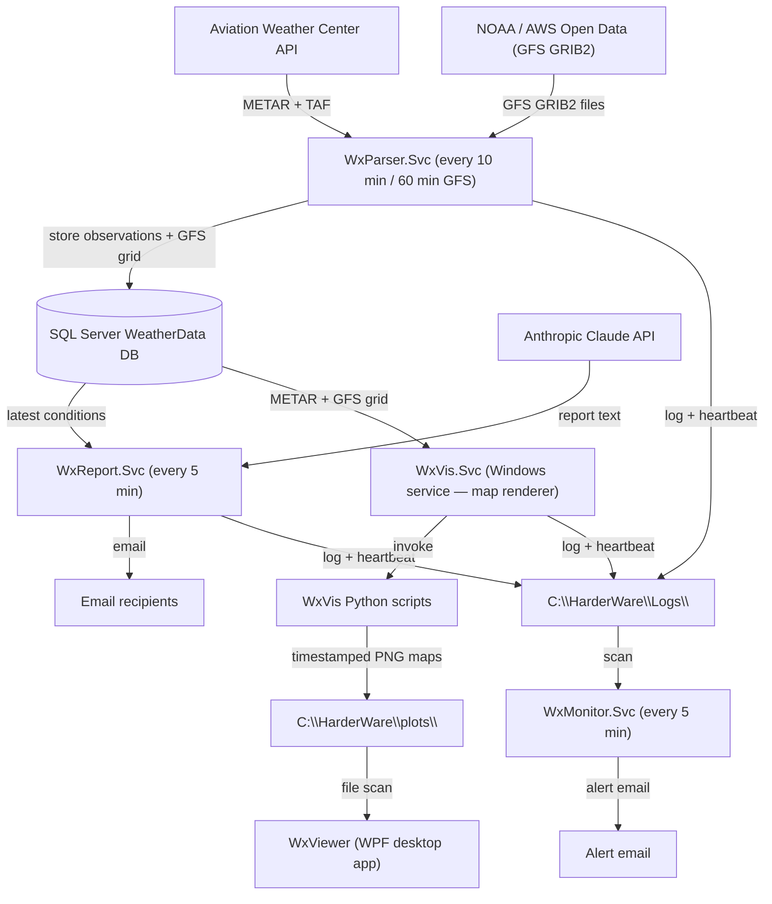
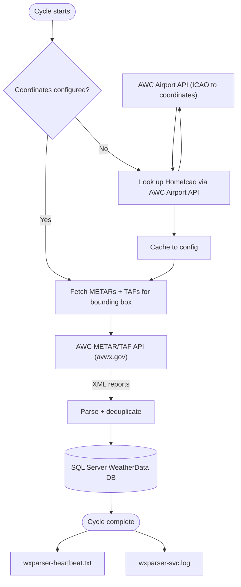
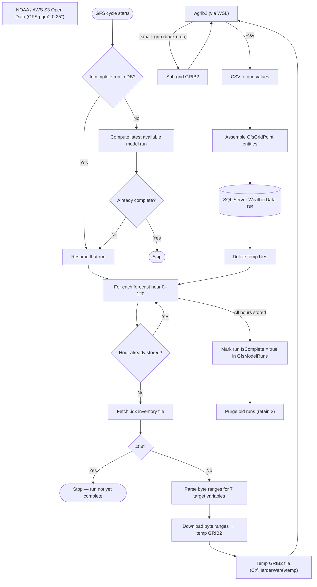
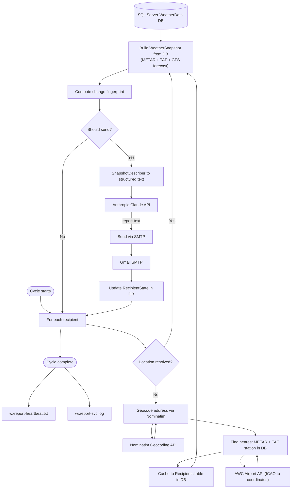
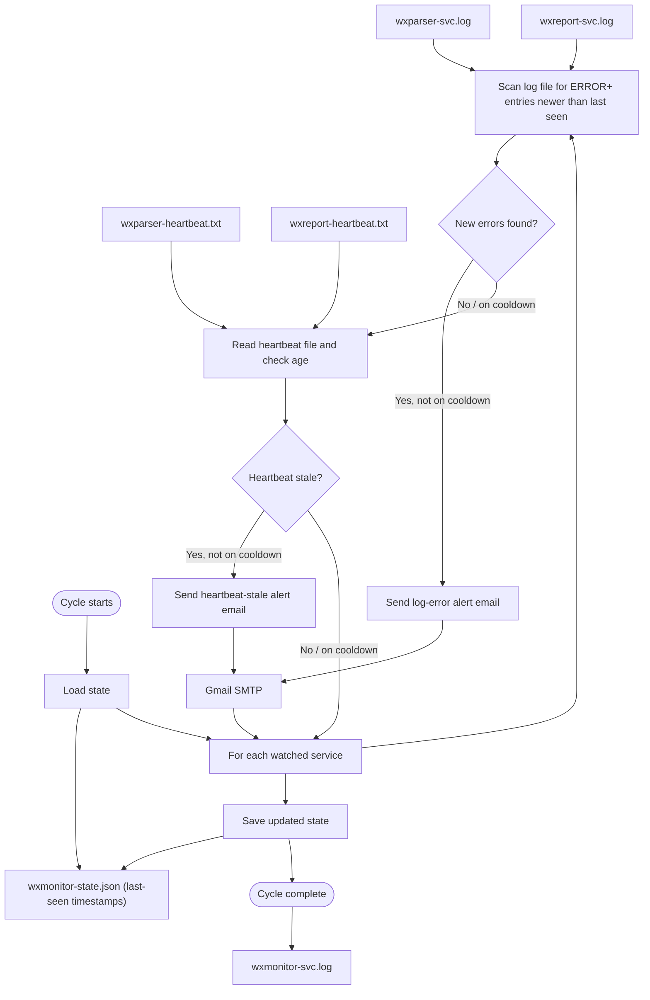
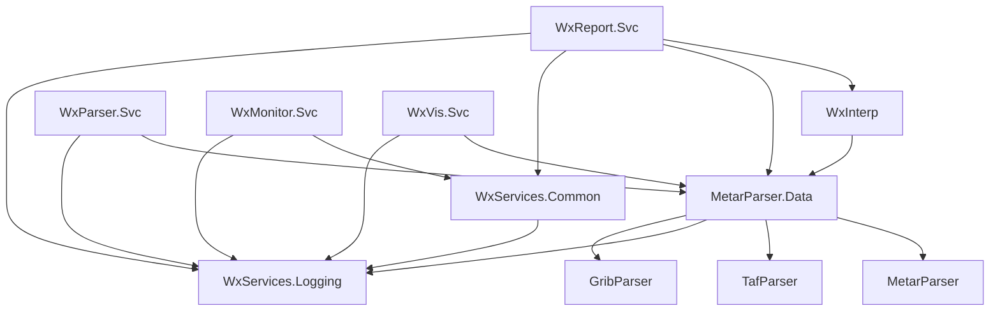
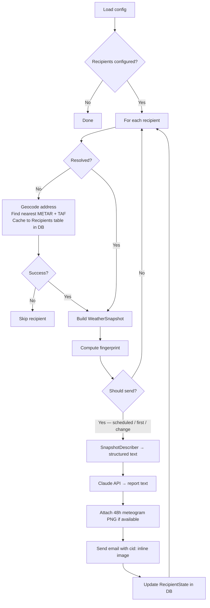
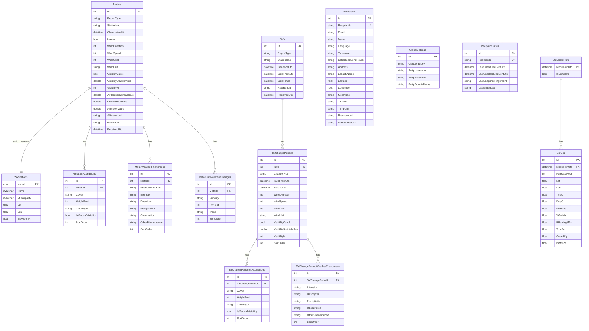

# WxServices System — Design Document

**Living document.** Update this file whenever the code changes in a meaningful way.

---

> **Viewing this document with diagrams**
>
> The architecture diagrams in this file are written in [Mermaid](https://mermaid.js.org/) and must be rendered to be readable. Raw Markdown shows them as fenced code blocks.
>
> **One-time setup in VS Code:**
> 1. Open the Extensions panel — **Ctrl+Shift+X**
> 2. Search for **Markdown Preview Mermaid Support**
> 3. Install the extension by **Matt Bierner**
>
> **Viewing the rendered document:**
> - **Ctrl+Shift+V** — opens a rendered preview in a new tab
> - **Ctrl+K V** — opens the rendered preview side-by-side with the source
>
> The preview updates automatically as you edit the source.

---

## Table of Contents

1. [Purpose](#1-purpose)
2. [System Architecture](#2-system-architecture)
3. [Solution Structure](#3-solution-structure)
4. [Service Details](#4-service-details)
   - [WxParser.Svc — Data Fetcher](#41-wxparsersvc--data-fetcher)
   - [WxReport.Svc — Report Generator](#42-wxreportsvc--report-generator)
   - [WxVis.Svc — Map Renderer](#43-wxvissvc--map-renderer)
   - [WxVis — Python Visualisation](#44-wxvis--python-visualisation)
   - [WxMonitor.Svc — Health Monitor](#45-wxmonitorsvc--health-monitor)
   - [WxViewer — Desktop Map Viewer](#46-wxviewer--desktop-map-viewer)
   - [WxManager — Management GUI](#47-wxmanager--management-gui)
5. [Class Libraries](#5-class-libraries)
6. [Data Model](#6-data-model)
7. [Configuration Guide](#7-configuration-guide)
8. [External Dependencies](#8-external-dependencies)
9. [Installation and Deployment](#9-installation-and-deployment)
10. [Known Limitations and Future Work](#10-known-limitations-and-future-work)
11. [Observability](#11-observability)

---

## 1. Purpose

WxServices is a set of Windows services that:

- Periodically fetch METAR and TAF aviation weather reports from the Aviation Weather Center API and store them in a local SQL Server database.
- Download GFS numerical weather prediction model data from NOAA (via the AWS Open Data mirror) and extract gridded medium-range forecasts covering temperature, wind, cloud cover, precipitation rate, and convective energy (CAPE) for the configured region.
- Generate friendly, plain-English (or other language) weather summaries using Anthropic's Claude AI and email them to a configured list of recipients.
- Render weather visualisation maps (synoptic analysis, GFS forecast parameter maps, and per-recipient meteograms) automatically via WxVis.Svc, which invokes the WxVis Python project after each data cycle.
- Embed a 48-hour meteogram in each recipient's weather report email and attach full-period meteograms to the WxViewer Meteograms tab.
- Provide a local WPF desktop viewer (WxViewer) for browsing and animating the generated maps and meteograms side-by-side.
- Monitor the health of the above services and send alert emails if errors occur or a service goes silent.
- Provide a local WPF management GUI (WxManager) for adding and editing recipients and sending operator service announcements to all subscribers.

Recipients each have their own location. The system automatically resolves the nearest METAR and TAF reporting stations for each recipient on first run and caches the result. Daily reports are sent at each recipient's configured local time; additional reports are triggered by significant weather changes.

---

## 2. System Architecture

### 2.1 Overview

Three Windows services share a log directory and a SQL Server database. WxParser.Svc feeds the database; WxReport.Svc reads from it; WxMonitor.Svc watches both.



---

### 2.2 WxParser.Svc — METAR/TAF data flow



---

### 2.3 WxParser.Svc — GFS data flow

Runs on a separate timer (default: every 60 minutes).



---

### 2.4 WxReport.Svc — data flow



---

### 2.5 WxMonitor.Svc — data flow



---

## 3. Solution Structure

```
WxServices/
├── DESIGN.md                        ← this file
├── WxServices.sln
├── Directory.Build.props            ← single product version (e.g. 1.0.0) applied to all assemblies
├── appsettings.shared.json          ← single source of truth for all config (InstallRoot, DB, SMTP, Claude, WxVis, Monitor, etc.) — git-tracked
├── Deploy-WxService.ps1             ← PowerShell deploy script (run as Administrator)
├── tools/
│   ├── wgrib2                       ← pre-built Linux binary (executed via WSL); path derived from InstallRoot at runtime
│   └── wgrib2-version.txt           ← version stamp; Build-Release.ps1 prints a reminder to check for updates
└── src/
    ├── MetarParser/                 ← METAR text parser library
    ├── TafParser/                   ← TAF text parser library
    ├── GribParser/                  ← wgrib2 subprocess wrapper; CSV parser → GribValue records
    ├── MetarParser.Data/            ← EF Core entities, fetchers, DB context, geocoders, DatabaseSetup
    ├── WxServices.Logging/          ← log4net wrapper (static Logger class)
    ├── WxServices.Common/           ← shared utilities (WxPaths, SmtpSender, SmtpConfig, Util)
    ├── WxInterp/                    ← snapshot interpreter (METAR+TAF+GFS → WeatherSnapshot)
    ├── WxParser.Svc/                ← Windows service: periodic METAR/TAF + GFS fetch
    ├── WxReport.Svc/                ← Windows service: report generation and email
    ├── WxMonitor.Svc/               ← Windows service: log and heartbeat monitoring
    ├── WxVis.Svc/                   ← Windows service: automated map rendering
    ├── WxViewer/                    ← WPF desktop app: animated weather map viewer
    ├── WxManager/                   ← WPF management GUI: recipient editor + announcement sender
    └── WxVis/                       ← Python visualisation project (conda env: wxvis)
        ├── db.py                    ← SQLAlchemy engine + data loading queries
        ├── synoptic_map.py          ← Synoptic analysis maps (Barnes interpolation)
        ├── forecast_map.py          ← GFS forecast parameter maps (contour lines)
        ├── config.json              ← DB connection string + output directory (standalone fallback; service passes env vars)
        └── requirements.txt         ← conda install list
tests/
    ├── MetarParser.Tests/
    ├── TafParser.Tests/
    ├── WxInterp.Tests/
    └── WxMonitor.Tests/
```

WxVis is a standalone Python project; it has no build-time dependency on the C# projects. It reads directly from the same SQL Server database using SQLAlchemy + pyodbc (Windows Authentication).

### Project dependency graph



---

## 4. Service Details

### 4.1 WxParser.Svc — Data Fetcher

**Purpose:** Keep the local database populated with current METAR, TAF, and GFS forecast data.

**METAR/TAF cycle (default: every 10 minutes):**
1. Resolve home coordinates from config (`HomeLatitude`, `HomeLongitude`). If absent, look up via `AirportLocator` using `HomeIcao` and cache to `appsettings.local.json`.
2. Fetch all METARs within the configured fetch region via the AWC API.  The region is either explicit bounds (`RegionSouth/North/West/East`) or derived from `HomeLatitude/HomeLongitude ± BoundingBoxDegrees`.
3. Fetch the home ICAO station explicitly (in case it falls outside the region).
4. Fetch all TAFs within the same region.
5. Insert new records; skip duplicates (unique index on station + observation time + report type).
6. Write the current UTC timestamp to `wxparser-heartbeat.txt`.

**GFS cycle (default: every 60 minutes):**
1. Check for any incomplete model run registered in `GfsModelRuns`. If one exists, resume it; otherwise compute the most recent GFS cycle (00Z/06Z/12Z/18Z) that should be available on NOMADS.
2. For each forecast hour 0–120 not yet stored, fetch the `.idx` inventory file for that hour. A 404 means the run is still being computed — stop and resume next cycle.
3. Download byte-range HTTP requests for the 8 target variables (TMP, SPFH, UGRD, VGRD, PRATE, TCDC, CAPE, PRMSL) and concatenate them into a temporary GRIB2 file.
4. Invoke wgrib2 (via WSL) to crop to the configured fetch region and emit a CSV of grid values.
5. Assemble `GfsGridPoint` entities (applying unit conversions) and insert into `GfsGrid`.
6. When all 121 hours are stored, mark the run `IsComplete = true` and purge old runs (retaining the 2 most recent).

**Airport metadata refresh cycle (once per week, and on first startup):**
1. Download `airports.csv` from OurAirports (`https://davidmegginson.github.io/ourairports-data/airports.csv`), decoded as UTF-8.
2. Parse the CSV; skip rows where `icao_code` and `ident` are both blank, and skip any identifier not exactly 4 characters long.
3. Upsert all valid rows into `WxStations`: update existing rows with properly-cased `Name` and `Municipality`; insert new rows for airports not yet seen. Coordinates and elevation are refreshed from OurAirports data.

**Metrics emitted (OpenTelemetry):**

| Metric | Type | Description |
|---|---|---|
| `wxparser.fetch.cycles.total` | Counter | Incremented on each successful METAR/TAF fetch cycle |
| `wxparser.fetch.cycle.duration.seconds` | Histogram | Wall-clock duration of each METAR/TAF fetch cycle (buckets: 1 2 5 10 20 30 60 120 s) |

See [Section 11 — Observability](#11-observability) for the collection stack.

**Key classes:**
| Class | Location | Role |
|---|---|---|
| `FetchWorker` | WxParser.Svc | `BackgroundService`; owns the METAR/TAF, GFS, and airport-refresh cycles |
| `MetarFetcher` | MetarParser.Data | AWC API call → parse → insert METARs |
| `TafFetcher` | MetarParser.Data | AWC API call → parse → insert TAFs |
| `GfsFetcher` | MetarParser.Data | NOMADS byte-range download → wgrib2 → insert GfsGridPoints |
| `AirportDataImporter` | MetarParser.Data | Downloads OurAirports CSV; upserts `WxStations` with names, municipalities, and coordinates |
| `GribExtractor` | GribParser | wgrib2 subprocess wrapper; parses CSV output into `GribValue` records |
| `MetarParser` | MetarParser | Parses raw METAR text into structured objects |
| `TafParser` | TafParser | Parses raw TAF text into structured objects |
| `AirportLocator` | MetarParser.Data | AWC API: resolves ICAO to lat/lon; finds nearest METAR/TAF stations by bounding box |

---

### 4.2 WxReport.Svc — Report Generator

**Purpose:** Generate personalized weather reports for each recipient and deliver them by email.

**Cycle (default: every 5 minutes):**



**Send-decision logic:**
- **First run:** Immediately sends a welcome + weather report.
- **Scheduled:** Sends once per configured hour when that hour arrives in the recipient's local timezone. Multiple hours can be specified (e.g. `"6, 18"` for morning and evening); default is `"7"`. Subject line: "Weather report — …".
- **Significant change:** Sends an unscheduled report when the weather fingerprint changes and the classified severity is `Update` or `Alert`, subject to a minimum gap between sends (default 60 minutes). `Minor` severity changes are suppressed. Subject line and Claude prompt vary by severity:

| Severity | Trigger | Subject line | Claude opening |
|---|---|---|---|
| `Alert` | Dangerous observed-condition flag appeared: wind, visibility, or thunderstorm rose above threshold | "Weather alert — …" | One urgent sentence naming the new condition |
| `Update` | Observed precipitation appeared; GFS risk flag (CAPE or precip) appeared; or forecast high/low temperature bucket shifted | "Weather update — …" | One or two sentences summarising what changed |
| `Minor` | "Conditions improved" — observed flags (wind, visibility, thunderstorm, precipitation) cleared, or GFS risk flags cleared — send suppressed | — send suppressed — | — |

**Significant-change thresholds (configurable):**
| Condition | Default threshold |
|---|---|
| Wind speed | ≥ 25 kt |
| Visibility | < 3.0 SM |
| Ceiling | < 3,000 ft AGL |
| GFS forecast high temperature | Changes by ≥ 15 °F (next calendar day) |
| GFS forecast low temperature | Changes by ≥ 15 °F (next calendar day) |
| GFS CAPE | Any forecast day ≥ 1,000 J/kg |
| GFS precipitation rate | Any forecast day ≥ 2.0 mm/hr |

**METAR station fallback (tiered):**
1. Try each ICAO in the recipient's `MetarIcao` list (comma-separated, preference order); a station is only accepted if its most recent observation is within the last 3 hours.
2. Fall back to any station in the database with data in the last 3 hours.
3. If no data at all, skip the recipient for this cycle.

The config is never updated when a fallback station is used; a warning is logged.  When the station used differs from the one in `RecipientState.LastMetarIcao` (i.e. the station changed since the last report), Claude is informed via the prompt and includes a brief, matter-of-fact note in the report — in the change-summary band for unscheduled sends, or in the closing summary for scheduled ones.  `LastMetarIcao` is updated on every successful send.

**Recipient resolution (one-time, cached):**
1. Geocode `Address` via Nominatim → lat/lon + locality name.
2. Query the database for METAR stations active within the last 3 hours; use the AWC bbox API to find the nearest station from that active set (falling back to the full API result on first run before local data exists).
3. Query the AWC TAF bbox API for the nearest TAF station. If none is found, store the sentinel value `"NONE"` to prevent repeated lookups.
4. Write lat, lon, `MetarIcao`, `TafIcao`, and `LocalityName` back to the `Recipients` database table.

**Key classes:**
| Class | Location | Role |
|---|---|---|
| `ReportWorker` | WxReport.Svc | `BackgroundService`; owns the report loop |
| `RecipientResolver` | WxReport.Svc | Address geocoding and station resolution; cache write-back; retries geocoding up to 3× |
| `WxInterpreter` | WxInterp | Queries DB → `WeatherSnapshot` (METAR + TAF + GFS); station fallback logic |
| `GfsInterpreter` | WxInterp | Bilinear interpolation over the four surrounding 0.25° GFS grid points → `GfsForecast` |
| `SnapshotDescriber` | WxReport.Svc | `WeatherSnapshot` → structured plain-text for Claude; unit-aware (temperature, pressure, wind speed); outputs relative humidity (computed from temperature and dew point) rather than raw dew point |
| `ClaudeClient` | WxReport.Svc | Anthropic Messages API wrapper; generates HTML email body; accepts `UnitPreferences` and `ChangeSeverity` to tailor the system prompt per recipient; retries transient failures (429, 529, 5xx, `HttpRequestException`) up to 3 times with linear backoff |
| `SmtpSender` | WxServices.Common | MailKit SMTP wrapper; `SendAsync` accepts optional `htmlBody` and `inlineImages`; sends `multipart/alternative` (plain-text + HTML); HTML part is wrapped in `multipart/related` when inline images are provided (`cid:` URI support); `fromName` set per-service at construction time; all failures (including invalid addresses and SMTP errors) are caught and return `false` rather than throwing |
| `SnapshotFingerprint` | WxReport.Svc | Computes an 8-field pipe-delimited fingerprint (W, V, TS, PR, GH, GL, GC, GP) from significant weather fields; `ClassifyChange` compares two fingerprints and returns a `ChangeSeverity` value |

---

### 4.3 WxVis.Svc — Map Renderer

**Purpose:** Automatically render weather maps after each data cycle, eliminating the need to run Python scripts manually.

**Three workers:**

| Worker | Trigger | Output filename format |
|---|---|---|
| `AnalysisMapWorker` | After each METAR fetch cycle | `synoptic_{label}_{yyyyMMdd_HH}.png` |
| `ForecastMapWorker` | Progressively, as each forecast hour's data arrives for the latest model run | `forecast_{yyyyMMdd_HH}_f{NNN}.png` |
| `MeteogramWorker` | Once per complete GFS model run; one pair per unique (ICAO, TempUnit, Timezone) in Recipients | `meteogram_{yyyyMMdd_HH}_{ICAO}_{tzSafe}_abbrev.png`, `meteogram_{yyyyMMdd_HH}_{ICAO}_{tzSafe}_full.png`; manifest: `meteogram_manifest_{yyyyMMdd_HH}.json` |

All workers check for existing current output files before invoking Python; already-current files are skipped.

**Map rendering (`MapRenderer`):**
- Invokes the appropriate WxVis Python script via `Process`/`ProcessStartInfo`.
- Augments the process `PATH` with the conda environment's `bin`, `Library\bin`, and `Scripts` directories so Python and its DLL dependencies resolve correctly when the service runs under the Windows service account (which has a minimal PATH).
- Captures stdout and stderr separately: stdout lines are logged at INFO; stderr lines are logged at WARN (so genuine Python tracebacks surface as warnings). WxVis's `logger.py` directs its console handler to `sys.stdout` so that normal Python log output does not trigger spurious WARN entries in the service log.
- On cancellation (service stop or redeploy), kills the Python subprocess via `Kill(entireProcessTree: true)` before re-throwing, preventing orphaned render processes from running after the service exits.
- All three Python scripts (`forecast_map.py`, `synoptic_map.py`, `meteogram.py`) write output to a `.tmp` file and atomically rename it to the final `.png` via `os.replace()`. This ensures the output directory never contains a partially-written image, so WxVis.Svc is safe to stop and redeploy at any time without risk of serving corrupt maps. Each `plt.savefig()` call explicitly passes `format="png"` because matplotlib infers the output format from the file extension — without it, `.png.tmp` would be treated as an unknown format and the render would fail.

**Stale plot cleanup:** `AnalysisMapWorker` runs a daily purge that deletes `*.png` files older than `PlotRetentionDays` from the output directory.

**Key classes:**
| Class | Location | Role |
|---|---|---|
| `AnalysisMapWorker` | WxVis.Svc | `BackgroundService`; renders synoptic maps after METAR cycles; daily PNG purge |
| `ForecastMapWorker` | WxVis.Svc | `BackgroundService`; renders forecast hours progressively as data arrives for the latest model run (complete or still ingesting) |
| `MeteogramWorker` | WxVis.Svc | `BackgroundService`; renders a 48h abbreviated + full-period meteogram for each recipient location after each complete GFS run; writes manifest JSON |
| `MapRenderer` | WxVis.Svc | Subprocess launcher; conda PATH augmentation; stdout/stderr capture |

---

### 4.4 WxVis — Python Visualisation

**Purpose:** Render weather maps from the local database. Called automatically by WxVis.Svc; can also be run manually for development and testing.

**Script catalogue:**

| Script | Output type | Data source | Output filename |
|---|---|---|---|
| `synoptic_map.py` | Synoptic analysis map (Barnes interpolation) | Latest METAR + WxStations | `synoptic_{label}_{yyyyMMdd_HH}.png` |
| `forecast_map.py` | GFS forecast parameter map | GfsGrid for a specific model run and forecast hour | `forecast_{yyyyMMdd_HH}_f{NNN}.png` |
| `meteogram.py` | Point-forecast meteogram (two PNGs per location) | GfsGrid nearest grid point; bilinear interpolation to recipient lat/lon | `meteogram_{yyyyMMdd_HH}_{ICAO}_{tzSafe}_abbrev.png`, `meteogram_{yyyyMMdd_HH}_{ICAO}_{tzSafe}_full.png` |

**Rendering details:**
- Map projection is selected automatically by `choose_projection()` based on the centre latitude of the extent: Mercator for tropics (|lat| < 25°), Lambert Conformal for mid-latitudes (25–70°), Stereographic for polar regions (≥ 70°).
- Map limits are computed by dense boundary sampling (`_inner_proj_limits`, 200 points per edge) so the plotted area fills to the border with no empty corners from projection curvature.
- Isobars: black solid, 4 hPa interval, labelled.
- Temperature isopleths: red dashed, 3°C interval, labelled.
- Dewpoint isopleths: teal (`#00838f`) dashed, 3°C interval, labelled. Teal distinguishes isodrosotherms from the green precipitation fill.
- Precipitation shading (forecast_map only): semi-transparent green (`#66bb6a`, alpha 0.45) `contourf` fill over areas where the Gaussian-smoothed GFS PRATE field exceeds 0.1 mm/hr. Drawn below isopleths so contour lines and station symbols remain legible. The smoothing turns the blocky 0.25° grid into a smooth curved boundary.
- Pressure extrema: **H** (navy) / **L** (maroon), neighbourhood 12 grid cells (~3°/333 km), minimum prominence 1 hPa.
- Temperature extrema: **W** (dark red) / **K** (steel blue), neighbourhood 12 grid cells, no minimum prominence filter.
- Station models (synoptic_map): MetPy StationPlot; stations thinned with `reduce_point_density` (default 75 km). Fields plotted: NW = air temperature (dark red), SW = dew point (dark green), NE = encoded SLP (3-digit), centre = wind barb + sky-cover symbol + present-weather symbol, SE = station ICAO ID (navy).
- Station models (forecast_map): MetPy StationPlot at METAR station locations, displaying interpolated GFS values. Fields plotted: NW = air temperature (dark red), SW = dew point (dark green), NE = encoded SLP (3-digit), centre = wind barb + sky-cover symbol, SE = station ICAO ID (navy).
- Contours (synoptic_map): Barnes-interpolated grid converted from projection metres to lat/lon before plotting so Cartopy clips to the inner viewport, matching forecast_map white-space border behaviour.
- Map extent is configured via `WxVis:MapExtent` in `appsettings.shared.json`. Accepts a preset name (`south_central`, `conus`) or explicit W,E,S,N coordinates (e.g. `"-106,-88,25,38"`). When empty, maps auto-fit to the available data.
- Extrema labels (H/L/W/K): before placing a label, its lat/lon position is converted to projection metres and compared against `ax.get_xlim()`/`ax.get_ylim()` with a 3 % inward margin on all edges; labels outside or too close to the boundary are silently skipped. The margin guards against `plt.tight_layout()`, which adjusts subplot padding after labels are placed and can shift the effective axes boundary enough to push a borderline anchor outside the saved image. `ax.set_xlim`/`ax.set_ylim` are also re-applied after `tight_layout()` for the same reason.

**Meteogram (`meteogram.py`):**
- Loaded via `db.load_gfs_nearby()` — queries GfsGrid within ±0.5° of the target lat/lon for all forecast hours of the run, then selects the nearest grid point per hour.
- Two vertical panels: top (1/3 height) = wind barbs (always in knots); bottom (2/3 height) = temperature line (black, left axis) and relative humidity line (green, right axis, 0–100%).
- Left axis: "T (°F)" or "T (°C)" depending on `--temp-unit`.  Right axis: "RH (%)".
- Thin horizontal grid lines in the bottom panel at each temperature-axis tick position (light grey, `linewidth=0.4`); anchored to the temperature axis so tick labels are always round numbers. RH axis grid suppressed to avoid a second overlapping set of lines.
- Time axis in recipient local time (`--tz`, IANA timezone name, e.g. `America/Chicago`). Bold vertical lines at every local midnight; day-of-week and day-of-month labels centred in each day's segment. X-axis ticks every 6 local hours, labelled HH:MM.
- Barbs thinned automatically if spacing < 0.18" to prevent overlapping.
- Abbreviated version (48-hour, emailed): first 48 hours, 10" wide × 3.0" @ 100 dpi → 1000 × 300 px.
- Full-period version: all available hours, width scales with duration (10"–18") × 3.0" @ 100 dpi.
- RH computed from TmpC and DwpC via Magnus formula.  Wind speed converted m/s → kt.
- `tzSafe` in output filenames = IANA name with `/` replaced by `-` (e.g. `America-Chicago`).

**Manual use:**
```powershell
conda activate wxvis
cd C:\Users\PaulH\...\WxServices\src\WxVis

python synoptic_map.py [--extent south_central] [--density 75]
python forecast_map.py --run 20260402_18 --fh 84 [--extent -106,-88,25,38]
python meteogram.py --run 20260404_00 --lat 29.97 --lon -95.34 --icao KDWH \
    --locality "Spring" --temp-unit F --tz "America/Chicago" \
    --out-abbrev C:\HarderWare\plots\meteogram_20260404_00_KDWH_America-Chicago_abbrev.png \
    --out-full C:\HarderWare\plots\meteogram_20260404_00_KDWH_America-Chicago_full.png
# Chart title: "Spring (°F)"  — locality name and unit only; no ICAO prefix
```

Output PNGs are saved to the directory configured in `config.json` (default `C:\HarderWare\plots\`).

**Key files:**
| File | Role |
|---|---|
| `db.py` | SQLAlchemy engine; `load_latest_metars`, `load_gfs_grid`, `load_gfs_nearby` (bounding-box query for meteogram point interpolation), `load_output_dir` |
| `map_utils.py` | Shared rendering utilities: `CONUS_EXTENT`, `SOUTH_CENTRAL_EXTENT`, `_inner_proj_limits`, `_mark_extrema`, `_smooth_with_nans` |
| `synoptic_map.py` | METAR data-prep helpers; Barnes contour analysis; `render_synoptic_map` |
| `forecast_map.py` | GFS grid contouring; `render_forecast_map` |
| `meteogram.py` | Point-forecast meteogram; `_nearest_point_series`, `_compute_rh`, `render_meteogram` |

---

### 4.5 WxMonitor.Svc — Health Monitor

**Purpose:** Alert the operator by email when either watched service logs errors, goes silent, or METAR data goes stale.

**Cycle (default: every 5 minutes):**
1. For each watched service, scan its log file for entries at or above `AlertOnSeverity` (default: ERROR) with a timestamp newer than the last one processed.
2. For each watched service, read its heartbeat file and compare its age to `HeartbeatMaxAgeMinutes`.
3. Query the database for the most recent METAR observation timestamp; if it is older than `MetarStalenessThresholdMinutes` (default 120), send a staleness alert.
4. Send alert emails for any findings not on cooldown (`AlertCooldownMinutes`, default 60).
5. Persist state (last-seen log timestamp, last-alert timestamps) to `wxmonitor-state.json`.

**First-run behaviour:** On first run, `LastSeenLogTimestamp` is null. The scanner baselines to the latest entry in the log without sending alerts, so installation does not flood the inbox with historical errors.

**Key classes:**
| Class | Location | Role |
|---|---|---|
| `MonitorWorker` | WxMonitor.Svc | `BackgroundService`; owns the monitor loop |
| `LogScanner` | WxMonitor.Svc | Parses log file; handles multi-line entries (stack traces); filters by severity and timestamp |
| `HeartbeatChecker` | WxMonitor.Svc | Reads heartbeat file; returns age |
| `SmtpSender` | WxServices.Common | MailKit SMTP wrapper; `fromName` set per-service at construction time |
| `MonitorStateStore` | WxMonitor.Svc | Reads/writes `wxmonitor-state.json` |

---

### 4.6 WxViewer — Desktop Map Viewer

**Purpose:** Provide a local WPF desktop application for browsing and animating the PNG maps and meteograms produced by WxVis.Svc.

**Layout:** A frameless maximised window (no OS title bar) with a custom header bar containing the HarderWare/WxViewer logo and standard window controls (minimise, restore, close). Below the header, a `TabControl` hosts two tabs:

**Maps tab** — split into two independent panes by a draggable `GridSplitter`:

| Pane | Content | Controls |
|---|---|---|
| Left | Synoptic analysis maps | Map selector (by obs time), step back/play/step forward, speed, time slider, obs-time label |
| Right | GFS forecast maps | Run selector, step back/play/step forward, speed, hour slider, valid-time label |

Each pane has its own toolbar docked to the top of the pane, immediately above the map image.

**Meteograms tab** — shows full-period meteograms for a selected GFS run:
- Run selector ComboBox (newest first).
- Recipient selector ComboBox (next to the Run selector) — lists all recipients from the database as `"recipientId — Name (Language)"`. Selecting a recipient scrolls to their meteogram and briefly highlights it with a coloured background (clears after 2 seconds). If no meteogram exists for the recipient in the current run a modal dialog is shown. Matching uses `(FirstIcao, TempUnit, Timezone)` — the same grouping key used by `MeteogramWorker`.
- Vertically scrollable list of locations sorted by ICAO, each labelled `"KXXX — Locality (°F) · City"` where *City* is the city component of the IANA timezone (e.g. `· Chicago`). Multiple entries for the same ICAO are possible when recipients share a station but use different timezones or temperature units.
- Each meteogram item has a **Recipients** button (left of the label) that opens a modal dialog listing every recipient who receives that meteogram: ID, Name, and Language.
- Each meteogram image is independently horizontally scrollable (full-period images can be 1800 px wide).
- Populated from `meteogram_manifest_{yyyyMMdd_HH}.json` files written by `MeteogramWorker`. Each manifest entry carries `Icao`, `LocalityName`, `TempUnit`, `Timezone`, `FileAbbrev`, and `FileFull`.

**File discovery (`MapFileScanner`):**
- Scans the configured output directory for `synoptic_*.png`, `forecast_*.png`, and `meteogram_manifest_*.json` files on startup and whenever the directory changes.
- Two `FileSystemWatcher` instances: one for `*.png`, one for `*.json`.
- Parses the timestamp embedded in each filename; analysis entries are sorted newest-first.
- `DirectoryChanged` events are marshalled back to the WPF UI thread via `Dispatcher.BeginInvoke`.

**Animation:**
- Two independent `DispatcherTimer` instances — one per pane — allow both panes to play simultaneously at their own speeds.
- Analysis pane defaults to the newest map; the slider and ComboBox stay in sync — selecting a map from either updates the other. Play animates oldest-to-newest; if already at the newest it restarts from the oldest. The analysis slider uses `IsDirectionReversed="True"` so the thumb sits at the right for the newest map and moves left toward older observations.
- Forecast pane starts at forecast hour 0; play steps through all available hours.
- `BitmapImage` is loaded with `CacheOption.OnLoad` (releases file handle immediately) and `Freeze()`d for cross-thread safety.

**Key classes:**
| Class | Role |
|---|---|
| `MapFileScanner` | Directory scan + two `FileSystemWatcher`s (PNG + JSON); returns `List<AnalysisLabel>`, `List<ForecastRun>`, `List<MeteogramRun>` |
| `AnalysisLabel` | Represents one analysis PNG file; `Name` = file path (selection key), `Label` = obs-time string |
| `MeteogramRun` | One GFS run with a list of `MeteogramItem`s parsed from the manifest JSON |
| `MeteogramItem` | One location entry; loads and freezes `FullImage` (`BitmapImage`) on construction |
| `MainViewModel` | All bindable state; two animation timers; meteogram run/item collections; `Refresh()` scans all three file types |
| `RelayCommand` | `ICommand` implementation; `CanExecuteChanged` wired to `CommandManager.RequerySuggested` |
| `MainWindow` | Frameless WPF window; `WindowChrome` for correct maximise/resize behaviour; custom title-bar and keyboard event handlers; suppresses ToolBar gripper and overflow button |

**Keyboard navigation:** Arrow keys are handled globally by `MainWindow.OnKeyDown`. Both sliders have `Focusable="False"` so they cannot capture keyboard focus and interfere with arrow-key routing; mouse dragging still works normally. ComboBoxes do capture focus, so arrow-key navigation is suppressed while a ComboBox is active.

| Key | Action |
|---|---|
| `→` / `←` | Forecast: step forward / back one hour |
| `Ctrl+→` / `Ctrl+←` | Forecast: jump to final / first hour |
| `↑` / `↓` | Analysis: step to newer / older map |
| `Ctrl+↑` / `Ctrl+↓` | Analysis: jump to newest / oldest map |

**Configuration:** The plots directory is derived from `InstallRoot` via `WxPaths`. Override `WxVis:PlotRetentionDays` in `appsettings.shared.json` to control how long plot files are retained.

---

### 4.7 WxManager — Management GUI

**Purpose:** WPF desktop application that provides a tabbed GUI for managing the WxServices system. Deployed to `C:\HarderWare\WxManager`.

**Tabs:**

- **Setup** — Prerequisites checklist that runs on application load. Uses `PrerequisiteChecker` from `WxServices.Common` to verify SQL Server, WSL, wgrib2, conda Python, wxvis packages, and Docker (optional). Each check shows a pass/fail indicator with a status message; failed checks include guidance text. A "Re-check" button re-runs all checks. The Configure, Recipients, and Announcement tabs are disabled until all required prerequisites pass.

- **Configure** — Settings editor for the entire system. Pre-populates all fields from the current configuration. Grouped into panels: Paths (InstallRoot, CondaPythonExe, wgrib2 WSL path), Home Location (ICAO, lat/lon, bounding box), Database (connection string + Test button), Email/SMTP (host, port, credentials + Test button that sends a real email), Claude API (key, model + Test button that sends a minimal API request), Map Rendering (extent preset or coordinates), and Monitoring (alert email). Saves all settings to `{InstallRoot}\appsettings.local.json`, which is in every service's config chain as an override layer — no redeployment needed. After save, automatically switches to the Setup tab and re-runs prerequisite checks.

- **Recipients** — Left pane shows a scrollable list of all recipients from the `Recipients` database table. Right pane provides an address geocoder (Nominatim), a nearby-stations grid, and a full recipient field editor. Selecting a station pre-fills the MetarIcao field.

  **Nearby-stations lookup:** After geocoding, WxManager queries `WxStations` for up to `WxManager:MaxNearbyStationsInLookup` (default 40) nearest known stations within `WxManager:StationLookupRadiusKm` (default 150 km), using a lat/lon bbox pre-filter followed by a Haversine sort. For each candidate it counts local METAR and TAF records. If a station has no local METAR records, it issues a single-station AWC query (lookback window: `WxManager:AwcMetarHours`, default 6 hours) as a fallback; stations that respond there but not in bbox results are flagged `AlwaysFetchDirect = true` in the database so the fetch cycle fetches them individually going forward. Non-reporting stations (no local data and no AWC response) are suppressed; up to `WxManager:MaxDisplayStations` (default 5) active stations are shown. A "Searching…" advisory is displayed in the Nearby Stations panel while the queries run. A successful address geocode implicitly begins editing (enabling Save/Cancel without requiring an explicit New click). Save validates all fields before writing: Id must be non-empty and contain only letters, digits, hyphens, and underscores; Email must be a valid RFC 5321 address (`System.Net.Mail.MailAddress`); Timezone must be a recognised IANA ID (from `BuildIanaTimeZoneList`); ScheduledSendHours, if set, must be comma-separated integers in 0–23; MetarIcao and TafIcao tokens must be exactly 4 alphanumeric characters and must exist in the `WxStations` table with non-null coordinates (hard block); if a station's coordinates fall outside the configured fetch bounding box the save proceeds but an amber warning banner is shown in place of the green success banner. Save writes directly to the `Recipients` table and shows a green auto-dismissing banner ("Saved successfully.") on success — the banner dismisses after `WxManager:SuccessMessageDismissMs` (default 3000 ms) — or an amber persistent banner on validation failure or bounding-box warning. Delete removes the row after confirmation and returns the form to an idle state (all fields blank, Save/Cancel/Delete disabled). A **Cancel** button discards unsaved edits at any time. The Timezone field is an editable ComboBox populated with canonical IANA timezone IDs (via `TimeZoneInfo.TryConvertWindowsIdToIanaId`); typing narrows the jump target. Default for new recipients: Language = `Report:DefaultLanguage` (typically "English"), Timezone = `WxManager:DefaultTimezone` (default "America/Chicago"), ScheduledSendHours = `Report:DefaultScheduledSendHour` (default 7), Temperature = °F, Pressure = inHg, Wind = mph.

- **Announcement** — Multi-line text editor for composing operator service announcements. Clicking **Send** loads the recipient list from the database, groups recipients by language, calls Claude to format the announcement as a professional HTML email for each language group (translating non-English groups), and sends via SMTP. Progress is shown inline. On complete success the text area is cleared; partial failures are reported in a dismissible amber message panel with selectable text.

**Configuration:** Follows the same layered pattern as the services. `appsettings.shared.json` supplies settings shared across projects (`Smtp`, `Claude`, `Fetch`, `Report:DefaultLanguage`, `Report:DefaultScheduledSendHour`). WxManager-specific non-secret settings (`WxManager:` section — station lookup radius, display limits, default timezone, AWC endpoint, User-Agent, success-banner timing) live in WxManager's own `appsettings.json`. Secrets (`Claude:ApiKey`, `Smtp:Username`, `Smtp:Password`, `Smtp:FromAddress`) are read from the `GlobalSettings` database row (Id = 1), with `C:\HarderWare\appsettings.local.json` and a local `appsettings.local.json` beside the executable as fallbacks.

**Deploy:** `.\Deploy-WxService.ps1 WxManager` publishes to `C:\HarderWare\WxManager`.

---

## 5. Class Libraries

### WxServices.Logging

A thin static wrapper around log4net. All services, WxManager, and WxViewer call `Logger.Initialise(logFilePath)` once at startup, passing the full log file path derived from `WxPaths`; thereafter `Logger.Info/Warn/Error/Fatal` are available everywhere. Caller file, method, and line number are captured automatically via `[CallerFilePath]` etc.

A single `log4net.shared.config` in the solution root is shared by all components. It uses `%property{LogFile}` (a log4net `PatternString`) to resolve the log file path set by `Logger.Initialise` at runtime. This replaces the former per-service `log4net.config` files.

Log format: `yyyy-MM-dd HH:mm:ss.fff LEVEL [File::Method:Line] message`

All timestamps are UTC: the shared config uses `%utcdate`, and the Python logger uses `time.gmtime`. `LogScanner` parses these timestamps with `DateTimeStyles.AssumeUniversal`.

### WxServices.Common

Shared utility code referenced by all services and applications.

Key types:
- `WxPaths` — derives all standard directory paths (Logs, plots, temp, WxVis, services, etc.) from a single `InstallRoot` setting; provides `ReadInstallRoot()` to bootstrap the value from `appsettings.shared.json` before the configuration builder runs
- `PrerequisiteChecker` — static class with individual async check methods for system prerequisites (SQL Server, WSL, wgrib2, conda Python, wxvis packages, Docker); each returns a `CheckResult(Ok, Message)` record. Services call `LogPrerequisitesAsync` at startup to log warnings for failed checks; WxManager uses the individual methods to display an interactive checklist in the Setup tab
- `SmtpConfig` — POCO holding SMTP host, port, credentials, and sender address (no `FromName`; each service supplies its own display name at construction time)
- `SmtpSender` — MailKit-based SMTP wrapper; constructed with `SmtpConfig` and a `fromName` string; `SendAsync` accepts a plain-text body, an optional `htmlBody`, and an optional `inlineImages` dictionary (content-id → file path); when HTML is provided the message is sent as `multipart/alternative`; when inline images are supplied the HTML part is wrapped in `multipart/related` so `` references resolve correctly in email clients; all failures (including invalid addresses and SMTP errors) are caught and return `false` rather than throwing
- `LanguageHelper` — maps natural-language names (English or native script) to BCP 47 IETF tags via `CultureInfo.GetCultures`; also provides localised announcement email subject lines
- `Util` — static utility class; currently exposes `Ignore(object? obj = null)` for suppressing "unused variable" warnings during debugging sessions

### WxInterp

Translates raw database entities into a language-neutral `WeatherSnapshot` value object, and exposes static helpers to find the nearest METAR/TAF station in the database to a given coordinate.

Key types:
- `WeatherSnapshot` — current conditions + TAF forecast periods + optional `GfsForecast`; includes `StationMunicipality` and `StationName` (from `WxStations`) used to label the email report sections
- `WxInterpreter` — queries DB, applies unit conversions, builds snapshot; optionally attaches GFS forecast when lat/lon provided
- `GfsInterpreter` — queries `GfsGrid` for the most recent complete model run and bilinearly interpolates the four surrounding 0.25° grid points to an exact location; produces a `GfsForecast` covering up to 6 days
- `GfsForecast` — model run time + list of `GfsDailyForecast`
- `GfsDailyForecast` — per-day high/low temperature (°C and °F), max wind speed (kt) and dominant direction, max cloud cover (%), max CAPE (J/kg), max precipitation rate (mm/hr above threshold)
- `ForecastPeriod`, `SkyLayer`, `SnapshotWeather` — snapshot sub-types for METAR/TAF data

---

## 6. Data Model

### Entity-relationship diagram



### Key indexes

| Table | Index | Type |
|---|---|---|
| Metars | StationIcao + ObservationUtc + ReportType | Unique |
| Metars | StationIcao | Non-unique |
| Tafs | StationIcao + IssuanceUtc + ReportType | Unique |
| Tafs | StationIcao | Non-unique |
| Recipients | RecipientId | Unique |
| RecipientStates | RecipientId | Unique |
| GfsGrid | ModelRunUtc + ForecastHour + Lat + Lon | Unique |
| GfsGrid | ModelRunUtc + ForecastHour | Non-unique |
| WxStations | IcaoId | Primary key |

**Notes on WxStations:**
- Seeded from OurAirports (`airports.csv`) by `AirportDataImporter`, which runs on first startup and weekly thereafter. This populates `Name` (properly cased), `Municipality` (city/town), and coordinates for all ~40 000 ICAO-coded airports worldwide.
- `MetarFetcher` also inserts stub rows for any ICAO not yet present after a METAR batch, so new stations appear immediately even before the next weekly refresh.
- `Municipality` is used by `WxReport.Svc` to label the Current Conditions section with a human-readable location rather than an ICAO code.
- WxVis queries `WxStations` via `INNER JOIN` so stub rows (null coordinates) are automatically excluded from maps.

---

## 7. Configuration Guide

### File layering

Each service loads configuration from up to two files, merged in order (later file wins):

| File | Tracked by git | Purpose |
|---|---|---|
| `appsettings.shared.json` | Yes | All non-secret settings for every service and application |
| `appsettings.local.json` | **No** | Per-machine overrides written by WxManager → Configure tab |

Secrets (SMTP credentials, Claude API key) are stored exclusively in the `GlobalSettings` database row (Id = 1) and never appear in any configuration file. Use WxManager → Configure tab to set them.

### appsettings.shared.json (WxServices root)

This single file contains every non-secret setting for all services and applications. Key sections:

- **`Fetch`** — METAR/TAF fetch interval, home station, bounding box / explicit region bounds, retention
- **`Gfs`** — GFS fetch interval, delay, wgrib2 path, forecast hours, retention
- **`Smtp`** — Host and port only (credentials are in the database)
- **`Claude`** — Model, endpoint, API version, max tokens (API key is in the database)
- **`Telemetry`** — `Enabled` flag and OTLP endpoint (disabled by default)
- **`WxVis`** — Conda Python path, map extent, plot retention
- **`Monitor`** — Alert interval, email, severity threshold, watched services
- **`Report`** — Report interval, language, schedule, thresholds, significant-change config
- **`WxManager`** — Station lookup radius, AWC endpoint, display settings

### Recipients — database

**Recipients** (`Recipients` table): managed via WxManager → Recipients tab. `RecipientId` is the stable key; `Latitude`, `Longitude`, `MetarIcao`, `TafIcao`, and `LocalityName` are written back by `RecipientResolver` on first resolution.

**Notes on recipient fields:**
- `RecipientId` must be unique across all recipients. It is the stable key linking `Recipients` to `RecipientStates`.
- `Address` is used only for one-time geocoding; it is never displayed in reports.
- `LocalityName` is used in report subjects and body. If absent, it is inferred from geocoding on first run.
- `ScheduledSendHours` is a comma-separated string of hours (0–23) in the recipient's local timezone (e.g. `"6, 18"` for morning and evening; `"7"` for a single hour). Falls back to `DefaultScheduledSendHours` when omitted.
- `MetarIcao` accepts a comma-separated list in preference order (e.g. `"KDWH, KHOU"`). The first station with an observation within the last 3 hours is used; no DB update occurs when a fallback station is used.
- `Latitude`, `Longitude`, `MetarIcao`, `TafIcao` are written back to the database automatically by the service on first resolution. To re-trigger resolution (e.g. after a move), set them to `NULL` in the `Recipients` table.
- `TempUnit`, `PressureUnit`, `WindSpeedUnit` control how values are displayed. Each is independent. Supported values: `TempUnit`: `"F"` or `"C"`; `PressureUnit`: `"inHg"` or `"kPa"`; `WindSpeedUnit`: `"mph"` or `"kph"`. All default to US customary.

### Secrets — database

**Secrets** (`GlobalSettings` table, Id = 1): managed via WxManager → Configure tab. Stored exclusively in the database — never in configuration files. Fields: `ClaudeApiKey`, `SmtpUsername`, `SmtpPassword`, `SmtpFromAddress`. Services read these at the start of every cycle.

---

## 8. External Dependencies

| Service | API / Tool | Purpose | Auth |
|---|---|---|---|
| WxParser.Svc | [AWC METAR/TAF API](https://aviationweather.gov/data/api/) | Fetch weather reports | None (public) |
| WxParser.Svc / WxReport.Svc | AWC Airport API | Resolve ICAO → coordinates; nearest station lookup | None (public) |
| WxParser.Svc | [OurAirports](https://davidmegginson.github.io/ourairports-data/airports.csv) | Airport names, municipalities, coordinates for all ICAO airports | None (public) |
| WxParser.Svc | [NOAA GFS / AWS Open Data](https://noaa-gfs-bdp-pds.s3.amazonaws.com) | Download GFS GRIB2 forecast files | None (public) |
| WxParser.Svc | wgrib2 (WSL) | Extract sub-grid values from GRIB2 files | n/a (local binary) |
| WxReport.Svc | [Nominatim](https://nominatim.openstreetmap.org/) | Geocode recipient address | None (User-Agent required) |
| WxReport.Svc | Anthropic Claude API | Generate natural-language reports | API key |
| WxReport.Svc / WxMonitor.Svc | Gmail SMTP | Send emails | App password |

**WxVis Python packages (conda env: wxvis, Python 3.12):**
| Package | Purpose |
|---|---|
| `metpy` | StationPlot, reduce_point_density, Barnes interpolation |
| `cartopy` | Map projections and geographic features (requires conda — C extensions) |
| `matplotlib` | Figure rendering, contour lines |
| `scipy` | Gaussian smoothing, local extrema detection |
| `sqlalchemy` + `pyodbc` | SQL Server access via Windows Authentication |
| `pandas` / `numpy` | Data manipulation and grid math |

**NuGet packages:**
| Package | Used by |
|---|---|
| `Microsoft.EntityFrameworkCore.SqlServer` | MetarParser.Data |
| `Microsoft.Extensions.Hosting.WindowsServices` | All services |
| `MailKit` | WxServices.Common |
| `log4net` | WxServices.Logging |

**System prerequisites:**
| Prerequisite | Notes |
|---|---|
| WSL (Windows Subsystem for Linux) | Required for wgrib2; Ubuntu recommended |
| wgrib2 | Bundled in `tools/wgrib2`; path derived from InstallRoot at runtime via `WxPaths.Wgrib2BundledWslPath` |

---

## 9. Installation and Deployment

### Prerequisites
- Windows 10/11 (64-bit) — all services use `UseWindowsService`
- .NET 8 runtime
- SQL Server Express (or higher); default instance name `SQLEXPRESS`
- Gmail account with an App Password configured for SMTP
- WSL (wgrib2 is bundled in `tools/` and runs via WSL automatically)
- Miniconda with the wxvis conda environment (for map rendering)
- Docker Desktop (optional, for Prometheus + Grafana observability)

### Installer

`HarderWare_WxServices.iss` is an Inno Setup script that produces a single `HarderWare_WxServices_Setup.exe` installer.  To build it:

1. Run `.\Build-Release.ps1` to publish all components into the `release\` staging directory. The script reads the product version from `Directory.Build.props` and prints the ISCC command to run.
2. Compile the `.iss` script with Inno Setup: `ISCC.exe /DAppVer=1.0.0 HarderWare_WxServices.iss` (use the version printed by the build script).

The installer copies files to the chosen directory (default `C:\HarderWare`), registers the four Windows services, updates `InstallRoot` in `appsettings.shared.json` to match the install path, creates Start Menu and optional desktop shortcuts, and launches WxManager for first-run configuration.  Uninstall stops and removes the services.

### Developer deploy script

`Deploy-WxService.ps1` (in the solution root) automates stop/publish/start for each service.  It reads `InstallRoot` from `appsettings.shared.json` and uses `$PSScriptRoot` as the solution root — no hardcoded paths to edit.  See `DEVELOPER-README.md` for full developer setup instructions.

Run from an **elevated** PowerShell prompt:

```powershell
.\Deploy-WxService.ps1 all           # Everything
.\Deploy-WxService.ps1 WxReportSvc   # Single service
.\Deploy-WxService.ps1 WxManager     # Management GUI only
.\Deploy-WxService.ps1 WxViewer      # Desktop viewer only
.\Deploy-WxService.ps1 WxVis         # Python scripts only
```

Valid names: `WxParserSvc`, `WxReportSvc`, `WxMonitorSvc`, `WxVisSvc`, `WxViewer`, `WxManager`, `WxVis`, `all`.

`all` copies WxVis Python scripts to `{InstallRoot}\WxVis\` first, then deploys the four Windows services, WxManager, and WxViewer.

### First-time install (run as Administrator)
```
sc.exe create WxParserSvc  binPath= "C:\HarderWare\BuildCache\WxServices\WxParser.Svc\bin\Release\net8.0\publish\WxParser.Svc.exe"
sc.exe create WxReportSvc  binPath= "C:\HarderWare\BuildCache\WxServices\WxReport.Svc\bin\Release\net8.0\publish\WxReport.Svc.exe"
sc.exe create WxMonitorSvc binPath= "C:\HarderWare\BuildCache\WxServices\WxMonitor.Svc\bin\Release\net8.0\publish\WxMonitor.Svc.exe"
sc.exe create WxVisSvc     binPath= "C:\HarderWare\BuildCache\WxServices\WxVis.Svc\bin\Release\net8.0\publish\WxVis.Svc.exe"

sc.exe start WxParserSvc
sc.exe start WxReportSvc
sc.exe start WxMonitorSvc
sc.exe start WxVisSvc
```

### Database setup

The database schema is managed by `DatabaseSetup.EnsureSchemaAsync()` in `MetarParser.Data`.  Every service calls this method at startup.  The first service to start creates the database (via EF Core `EnsureCreatedAsync`) and all additional tables/columns (via idempotent `IF NOT EXISTS` DDL).  Subsequent services and restarts are no-ops.  No manual SQL scripts or EF migrations are needed.

### Startup order
Start `WxParserSvc` first and allow at least one fetch cycle to complete before starting `WxReportSvc`, so METAR data is available for station resolution. GFS data will begin accumulating on the first 60-minute GFS cycle; full temperature forecasts appear in reports once the first complete model run is ingested (up to ~4 hours after the run's nominal time).

### Versioning

All assemblies share a single version defined in `Directory.Build.props` (`<Version>`). To bump the version, edit that one element — everything else picks it up automatically. `WxPaths.ProductVersion` reads it at runtime. `WxPaths.GitCommit` reads the short git commit hash embedded at build time via a custom `AssemblyMetadataAttribute`.

Where the version appears:
- **WxManager / WxViewer title bars** — via a `Run` element in the custom WindowChrome title bar
- **Email report footer** — `· WxServices 1.0.0` appended to the station/GFS line
- **All six program log files** — `WxReport.Svc 1.0.0 (commit abc1234) starting.`
- **Windows Apps list** — from the Inno Setup `AppVersion` (passed via `/DAppVer=` at compile time)

### Log files
All logs are written to `{InstallRoot}\Logs\` (default `C:\HarderWare\Logs\`). Log files: `wxparser-svc.log`, `wxreport-svc.log`, `wxmonitor-svc.log`, `wxvis-svc.log`, `wxmanager.log`, `wxviewer.log`, `wxvis.log` (Python). All paths are derived from the `InstallRoot` setting in `appsettings.shared.json` via the `WxPaths` class.

### Changing a recipient's location
1. In the `Recipients` database table, update `Address` and set `Latitude`, `Longitude`, `MetarIcao`, and `TafIcao` to `NULL` (or use WxManager → Recipients tab to edit the recipient).
2. The service will re-geocode and re-resolve on the next cycle.

---

## 10. Known Limitations and Future Work

| Item | Notes |
|---|---|
| Single bounding box | All METAR, TAF, and GFS data is fetched for one geographic region. Supporting recipients in widely separated locations would require per-region fetch configuration. |
| GFS requires WSL | wgrib2 is a bundled Linux binary invoked via `wsl.exe`. If WSL is unavailable, the GFS cycle logs errors and skips ingestion; METAR/TAF reports continue normally without forecast data. |
| GFS forecast delay | A complete model run takes up to ~4 hours after the nominal run time to appear on NOMADS. During this window the previous run's data is used. |
| Metrics only on WxParser.Svc | Cycle duration and count metrics are instrumented on WxParser.Svc only. WxReport.Svc, WxVis.Svc, and WxMonitor.Svc have no OTel instrumentation yet. |
| WxMonitor does not watch itself | WxMonitor has no watchdog. A Windows Task Scheduler task could serve this purpose if needed. |
| Nominatim rate limit | Nominatim's terms require a maximum of 1 request/second and a valid User-Agent. Resolution is one-time per recipient, so this is unlikely to be a problem in practice. |
| WxViewer has no database access | WxViewer reads PNG files and manifest JSON files directly. METAR observation tables would require a database-connected panel in a future session. |

---

## 11. Observability

### Stack

Metrics are collected via OpenTelemetry and visualised in Grafana. The stack runs as Docker containers defined in `observability/docker-compose.yml`.

```
WxParser.Svc  ──OTLP/HTTP──▶  otel-collector  ──Prometheus scrape──▶  Prometheus  ──▶  Grafana
              (port 4318)      (port 8889)                              (port 9090)      (port 3000)
```

| Container | Image | Purpose |
|---|---|---|
| `otel-collector` | `otel/opentelemetry-collector:latest` | Receives OTLP metrics; exposes Prometheus scrape endpoint |
| `prometheus` | `prom/prometheus:latest` | Scrapes collector; stores time-series data |
| `grafana` | `grafana/grafana:11.4.0` | Dashboard UI (admin password: `grafana`); default timezone UTC |

Start the stack from the `observability/` directory:
```
docker compose up -d
```

### WxParser.Svc instrumentation

Metrics are emitted via `System.Diagnostics.Metrics` and exported over OTLP/HTTP every 10 seconds.

Telemetry is disabled by default. To enable it, set `Telemetry:Enabled` to `true` in `appsettings.shared.json`. The OTLP endpoint is configured by `Telemetry:OtlpEndpoint` (default `http://localhost:4318/v1/metrics`). When disabled, no exporter is registered and no background HTTP traffic occurs. **The full signal path (`/v1/metrics`) must be included — the SDK does not append it automatically when the endpoint is set in code.**

### Useful Prometheus queries

| Query | What it shows |
|---|---|
| `wxparser_fetch_cycles_total` | Cumulative completed fetch cycles |
| `increase(wxparser_fetch_cycles_total[1h])` | Cycles completed in the last hour |
| `increase(wxparser_fetch_cycle_duration_seconds_bucket[1h])` | Histogram input for quantile queries |
| `histogram_quantile(0.95, increase(wxparser_fetch_cycle_duration_seconds_bucket[1h]))` | p95 fetch cycle duration over the last hour |

Use `increase()` rather than `rate()` for these metrics — the fetch cycle fires every 10 minutes, so `rate()` produces near-zero values that cause `histogram_quantile` to return NaN.
